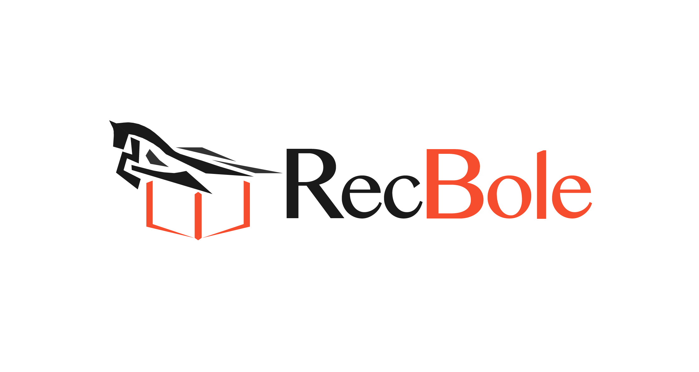
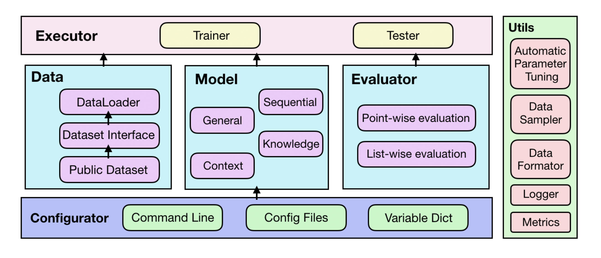

--------------------------------------------------------------------------------

# RecBole (伯乐)

*“世有伯乐，然后有千里马。千里马常有，而伯乐不常有。”——韩愈《马说》*

[](https://pypi.org/project/recbole/)
[](https://anaconda.org/aibox/recbole)
[](./LICENSE)
[](https://arxiv.org/abs/2011.01731)


[中文主页] | [文档] | [数据集] | [论文] | [博客] | [English Version]

[中文主页]: https://recbole.io/cn
[文档]: https://recbole.io/docs/
[数据集]: https://github.com/RUCAIBox/RecDatasets
[论文]: https://arxiv.org/abs/2011.01731
[博客]: https://blog.csdn.net/Turinger_2000/article/details/111182852
[English Version]: README.md


RecBole 是一个基于 PyTorch 实现的，面向研究者的，易于开发与复现的，统一、全面、高效的推荐系统代码库。
我们实现了78个推荐系统模型，包含常见的推荐系统类别，如:

+ General Recommendation
+ Sequential Recommendation
+ Context-aware Recommendation
+ Knowledge-based Recommendation


我们约定了一个统一、易用的数据文件格式，并已支持 28 个 benchmark dataset。
用户可以选择使用我们的数据集预处理脚本，或直接下载已被处理好的数据集文件。


<p align="center">
  
  <br>
  <b>图片</b>: RecBole 总体架构
</p>


## 特色
+ **通用和可扩展的数据结构** 我们设计了通用和可扩展的数据结构来支持各种推荐数据集统一化格式和使用。

+ **全面的基准模型和数据集** 我们实现了78个常用的推荐算法，并提供了28个推荐数据集的格式化副本。

+ **高效的 GPU 加速实现** 我们针对GPU环境使用了一系列的优化技术来提升代码库的效率。

+ **大规模的标准评测** 我们支持一系列被广泛认可的评估方式来测试和比较不同的推荐算法。


## RecBole 新闻
**02/25/2022**: 我们发布了 [v1.0.1](https://github.com/RUCAIBox/RecBole/releases/tag/v1.0.1).

**09/17/2021**: 我们发布了 [v1.0.0](https://github.com/RUCAIBox/RecBole/releases/tag/v1.0.0).

**03/22/2021**: 我们发布了 [v0.2.1](https://github.com/RUCAIBox/RecBole/releases/tag/v0.2.1).

**01/15/2021**: 我们发布了 [v0.2.0](https://github.com/RUCAIBox/RecBole/releases/tag/v0.2.0).

**12/10/2020**: 我们发布了[RecBole小白入门系列中文博客（持续更新中）](https://blog.csdn.net/Turinger_2000/article/details/111182852) 。

**12/06/2020**: 我们发布了 RecBole [v0.1.2](https://github.com/RUCAIBox/RecBole/releases/tag/v0.1.2).

**11/29/2020**: 我们在三个不同大小的数据集上进行了时间和内存开销的初步测试，
并提供了 [测试结果](https://github.com/RUCAIBox/RecBole#time-and-memory-costs) 以供参考。

**11/03/2020**: 我们发布了第一版 RecBole **v0.1.1**.


## 安装
RecBole可以在以下几种系统上运行:

* Linux
* Windows 10
* macOS X

RecBole需要在python 3.7或更高的环境下运行。

RecBole要求torch版本在1.7.0及以上，如果你想在GPU上运行RecBole，请确保你的CUDA版本或CUDAToolkit版本在9.2及以上。
这需要你的NVIDIA驱动版本为396.26或以上（在linux系统上）或者为397.44或以上（在Windows10系统上）。


### 从Conda安装

```bash
conda install -c aibox recbole
```

### 从pip安装

```bash
pip install recbole
```

### 从源文件安装
```bash
git clone https://github.com/RUCAIBox/RecBole.git && cd RecBole
pip install -e . --verbose
```

## 快速上手
如果你从GitHub下载了RecBole的源码，你可以使用提供的脚本进行简单的使用：

```bash
python run_recbole.py
```

这个例子将会在ml-100k这个数据集上进行BPR模型的训练和测试。

一般来说，这个例子将花费不到一分钟的时间，我们会得到一些类似下面的输出：

```
INFO ml-100k
The number of users: 944
Average actions of users: 106.04453870625663
The number of items: 1683
Average actions of items: 59.45303210463734
The number of inters: 100000
The sparsity of the dataset: 93.70575143257098%

INFO Evaluation Settings:
Group by user_id
Ordering: {'strategy': 'shuffle'}
Splitting: {'strategy': 'by_ratio', 'ratios': [0.8, 0.1, 0.1]}
Negative Sampling: {'strategy': 'full', 'distribution': 'uniform'}

INFO BPRMF(
    (user_embedding): Embedding(944, 64)
    (item_embedding): Embedding(1683, 64)
    (loss): BPRLoss()
)
Trainable parameters: 168128

INFO epoch 0 training [time: 0.27s, train loss: 27.7231]
INFO epoch 0 evaluating [time: 0.12s, valid_score: 0.021900]
INFO valid result:
recall@10: 0.0073  mrr@10: 0.0219  ndcg@10: 0.0093  hit@10: 0.0795  precision@10: 0.0088

...

INFO epoch 63 training [time: 0.19s, train loss: 4.7660]
INFO epoch 63 evaluating [time: 0.08s, valid_score: 0.394500]
INFO valid result:
recall@10: 0.2156  mrr@10: 0.3945  ndcg@10: 0.2332  hit@10: 0.7593  precision@10: 0.1591

INFO Finished training, best eval result in epoch 52
INFO Loading model structure and parameters from saved/***.pth
INFO best valid result:
recall@10: 0.2169  mrr@10: 0.4005  ndcg@10: 0.235  hit@10: 0.7582  precision@10: 0.1598
INFO test result:
recall@10: 0.2368  mrr@10: 0.4519  ndcg@10: 0.2768  hit@10: 0.7614  precision@10: 0.1901
```

如果你要改参数，例如 ``learning_rate``, ``embedding_size``, 只需根据您的需求增加额外的参数，例如：

```bash
python run_recbole.py --learning_rate=0.0001 --embedding_size=128
```

如果你想改变运行模型，只需要在执行脚本时添加额外的设置参数即可：

```bash
python run_recbole.py --model=[model_name]
```


### 自动调参
伯乐还支持自动调参功能，打开`RecBole/hyper.test` 然后设置一系列你想要调整的超参数进行自动搜索。下面有两种方式来进行超参搜索：
* **loguniform**：参数会遵循均匀分布随机选取。
* **choice**: 参数会从所设置的列表中选择每个离散值进行搜索。

下面是一个`hyper.test`的例子
```
learning_rate loguniform -8, 0
embedding_size choice [64, 96 , 128]
train_batch_size choice [512, 1024, 2048]
mlp_hidden_size choice ['[64, 64, 64]','[128, 128]']
```
然后在命令行中运行：
```
python run_hyper.py --model=[model_name] --dataset=[data_name] --config_files=xxxx.yaml --params_file=hyper.test
e.g.
python run_hyper.py --model=BPR --dataset=ml-100k --config_files=test.yaml --params_file=hyper.test
```
注意：`--config_files=test.yaml`是可选的，如果你没有任何客制化设置，这个选项可以不添加，会默认使用该模型的默认配置。

这个过程可能会花费一段时间，请耐心等待：
```
running parameters:                                                                                                                    
{'embedding_size': 64, 'learning_rate': 0.005947474154838498, 'mlp_hidden_size': '[64,64,64]', 'train_batch_size': 512}                
  0%|                                                                                           | 0/18 [00:00<?, ?trial/s, best loss=?]
```
你可以在我们的[docs](https://recbole.io/docs/user_guide/usage/parameter_tuning.html)中找到更多关于超参调试的信息。

## 时间和内存开销
我们构建了初步的实验来测试三个不同大小的数据集（小、中、大）的时间和内存开销。
有关详细信息，请单击以下链接。

* [General recommendation models](asset/time_test_result/General_recommendation.md)<br>
* [Sequential recommendation models](asset/time_test_result/Sequential_recommendation.md)<br>
* [Context-aware recommendation models](asset/time_test_result/Context-aware_recommendation.md)<br>
* [Knowledge-based recommendation models](asset/time_test_result/Knowledge-based_recommendation.md)<br>

NOTE: 我们的测试结果只给出了RecBole库中实现模型的大致时间和内存开销（基于我们的机器服务器）。
我们欢迎任何关于测试、实现的建议。我们将继续改进我们的实现，并更新这些测试结果。


## RecBole 重要发布
| Releases  | Date   |
|-----------|--------|
| v1.0.0    | 09/17/2021 |
| v0.2.0    | 01/15/2021 |
| v0.1.1    | 11/03/2020 |


## 贡献

如果您遇到错误或有任何建议，请通过 [Issue](https://github.com/RUCAIBox/RecBole/issues) 进行反馈

我们欢迎关于修复错误、添加新特性的任何贡献。

如果想贡献代码，请先在issue中提出问题，然后再提PR。

我们对[@tszumowski](https://github.com/tszumowski), [@rowedenny](https://github.com/rowedenny), [@deklanw](https://github.com/deklanw) 等用户提出的建议表示感谢。

我们也对[@rowedenny](https://github.com/rowedenny), [@deklanw](https://github.com/deklanw) 等用户做出的贡献表示感谢。


## 引用
如果你觉得RecBole对你的科研工作有帮助，请引用我们的[论文](https://arxiv.org/abs/2011.01731):

```
@article{recbole,
    title={RecBole: Towards a Unified, Comprehensive and Efficient Framework for Recommendation Algorithms},
    author={Wayne Xin Zhao and Shanlei Mu and Yupeng Hou and Zihan Lin and Kaiyuan Li and Yushuo Chen and Yujie Lu and Hui Wang and Changxin Tian and Xingyu Pan and Yingqian Min and Zhichao Feng and Xinyan Fan and Xu Chen and Pengfei Wang and Wendi Ji and Yaliang Li and Xiaoling Wang and Ji-Rong Wen},
    year={2020},
    journal={arXiv preprint arXiv:2011.01731}
}
```

## 项目团队
RecBole由 [中国人民大学, 北京邮电大学, 华东师范大学](https://www.recbole.io/cn/about.html) 的同学和老师进行开发和维护。 

以下是伯乐项目的首席开发人员名单。他们是伯乐项目的灵魂人物，为伯乐项目的开发作出了重大贡献！

|         时间段          |        版本         |               首席开发者                 |
| :-------------------: | :--------------------: | :--------------------------------------------: |
| 2020年6月<br> ~<br> 2020年11月 |        v0.1.1         |  牟善磊 ([@ShanleiMu](https://github.com/ShanleiMu)), 侯宇蓬 ([@hyp1231](https://github.com/@hyp1231)),<br> 林子涵 ([@linzihan-backforward](https://github.com/linzihan-backforward)), 李凯元 ([@tsotfsk](https://github.com/tsotfsk))|
|   2020年11月<br> ~ <br> 现在    |  v0.1.2 ~ v1.0.0 |      陈昱硕 ([@chenyushuo](https://github.com/https://github.com/chenyushuo)), 潘星宇 ([@2017pxy](https://github.com/2017pxy))    |


## 免责声明
RecBole 基于 [MIT License](./LICENSE) 进行开发，本项目的所有数据和代码只能被用于学术目的。
