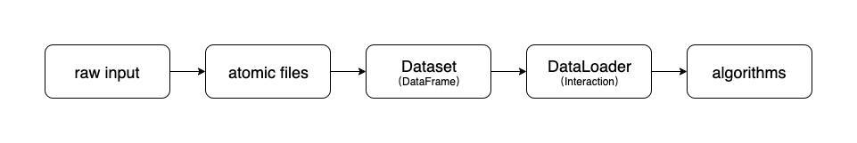

Data Flow
===========

For extensibility and reusability, our data module designs an elegant data flow that transforms raw data into the model input.

The overall data flow can be described as follows:

The details are as follows:

- Raw Input
    Unprocessed raw input dataset. Detailed as `Dataset List </dataset_list.html>`_.
- Atomic Files
    Basic components for characterizing the input of various recommendation tasks, proposed by RecBole. Detailed as :doc:`atomic_files`.
- Dataset:
    Mainly based on the primary data structure of :class:`pandas.DataFrame` in the library of `pandas <https://pandas.pydata.org/>`_.
    During the transformation step from atomic files to class :class:`Dataset`,
    we provide many useful functions that support a series of preprocessing functions in recommender systems,
    such as k-core data filtering and missing value imputation.
- DataLoader:
    Mainly based on a general internal data structure implemented by our library, called :class:`~recbole.data.interaction.Interaction`.
    :class:`~recbole.data.interaction.Interaction` is the internal data structural that is fed into the recommendation algorithms.
    It is implemented as a new abstract data type based on :class:`python.Dict`, which is a key-value indexed data structure.
    The keys correspond to features from input, which can be conveniently referenced with feature names when writing the recommendation algorithms;
    and the values correspond to tensors (implemented by :class:`torch.Tensor`), which will be used for the update and computation in learning algorithms.
    Specially, the value entry for a specific key stores all the corresponding tensor data in a batch or mini-batch.
