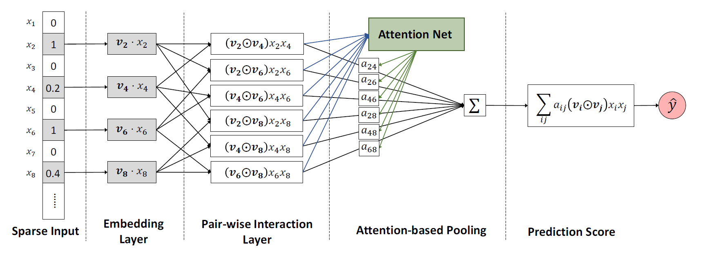

AFM
===========

Introduction
---------------------

`[paper] <https://dl.acm.org/doi/abs/10.5555/3172077.3172324>`_

**Title:** Attentional Factorization Machines: Learning the Weight of Feature Interactions via Attention Networks

**Authors:** Jun Xiao, Hao Ye, Xiangnan He,  Hanwang Zhang,  Fei Wu,  Tat-Seng Chua

**Abstract:**  *Factorization Machines* (FMs) are a supervised learning approach that enhances the linear regression model by incorporating the second-order feature interactions. Despite effectiveness, FM can be hindered by its modelling of all feature interactions with the same weight, as not all feature interactions are equally useful and predictive. For example, the interactions with useless features may even introduce noises and adversely degrade the performance. In this work, we improve FM by discriminating the importance of different feature interactions. We propose a novel model named *Attentional Factorization Machine* (AFM), which learns the importance of each feature interaction from data via a neural attention network. Extensive experiments on two real-world datasets demonstrate the effectiveness of AFM. Empirically, it is shown on regression task AFM betters FM with a 8.6% relative improvement, and consistently outperforms the state-of-the-art deep learning methods Wide&Deep [Cheng *et al.* , 2016] and Deep-Cross [Shan *et al.* , 2016] with a much simpler structure and fewer model parameters.

Quick Start with RecBole
-------------------------

**Model Hyper-Parameters:**

- ``embedding_size (int)`` : The embedding size of features. Defaults to ``10``.
- ``attention_size (int)`` : The vector size in attention mechanism. Defaults to ``25``.
- ``dropout_prob (float)`` : The dropout rate. Defaults to ``0.3``.
- ``reg_weight (float)`` : The L2 regularization weight. Defaults to ``2.0``.

**A Running Example:**

Write the following code to a python file, such as `run.py`

.. code:: python

   from recbole.quick_start import run_recbole

   run_recbole(model='AFM', dataset='ml-100k')

And then:

.. code:: bash

   python run.py

Tuning Hyper Parameters
-------------------------

If you want to use ``HyperTuning`` to tune hyper parameters of this model, you can copy the following settings and name it as ``hyper.test``.

.. code:: bash

   learning_rate choice [0.01,0.005,0.001,0.0005,0.0001]
   dropout_prob choice [0.0,0.1,0.2,0.3,0.4,0.5]
   attention_size choice [10,15,20,25,30,40]
   reg_weight choice [0,0.1,0.2,1,2,5,10]

Note that we just provide these hyper parameter ranges for reference only, and we can not guarantee that they are the optimal range of this model.

Then, with the source code of RecBole (you can download it from GitHub), you can run the ``run_hyper.py`` to tuning:

.. code:: bash

	python run_hyper.py --model=[model_name] --dataset=[dataset_name] --config_files=[config_files_path] --params_file=hyper.test

For more details about Parameter Tuning, refer to :doc:`../../../user_guide/usage/parameter_tuning`.

If you want to change parameters, dataset or evaluation settings, take a look at

- :doc:`../../../user_guide/config_settings`
- :doc:`../../../user_guide/data_intro`
- :doc:`../../../user_guide/train_eval_intro`
- :doc:`../../../user_guide/usage`
