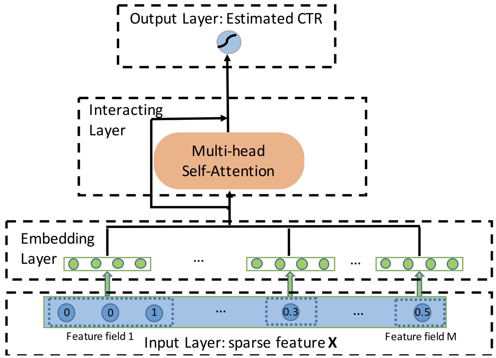

AutoInt
===========

Introduction
---------------------

`[paper] <https://dl.acm.org/doi/10.1145/3357384.3357925>`_

**Title:** AutoInt: Automatic Feature Interaction Learning via Self-Attentive Neural Networks

**Authors:** Weiping Song, Chence Shi, Zhiping Xiao, Zhijian Duan, Yewen Xu, Ming Zhang, Jian Tang

**Abstract:**  Click-through rate (CTR) prediction, which aims to predict the probability of a user clicking on an ad or an item, is critical to many online applications such as online advertising and recommender systems. The problem is very challenging since (1) the input features (e.g., the user id, user age, item id, item category) are usually sparse and high-dimensional, and (2) an effective prediction relies on high-order combinatorial features (a.k.a. cross features), which are very time-consuming to hand-craft by domain experts and are impossible to be enumerated. Therefore, there have been efforts in finding low-dimensional representations of the sparse and high-dimensional raw features and their meaningful combinations. In this paper, we propose an effective and efficient method called the AutoInt to automatically learn the high-order feature interactions of input features. Our proposed algorithm is very general, which can be applied to both numerical and categorical input features. Specifically, we map both the numerical and categorical features into the same low-dimensional space. Afterwards, a multi-head self-attentive neural network with residual connections is proposed to explicitly model the feature interactions in the low-dimensional space. With different layers of the multi-head self-attentive neural networks, different orders of feature combinations of input features can be modeled. The whole model can be efficiently fit on large-scale raw data in an end-to-end fashion. Experimental results on four real-world datasets show that our proposed approach not only outperforms existing state-of-the-art approaches for prediction but also offers good explainability.

Quick Start with RecBole
-------------------------

**Model Hyper-Parameters:**

- ``embedding_size (int)`` : The embedding size of features. Defaults to ``10``.
- ``attention_size (int)`` : The vector size in attention mechanism. Defaults to ``16``.
- ``n_layers (int)`` : The number of attention layers. Defaults to ``3``.
- ``num_heads (int)`` : The number of attention heads. Defaults to ``2``.
- ``dropout_probs (list of float)`` : The dropout rate of dropout layer. Defaults to ``[0.2,0.2,0.2]``.
- ``mlp_hidden_size (list of int)`` : The hidden size of MLP layers. Defaults to ``[128,128]``.

**A Running Example:**

Write the following code to a python file, such as `run.py`

.. code:: python

   from recbole.quick_start import run_recbole

   run_recbole(model='AutoInt', dataset='ml-100k')

And then:

.. code:: bash

   python run.py

Tuning Hyper Parameters
-------------------------

If you want to use ``HyperTuning`` to tune hyper parameters of this model, you can copy the following settings and name it as ``hyper.test``.

.. code:: bash

   learning_rate choice [0.01,0.005,0.001,0.0005,0.0001]
   dropout_prob choice [0.0,0.1,0.2,0.3,0.4,0.5]
   attention_size choice [8,16,32]
   mlp_hidden_size choice ['[64,64,64]','[128,128,128]','[256,256,256]','[64,64]','[128,128]','[256,256]','[512,512]']

Note that we just provide these hyper parameter ranges for reference only, and we can not guarantee that they are the optimal range of this model.

Then, with the source code of RecBole (you can download it from GitHub), you can run the ``run_hyper.py`` to tuning:

.. code:: bash

	python run_hyper.py --model=[model_name] --dataset=[dataset_name] --config_files=[config_files_path] --params_file=hyper.test

For more details about Parameter Tuning, refer to :doc:`../../../user_guide/usage/parameter_tuning`.

If you want to change parameters, dataset or evaluation settings, take a look at

- :doc:`../../../user_guide/config_settings`
- :doc:`../../../user_guide/data_intro`
- :doc:`../../../user_guide/train_eval_intro`
- :doc:`../../../user_guide/usage`
