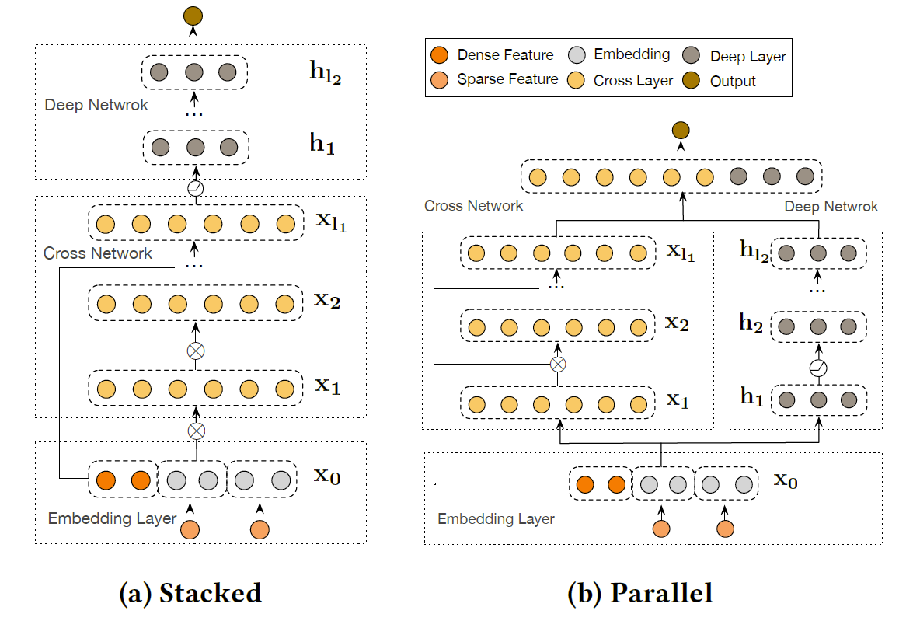

DCN V2
===========

Introduction
---------------------

`[paper] <https://dl.acm.org/doi/10.1145/3442381.3450078>`_

**Title:** DCN V2: Improved Deep & Cross Network and Practical Lessons
forWeb-scale Learning to Rank Systems

**Authors:** Ruoxi Wang, Rakesh Shivanna, Derek Z. Cheng, Sagar Jain, Dong Lin, Lichan Hong, Ed H. Chi

**Abstract:** Learning effective feature crosses is the key behind building recommender
systems. However, the sparse and large feature space requires
exhaustive search to identify effective crosses. Deep & Cross
Network (DCN) was proposed to automatically and efficiently learn
bounded-degree predictive feature interactions. Unfortunately, in
models that serve web-scale traffic with billions of training examples,
DCN showed limited expressiveness in its cross network at
learning more predictive feature interactions. Despite significant
research progress made, many deep learning models in production
still rely on traditional feed-forward neural networks to learn
feature crosses inefficiently.
In light of the pros/cons of DCN and existing feature interaction
learning approaches, we propose an improved framework DCN-V2
to make DCN more practical in large-scale industrial settings. In a
comprehensive experimental study with extensive hyper-parameter
search and model tuning, we observed that DCN-V2 approaches outperform
all the state-of-the-art algorithms on popular benchmark
datasets. The improved DCN-V2 is more expressive yet remains cost
efficient at feature interaction learning, especially when coupled
with a mixture of low-rank architecture. DCN-V2 is simple, can
be easily adopted as building blocks, and has delivered significant
offline accuracy and online business metrics gains across many
web-scale learning to rank systems at Google.

Quick Start with RecBole
-------------------------

**Model Hyper-Parameters:**

- ``mixed (bool)`` : The structure of cross network. Defaults to ``False``.
- ``structure (string)`` : The combination method between cross network and deep network. Defaults to ``stacked``.
- ``cross_layer_num (int)`` : The number of cross layers. Defaults to ``3``.
- ``expert_num (int)`` : The number of experts in mixed cross network. Defaults to ``4``.
- ``low_rank (int)`` : The embedding size of features. Defaults to ``128``.
- ``embedding_size (int)`` : The number of experts in mixed cross network. Defaults to ``16``.
- ``mlp_hidden_size (list of int)`` : The hidden size of deep network. Defaults to ``[768, 768]``.
- ``reg_weight (float)`` : The L2 regularization weight. Defaults to ``2``.
- ``dropout_prob (float)`` : The dropout rate. Defaults to ``0.2``.

**A Running Example:**

Write the following code to a python file, such as `run.py`

.. code:: python

   from recbole.quick_start import run_recbole

   run_recbole(model='DCNV2', dataset='ml-100k')

And then:

.. code:: bash

   python run.py

Tuning Hyper Parameters
-------------------------

If you want to use ``HyperTuning`` to tune hyper parameters of this model, you can copy the following settings and name it as ``hyper.test``.

.. code:: bash
   # structure = 'stacked', mixed = False
   learning_rate choice [0.01,0.005,0.001,0.0005,0.0001]
   mlp_hidden_size choice ['[256,256]','[512,512]','[768,768]','[1024, 1024]','[2048, 2048]']
   cross_layer_num choice [2,3,4,5]
   dropout_prob choice [0.0,0.1,0.2,0.3,0.4,0.5]
   reg_weight choice [0.1,1,2,5,10]

   # structure = 'stacked', mixed = True
   learning_rate choice [0.01 0.005,0.001,0.0005,0.0001]
   mlp_hidden_size choice ['[256,256]','[512,512]','[768,768]','[1024, 1024]','[2048, 2048]']
   cross_layer_num choice [2,3,4,5]
   expert_num choice [3,4,5]
   low_rank choice [64,128,256]
   dropout_prob choice [0.0,0.1,0.2,0.3,0.4,0.5]
   reg_weight choice [0.1,1,2,5,10]

Note that we just provide these hyper parameter ranges for reference only, and we can not guarantee that they are the optimal range of this model.

Then, with the source code of RecBole (you can download it from GitHub), you can run the ``run_hyper.py`` to tuning:

.. code:: bash

	python run_hyper.py --model=[model_name] --dataset=[dataset_name] --config_files=[config_files_path] --params_file=hyper.test

For more details about Parameter Tuning, refer to :doc:`../../../user_guide/usage/parameter_tuning`.

If you want to change parameters, dataset or evaluation settings, take a look at

- :doc:`../../../user_guide/config_settings`
- :doc:`../../../user_guide/data_intro`
- :doc:`../../../user_guide/train_eval_intro`
- :doc:`../../../user_guide/usage`