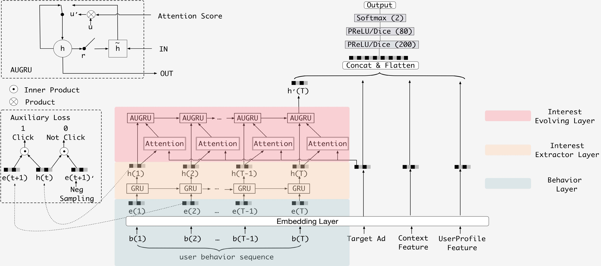

DIEN
===========

Introduction
---------------------

`[paper] <https://doi.org/10.1609/aaai.v33i01.33015941>`_

**Title:** Deep Interest Evolution Network for Click-Through Rate Prediction

**Authors:** Guorui Zhou, Na Mou, Ying Fan, Qi Pi, Weijie Bian,
Chang Zhou, Xiaoqiang Zhu, Kun Gai

**Abstract:** Click-through rate (CTR) prediction, whose goal is to estimate the probability of a user clicking on the item, 
has become one of the core tasks in the advertising system. For CTR prediction model, it is necessary to capture the latent
user interest behind the user behavior data. Besides, considering the changing of the external environment and the internal cognition, user interest evolves over time dynamically. There are several CTR prediction methods for interest modeling, while most of them regard the representation of behavior as the interest directly, and lack specially modeling for latent interest behind the concrete behavior. Moreover, little
work considers the changing trend of the interest. In this paper, we propose a novel model, named Deep Interest Evolution Network (DIEN), for CTR prediction. Specifically, we design interest extractor layer to capture temporal interests from history behavior sequence. At this layer, we introduce an auxiliary loss to supervise interest extracting at each step. As user interests are diverse, especially in the e-commerce
system, we propose interest evolving layer to capture interest evolving process that is relative to the target item. At interest evolving layer, attention mechanism is embedded into the sequential structure novelly, and the effects of relative interests are strengthened during interest evolution. In the experiments on both public and industrial datasets, DIEN significantly outperforms the state-of-the-art solutions. Notably,
DIEN has been deployed in the display advertisement system of Taobao, and obtained 20.7% improvement on CTR.

Quick Start with RecBole
-------------------------

**Model Hyper-Parameters:**

- ``embedding_size (int)`` : The embedding size of features. Defaults to ``10``.
- ``mlp_hidden_size (list of int)`` : The hidden size of MLP layers. Defaults to ``[256,256,256]``.
- ``dropout_prob (float)`` : The dropout rate. Defaults to ``0.0``.
- ``pooling_mode (str)`` : Pooling mode of sequence data. Defaults to ``'mean'``. Range in ``['max', 'mean', 'sum']``.
- ``gru_type (str)``: GRU type of Interest Evolving Layer. Defaults to ``'AUGRU'``. Range in ``['AGRU', 'AIGRU', 'AUGRU']``.
- ``alpha (float)``: The hyper-parameter which balances the interest representation and CTR prediction. Defaults to ``1.0``.

**A Running Example:**

Write the following code to a python file, such as `run.py`

.. code:: python

   from recbole.quick_start import run_recbole

   run_recbole(model='DIEN', dataset='ml-100k')

And then:

.. code:: bash

   python run.py

Tuning Hyper Parameters
-------------------------

If you want to use ``HyperTuning`` to tune hyper parameters of this model, you can copy the following settings and name it as ``hyper.test``.

.. code:: bash

   learning_rate choice [0.01 0.005,0.001,0.0005,0.0001]
   mlp_hidden_size choice ['[128,128,128]','[256,256,256]']
   dropout_prob choice [0.0,0.1,0.2,0.3,0.4,0.5]
   pooling_mode choice ['mean','max','sum']
   gru_type choice ['AGRU','AIGRU','AUGRU']
   alpha choice [0.5,1.0]

Note that we just provide these hyper parameter ranges for reference only, and we can not guarantee that they are the optimal range of this model.

Then, with the source code of RecBole (you can download it from GitHub), you can run the ``run_hyper.py`` to tuning:

.. code:: bash

	python run_hyper.py --model=[model_name] --dataset=[dataset_name] --config_files=[config_files_path] --params_file=hyper.test

For more details about Parameter Tuning, refer to :doc:`../../../user_guide/usage/parameter_tuning`.

If you want to change parameters, dataset or evaluation settings, take a look at

- :doc:`../../../user_guide/config_settings`
- :doc:`../../../user_guide/data_intro`
- :doc:`../../../user_guide/train_eval_intro`
- :doc:`../../../user_guide/usage`