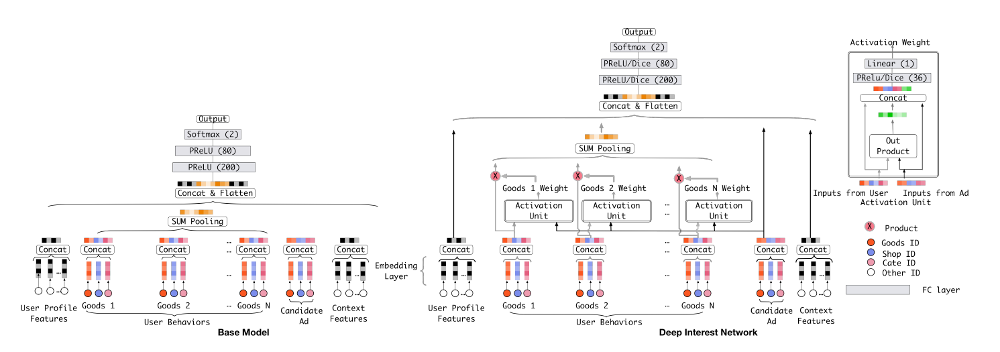

DIN
===========

Introduction
---------------------

`[paper] <https://dl.acm.org/doi/10.1145/3219819.3219823>`_

**Title:** Deep Interest Network for Click-Through Rate Prediction

**Authors:** Guorui Zhou, Chengru Song, Xiaoqiang Zhu, Ying Fan, Han Zhu, Xiao Ma,
Yanghui Yan, Junqi Jin, Han Li, Kun Gai

**Abstract:** Click-through rate prediction is an essential task in industrial
applications, such as online advertising. Recently deep learning
based models have been proposed, which follow a similar Embedding&MLP 
paradigm. In these methods large scale sparse input
features are first mapped into low dimensional embedding vectors,
and then transformed into fixed-length vectors in a group-wise
manner, finally concatenated together to fed into a multilayer perceptron
(MLP) to learn the nonlinear relations among features. In
this way, user features are compressed into a fixed-length representation
vector, in regardless of what candidate ads are. The use
of fixed-length vector will be a bottleneck, which brings difficulty
for Embedding&MLP methods to capture user’s diverse interests
effectively from rich historical behaviors. In this paper, we propose
a novel model: Deep Interest Network (DIN) which tackles this challenge
by designing a local activation unit to adaptively learn the
representation of user interests from historical behaviors with respect
to a certain ad. This representation vector varies over different
ads, improving the expressive ability of model greatly. Besides, we
develop two techniques: mini-batch aware regularization and data
adaptive activation function which can help training industrial deep
networks with hundreds of millions of parameters. Experiments on
two public datasets as well as an Alibaba real production dataset
with over 2 billion samples demonstrate the effectiveness of proposed
approaches, which achieve superior performance compared
with state-of-the-art methods. DIN now has been successfully deployed
in the online display advertising system in Alibaba, serving
the main traffic.

Quick Start with RecBole
-------------------------

**Model Hyper-Parameters:**

- ``embedding_size (int)`` : The embedding size of features. Defaults to ``10``.
- ``mlp_hidden_size (list of int)`` : The hidden size of MLP layers. Defaults to ``[256,256,256]``.
- ``dropout_prob (float)`` : The dropout rate. Defaults to ``0.0``.
- ``pooling_mode (str)`` : Pooling mode of sequence data. Defaults to ``'mean'``. Range in ``['max', 'mean', 'sum']``.

**A Running Example:**

Write the following code to a python file, such as `run.py`

.. code:: python

   from recbole.quick_start import run_recbole

   run_recbole(model='DIN', dataset='ml-100k')

And then:

.. code:: bash

   python run.py

Tuning Hyper Parameters
-------------------------

If you want to use ``HyperTuning`` to tune hyper parameters of this model, you can copy the following settings and name it as ``hyper.test``.

.. code:: bash

   learning_rate choice [0.01,0.005,0.001,0.0005,0.0001]
   dropout_prob choice [0.0,0.1,0.2,0.3,0.4,0.5]
   mlp_hidden_size choice ['[64,64,64]','[128,128,128]','[256,256,256]','[512,512,512]']
   pooling_mode choice ['mean','max','sum']

Note that we just provide these hyper parameter ranges for reference only, and we can not guarantee that they are the optimal range of this model.

Then, with the source code of RecBole (you can download it from GitHub), you can run the ``run_hyper.py`` to tuning:

.. code:: bash

	python run_hyper.py --model=[model_name] --dataset=[dataset_name] --config_files=[config_files_path] --params_file=hyper.test

For more details about Parameter Tuning, refer to :doc:`../../../user_guide/usage/parameter_tuning`.

If you want to change parameters, dataset or evaluation settings, take a look at

- :doc:`../../../user_guide/config_settings`
- :doc:`../../../user_guide/data_intro`
- :doc:`../../../user_guide/train_eval_intro`
- :doc:`../../../user_guide/usage`