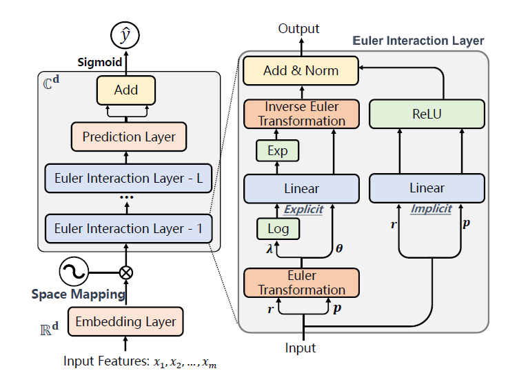

EulerNet
===========

Introduction
---------------------

`[paper] <https://dl.acm.org/doi/10.1145/3539618.3591681>`_

**Title:** EulerNet: Adaptive Feature Interaction Learning via Euler's Formula for CTR Prediction

**Authors:** Zhen Tian, Ting Bai, Wayne Xin Zhao, Ji-Rong Wen, Zhao Cao

**Abstract:**  Learning effective high-order feature interactions is very crucial in the CTR prediction task. However, it is very time-consuming to calculate high-order feature interactions with massive features in online e-commerce platforms. Most existing methods manually design a maximal order and further filter out the useless interactions from them. Although they reduce the high computational costs caused by the exponential growth of high-order feature combinations, they still suffer from the degradation of model capability due to the suboptimal learning of the restricted feature orders. The solution to maintain the model capability and meanwhile keep it efficient is a technical challenge, which has not been adequately addressed. To address this issue, we propose an adaptive feature interaction learning model, named as EulerNet, in which the feature interactions are learned in a complex vector space by conducting space mapping according to Euler's formula. EulerNet converts the exponential powers of feature interactions into simple linear combinations of the modulus and phase of the complex features, making it possible to adaptively learn the high-order feature interactions in an efficient way. Furthermore, EulerNet incorporates the implicit and explicit feature interactions into a unified architecture, which achieves the mutual enhancement and largely boosts the model capabilities. Such a network can be fully learned from data, with no need of pre-designed form or order for feature interactions. Extensive experiments conducted on three public datasets have demonstrated the effectiveness and efficiency of our approach. 

Quick Start with RecBole
-------------------------

**Model Hyper-Parameters:**

- ``embedding_size (int)`` : The embedding size of features. Defaults to ``16``.
- ``order_list (list)`` : The order vectors of EulerNet.Defaults to ``[30]``.
- ``drop_ex (float)`` : The dropout rate for the modulus and phase. Defaults to ``0.3``.
- ``drop_im (float)`` : The dropout rate for the real and imaginary part. Defaults to ``0.3``.
- ``apply_norm (bool)`` : Whether perform the layer norm. Defaults to ``False``.
- ``reg_weight (float)`` : The L2 regularization weight. Defaults to ``1e-5``.

**A Running Example:**

Write the following code to a python file, such as `run.py`

.. code:: python

   from recbole.quick_start import run_recbole

   run_recbole(model='EulerNet', dataset='ml-100k')

And then:

.. code:: bash

   python run.py

Tuning Hyper Parameters
-------------------------

If you want to use ``HyperTuning`` to tune hyper parameters of this model, you can copy the following settings and name it as ``hyper.test``.

.. code:: bash

    learning_rate choice [1e-3,1e-4,1e-5]
    reg_weight choice [1e-3,1e-5,1e-7]
    order_list choice [7,10,20,30]
    drop_ex choice [0.,0.1,0.2,0.3]
    drop_im choice [0.,0.1,0.2,0.3]
    apply_norm choice [True,False]

Note that we just provide these hyper parameter ranges for reference only, and we can not guarantee that they are the optimal range of this model.

Then, with the source code of RecBole (you can download it from GitHub), you can run the ``run_hyper.py`` to tuning:

.. code:: bash

	python run_hyper.py --model=[model_name] --dataset=[dataset_name] --config_files=[config_files_path] --params_file=hyper.test

For more details about Parameter Tuning, refer to :doc:`../../../user_guide/usage/parameter_tuning`.

If you want to change parameters, dataset or evaluation settings, take a look at

- :doc:`../../../user_guide/config_settings`
- :doc:`../../../user_guide/data_intro`
- :doc:`../../../user_guide/train_eval_intro`
- :doc:`../../../user_guide/usage`

