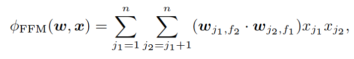

FFM
===========

Introduction
---------------------

`[paper] <https://dl.acm.org/doi/10.1145/2959100.2959134>`_

**Title:** Field-aware Factorization Machines for CTR Prediction

**Authors:** Yuchin Juan, Yong Zhuang, Wei-Sheng Chin, Chih-Jen Lin

**Abstract:**  Click-through rate (CTR) prediction plays an important role in computational advertising. Models based on degree-2 polynomial mappings and factorization machines (FMs) are widely used for this task. Recently, a variant of FMs, field-aware factorization machines (FFMs), outperforms existing models in some world-wide CTR-prediction competitions. Based on our experiences in winning two of them, in this paper we establish FFMs as an effective method for classifying large sparse data including those from CTR prediction. First, we propose efficient implementations for training FFMs. Then we comprehensively analyze FFMs and compare this approach with competing models. Experiments show that FFMs are very useful for certain classification problems. Finally, we have released a package of FFMs for public use.

Quick Start with RecBole
-------------------------

**Model Hyper-Parameters:**

- ``embedding_size (int)`` : The embedding size of features. Defaults to ``10``.
- ``fields (dict or None)`` : This parameter defines the mapping from fields to features, key is field's id, value is a list of features in this field. For example, in ml-100k dataset, it can be set as ``{0: ['user_id','age'], 1: ['item_id', 'class']}``. If it is set to ``None``, the features and the fields are corresponding one-to-one. Defaults to ``None``.

**A Running Example:**

Write the following code to a python file, such as `run.py`

.. code:: python

   from recbole.quick_start import run_recbole

   run_recbole(model='FFM', dataset='ml-100k')

And then:

.. code:: bash

   python run.py

**Notes:**

- The features defined in ``fields`` must be in the dataset and be loaded by data module in RecBole. It means the value in ``fields`` must appear in ``load_col``.

Tuning Hyper Parameters
-------------------------

If you want to use ``HyperTuning`` to tune hyper parameters of this model, you can copy the following settings and name it as ``hyper.test``.

.. code:: bash

   learning_rate choice [0.01,0.005,0.001,0.0005,0.0001]
   
Note that we just provide these hyper parameter ranges for reference only, and we can not guarantee that they are the optimal range of this model.

Then, with the source code of RecBole (you can download it from GitHub), you can run the ``run_hyper.py`` to tuning:

.. code:: bash

	python run_hyper.py --model=[model_name] --dataset=[dataset_name] --config_files=[config_files_path] --params_file=hyper.test

For more details about Parameter Tuning, refer to :doc:`../../../user_guide/usage/parameter_tuning`.

If you want to change parameters, dataset or evaluation settings, take a look at

- :doc:`../../../user_guide/config_settings`
- :doc:`../../../user_guide/data_intro`
- :doc:`../../../user_guide/train_eval_intro`
- :doc:`../../../user_guide/usage`

