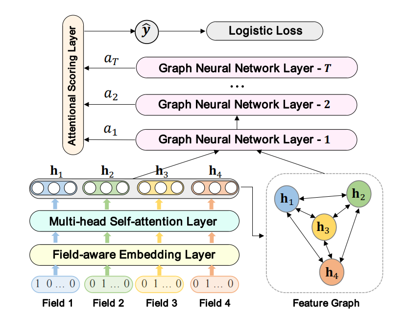

FiGNN
===========

Introduction
---------------------

`[paper] <https://dl.acm.org/doi/10.1145/3357384.3357951>`_

**Title:** Fi-GNN: Modeling Feature Interactions via Graph Neural Networks for CTR Prediction

**Authors:** Zekun Li, Zeyu Cui, Shu Wu, Xiaoyu Zhang, Liang Wang

**Abstract:**  Click-through rate (CTR) prediction is an essential task in web applications such as online advertising and recommender systems, whose features are usually in multi-field form. The key of this task is to model feature interactions among different feature fields. Recently proposed deep learning based models follow a general paradigm: raw sparse input multi-field features are first mapped into dense field embedding vectors, and then simply concatenated together to feed into deep neural networks (DNN) or other specifically designed networks to learn high-order feature interactions. However, the simple unstructured combination of feature fields will inevitably limit the capability to model sophisticated interactions among different fields in a sufficiently flexible and explicit fashion. In this work, we propose to represent the multi-field features in a graph structure intuitively, where each node corresponds to a feature field and different fields can interact through edges. The task of modeling feature interactions can be thus converted to modeling node interactions on the corresponding graph. To this end, we design a novel model Feature Interaction Graph Neural Networks (Fi-GNN). Taking advantage of the strong representative power of graphs, our proposed model can not only model sophisticated feature interactions in a flexible and explicit fashion, but also provide good model explanations for CTR prediction. Experimental results on two real-world datasets show its superiority over the state-of-the-arts.

Quick Start with RecBole
-------------------------

**Model Hyper-Parameters:**

- ``embedding_size (int)`` : The embedding size of features. Defaults to ``10``.
- ``attention_size (int)`` : The vector size in attention mechanism. Defaults to ``16``.
- ``n_layers (int)`` : The number of layers. Defaults to ``2``.
- ``num_heads (int)`` : The number of attention heads. Defaults to ``2``.
- ``hidden_dropout_prob (float)`` : The dropout rate of the hidden layer. Defaults to ``0.2``.
- ``attn_dropout_prob (float)`` : (float) The dropout rate of the multi-head self-attention layer. Defaults to ``0.2``.

**A Running Example:**

Write the following code to a python file, such as `run.py`

.. code:: python

   from recbole.quick_start import run_recbole

   run_recbole(model='FiGNN', dataset='ml-100k')

And then:

.. code:: bash

   python run.py

Tuning Hyper Parameters
-------------------------

If you want to use ``HyperTuning`` to tune hyper parameters of this model, you can copy the following settings and name it as ``hyper.test``.

.. code:: bash

   learning_rate choice [0.01,0.005,0.001,0.0005,0.0001]
   hidden_dropout_prob choice [0.0,0.1,0.2,0.3,0.4,0.5]
   attn_dropout_prob choice [0.0,0.1,0.2,0.3,0.4,0.5]
   attention_size choice [8,16,32]
   n_layers choice [2,3,4]

Note that we just provide these hyper parameter ranges for reference only, and we can not guarantee that they are the optimal range of this model.

Then, with the source code of RecBole (you can download it from GitHub), you can run the ``run_hyper.py`` to tuning:

.. code:: bash

	python run_hyper.py --model=[model_name] --dataset=[dataset_name] --config_files=[config_files_path] --params_file=hyper.test

For more details about Parameter Tuning, refer to :doc:`../../../user_guide/usage/parameter_tuning`.

If you want to change parameters, dataset or evaluation settings, take a look at

- :doc:`../../../user_guide/config_settings`
- :doc:`../../../user_guide/data_intro`
- :doc:`../../../user_guide/train_eval_intro`
- :doc:`../../../user_guide/usage`