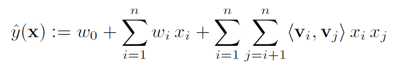

FM
===========

Introduction
---------------------

`[paper] <https://ieeexplore.ieee.org/abstract/document/5694074/>`_

**Title:** Factorization Machines

**Authors:** Steffen Rendle

**Abstract:**  In this paper, we introduce Factorization Machines (FM) which are a new model class that combines the advantages of Support Vector Machines (SVM) with factorization models. Like SVMs, FMs are a general predictor working with any real valued feature vector. In contrast to SVMs, FMs model all interactions between variables using factorized parameters. Thus they are able to estimate interactions even in problems with huge sparsity (like recommender systems) where SVMs fail. We show that the model equation of FMs can be calculated in linear time and thus FMs can be optimized directly. So unlike nonlinear SVMs, a transformation in the dual form is not necessary and the model parameters can be estimated directly without the need of any support vector in the solution. We show the relationship to SVMs and the advantages of FMs for parameter estimation in sparse settings. On the other hand there are many different factorization models like matrix factorization, parallel factor analysis or specialized models like SVD++, PITF or FPMC. The drawback of these models is that they are not applicable for general prediction tasks but work only with special input data. Furthermore their model equations and optimization algorithms are derived individually for each task. We show that FMs can mimic these models just by specifying the input data (i.e. the feature vectors). This makes FMs easily applicable even for users without expert knowledge in factorization models.

Quick Start with RecBole
-------------------------

**Model Hyper-Parameters:**

- ``embedding_size (int)`` : The embedding size of features. Defaults to ``10``.

**A Running Example:**

Write the following code to a python file, such as `run.py`

.. code:: python

   from recbole.quick_start import run_recbole

   run_recbole(model='FM', dataset='ml-100k')

And then:

.. code:: bash

   python run.py

Tuning Hyper Parameters
-------------------------

If you want to use ``HyperTuning`` to tune hyper parameters of this model, you can copy the following settings and name it as ``hyper.test``.

.. code:: bash

   learning_rate choice [0.01,0.005,0.001,0.0005,0.0001]
   
Note that we just provide these hyper parameter ranges for reference only, and we can not guarantee that they are the optimal range of this model.

Then, with the source code of RecBole (you can download it from GitHub), you can run the ``run_hyper.py`` to tuning:

.. code:: bash

	python run_hyper.py --model=[model_name] --dataset=[dataset_name] --config_files=[config_files_path] --params_file=hyper.test

For more details about Parameter Tuning, refer to :doc:`../../../user_guide/usage/parameter_tuning`.

If you want to change parameters, dataset or evaluation settings, take a look at

- :doc:`../../../user_guide/config_settings`
- :doc:`../../../user_guide/data_intro`
- :doc:`../../../user_guide/train_eval_intro`
- :doc:`../../../user_guide/usage`
