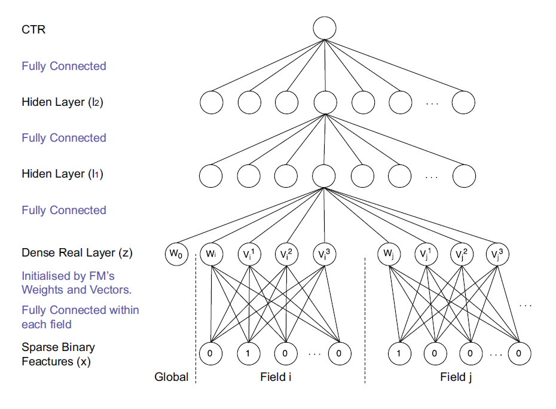

FNN
===========

Introduction
---------------------

`[paper] <https://link.springer.com/chapter/10.1007/978-3-319-30671-1_4>`_

**Title:** Deep Learning over Multi-field Categorical Data

**Authors:** Weinan Zhang, Tianming Du, and Jun Wang

**Abstract:**  Predicting user responses, such as click-through rate and conversion rate, are critical in many web applications including web search, personalised recommendation, and online advertising. Different from continuous raw features that we usually found in the image and audio domains, the input features in web space are always of multi-field and are mostly discrete and categorical while their dependencies are little known. Major user response prediction models have to either limit themselves to linear models or require manually building up high-order combination features. The former loses the ability of exploring feature interactions, while the latter results in a heavy computation in the large feature space. To tackle the issue, we propose two novel models using deep neural networks (DNNs) to automatically learn effective patterns from categorical feature interactions and make predictions of users’ ad clicks. To get our DNNs efficiently work, we propose to leverage three feature transformation methods, i.e., factorisation machines (FMs), restricted Boltzmann machines (RBMs) and denoising auto-encoders (DAEs). This paper presents the structure of our models and their efficient training algorithms. The large-scale experiments with real-world data demonstrate that our methods work better than major state-of-the-art models.

Quick Start with RecBole
-------------------------

**Model Hyper-Parameters:**

- ``embedding_size (int)`` : The embedding size of features. Defaults to ``10``.
- ``mlp_hidden_size (list of int)`` : The hidden size of MLP layers. Defaults to ``[256,256,256]``.
- ``dropout_prob (float)`` : The dropout rate. Defaults to ``0.2``.

**A Running Example:**

Write the following code to a python file, such as `run.py`

.. code:: python

   from recbole.quick_start import run_recbole

   run_recbole(model='FNN', dataset='ml-100k')

And then:

.. code:: bash

   python run.py

Tuning Hyper Parameters
-------------------------

If you want to use ``HyperTuning`` to tune hyper parameters of this model, you can copy the following settings and name it as ``hyper.test``.

.. code:: bash

   learning_rate choice [0.01,0.005,0.001,0.0005,0.0001]
   dropout_prob choice [0.0,0.1,0.2,0.3,0.4,0.5]
   mlp_hidden_size in ['[128,256,128]','[128,128,128]','[64,128,64]','[256,256,256]']
   
Note that we just provide these hyper parameter ranges for reference only, and we can not guarantee that they are the optimal range of this model.

Then, with the source code of RecBole (you can download it from GitHub), you can run the ``run_hyper.py`` to tuning:

.. code:: bash

	python run_hyper.py --model=[model_name] --dataset=[dataset_name] --config_files=[config_files_path] --params_file=hyper.test

For more details about Parameter Tuning, refer to :doc:`../../../user_guide/usage/parameter_tuning`.

If you want to change parameters, dataset or evaluation settings, take a look at

- :doc:`../../../user_guide/config_settings`
- :doc:`../../../user_guide/data_intro`
- :doc:`../../../user_guide/train_eval_intro`
- :doc:`../../../user_guide/usage`