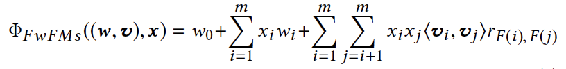

FwFM
===========

Introduction
---------------------

`[paper] <https://dl.acm.org/doi/10.1145/3178876.3186040>`_

**Title:** Field-weighted Factorization Machines for Click-Through Rate Prediction in Display Advertising

**Authors:** Junwei Pan, Jian Xu, Alfonso Lobos Ruiz, Wenliang Zhao, Shengjun Pan, Yu Sun, Quan Lu

**Abstract:**  Click-through rate (CTR) prediction is a critical task in online display advertising. The data involved in CTR prediction are typically multi-field categorical data, i.e., every feature is categorical and belongs to one and only one field. One of the interesting characteristics of such data is that features from one field often interact differently with features from different other fields. Recently, Field-aware Factorization Machines (FFMs) have been among the best performing models for CTR prediction by explicitly modeling such difference. However, the number of parameters in FFMs is in the order of feature number times field number, which is unacceptable in the real-world production systems. In this paper, we propose Field-weighted Factorization Machines (FwFMs) to model the different feature interactions between different fields in a much more memory-efficient way. Our experimental evaluations show that FwFMs can achieve competitive prediction performance with only as few as 4% parameters of FFMs. When using the same number of parameters, FwFMs can bring 0.92% and 0.47% AUC lift over FFMs on two real CTR prediction data sets.

Quick Start with RecBole
-------------------------

**Model Hyper-Parameters:**

- ``embedding_size (int)`` : The embedding size of features. Defaults to ``10``.
- ``dropout_prob (float)`` : The dropout rate. Defaults to ``0.0``.
- ``fields (dict) or None`` : This parameter defines the mapping from fields to features, key is field's id, value is a list of features in this field. For example, in ml-100k dataset, it can be set as ``{0: ['user_id','age'], 1: ['item_id', 'class']}``. If it is set to ``None``, the features and the fields are corresponding one-to-one. Defaults to ``None``.

**A Running Example:**

Write the following code to a python file, such as `run.py`

.. code:: python

   from recbole.quick_start import run_recbole

   run_recbole(model='FwFM', dataset='ml-100k')

And then:

.. code:: bash

   python run.py

**Notes:**

- The features defined in ``fields`` must be in the dataset and be loaded by data module in RecBole. It means the value in ``fields`` must appear in ``load_col``.

Tuning Hyper Parameters
-------------------------

If you want to use ``HyperTuning`` to tune hyper parameters of this model, you can copy the following settings and name it as ``hyper.test``.

.. code:: bash

   learning_rate choice [0.01,0.005,0.001,0.0005,0.0001]
   dropout_prob choice [0.0,0.1,0.2,0.3,0.4,0.5]
   
Note that we just provide these hyper parameter ranges for reference only, and we can not guarantee that they are the optimal range of this model.

Then, with the source code of RecBole (you can download it from GitHub), you can run the ``run_hyper.py`` to tuning:

.. code:: bash

	python run_hyper.py --model=[model_name] --dataset=[dataset_name] --config_files=[config_files_path] --params_file=hyper.test

For more details about Parameter Tuning, refer to :doc:`../../../user_guide/usage/parameter_tuning`.

If you want to change parameters, dataset or evaluation settings, take a look at

- :doc:`../../../user_guide/config_settings`
- :doc:`../../../user_guide/data_intro`
- :doc:`../../../user_guide/train_eval_intro`
- :doc:`../../../user_guide/usage`

