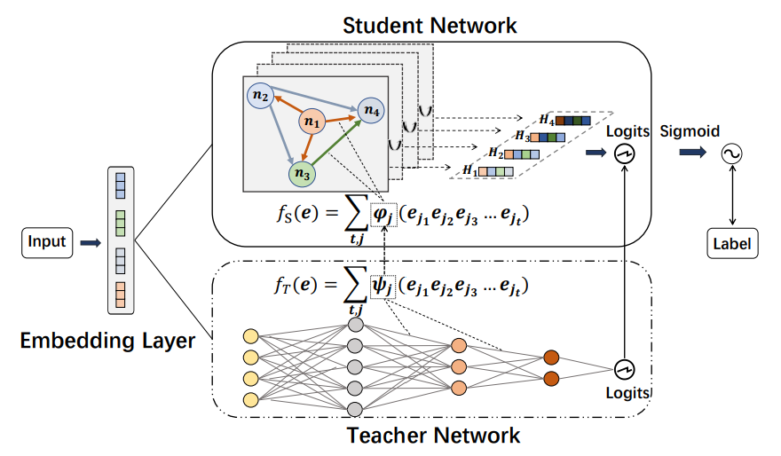

KD_DAGFM
===========

Introduction
---------------------

`[paper] <https://arxiv.org/abs/2211.11159>`_

**Title:** Directed Acyclic Graph Factorization Machines for CTR Prediction via Knowledge Distillation

**Authors:** Zhen Tian, Ting Bai, Zibin Zhang, Zhiyuan Xu, Kangyi Lin, Ji-Rong Wen, Wayne Xin Zhao

**Abstract:** With the growth of high-dimensional sparse data in web-scale recommender systems, 
the computational cost to learn high-order feature interaction in CTR prediction task largely increases, 
which limits the use of high-order interaction models in real industrial applications. 
Some recent knowledge distillation based methods transfer knowledge from complex teacher models 
to shallow student models for accelerating the online model inference. However, they suffer from 
the degradation of model accuracy in knowledge distillation process. It is challenging to balance the 
efficiency and effectiveness of the shallow student models. To address this problem, we propose a 
Directed Acyclic Graph Factorization Machine (KD-DAGFM) to learn the high-order feature interactions 
from existing complex interaction models for CTR prediction via Knowledge Distillation. The proposed 
lightweight student model DAGFM can learn arbitrary explicit feature interactions from teacher networks, 
which achieves approximately lossless performance and is proved by a dynamic programming algorithm. 
Besides, an improved general model KD-DAGFM+ is shown to be effective in distilling both explicit and 
implicit feature interactions from any complex teacher model. Extensive experiments are conducted on 
four real-world datasets, including a large-scale industrial dataset from WeChat platform with billions 
of feature dimensions. KD-DAGFM achieves the best performance with less than 21.5% FLOPs of the state-of-the-art
method on both online and offline experiments, showing the superiority of DAGFM to deal with the industrial 
scale data in CTR prediction task.

Quick Start with RecBole
-------------------------

**Model Hyper-Parameters:**

- ``teacher (str)`` : The name of teacher network. Defaults to ``'CrossNet'``.
- ``phase (str)`` : Range in ['teacher_training, 'distillation', 'finetuning']. Defaults to ``'teacher_training'``.
- ``type (str)`` : The type of interaction learning function in student network. Defaults to ``'outer'``.
- ``embedding_size (int)`` : The embedding size of features. Defaults to ``16``.
- ``t_depth (int)`` : The depth of teacher network. Defaults to ``3``.
- ``depth (int)`` : The depth of student network. Defaults to ``3``.
- ``alpha (float)`` : The hyperparameter of the weight of KD loss. Defaults to ``0.1``.
- ``beta (float)`` : The hyperparameter of the weight of CTR loss. Defaults to ``921.6``.
- ``warm_up (str)`` : The path of teacher model or student model. Defaults to ``''``.
- ``t_cin (list of int)`` : The parameter for teacher network CIN. Defaults to ``[200, 200, 200]``.

**A Running Example:**

1. Run teacher_training. Write the following code to `run_teacher_training.py`

.. code:: python

   from recbole.quick_start import run_recbole

   config_dict = {
       'phase': 'teacher_training',
   }
   run_recbole(model='KD_DAGFM', dataset='ml-100k', 
        config_dict=config_dict)

And then:

.. code:: bash

   python run_teacher_training.py

2. Run distillation. Write the following code to `run_distillation.py`

.. code:: python

   from recbole.quick_start import run_recbole

   config_dict = {
       'phase': 'distillation',
       'warm_up': './saved/<saved path of teacher model>',
   }
   run_recbole(model='KD_DAGFM', dataset='ml-100k', 
        config_dict=config_dict)

And then:

.. code:: bash

   python run_distillation.py

3. Run finetuning. Write the following code to `run_finetuning.py`

.. code:: python

   from recbole.quick_start import run_recbole

   config_dict = {
       'phase': 'finetuning',
       'warm_up': './saved/<saved path of student model>',
   }
   run_recbole(model='KD_DAGFM', dataset='ml-100k', 
        config_dict=config_dict)

And then:

.. code:: bash

   python run_finetuning.py

**Notes:**
- Each model trained would be saved , named as ``[model_name]-[trained_time].pth`` and saved to ``./saved/``.

- In the distillation and finetuning stage, please make sure that the warm_up is existed.

Tuning Hyper Parameters
-------------------------

If you want to use ``HyperTuning`` to tune hyper parameters of this model, you can copy the following settings and name it as ``hyper.test``.

.. code:: bash

   learning_rate choice [0.01,0.005,0.001,0.0005,0.0001]
   embedding_size choice [16, 32, 64]
   train_batch_size choice [512,1024,2048]
   alpha choice [0.1, 1, 10]
   beta choice [10, 100, 1000]

Note that we just provide these hyper parameter ranges for reference only, and we can not guarantee that they are the optimal range of this model.

Then, with the source code of RecBole (you can download it from GitHub), you can run the ``run_hyper.py`` to tuning:

.. code:: bash

	python run_hyper.py --model=[model_name] --dataset=[dataset_name] --config_files=[config_files_path] --params_file=hyper.test

For more details about Parameter Tuning, refer to :doc:`../../../user_guide/usage/parameter_tuning`.

If you want to change parameters, dataset or evaluation settings, take a look at

- :doc:`../../../user_guide/config_settings`
- :doc:`../../../user_guide/data_intro`
- :doc:`../../../user_guide/train_eval_intro`
- :doc:`../../../user_guide/usage`