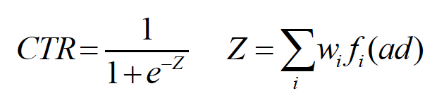

LR
===========

Introduction
---------------------

`[paper] <https://dl.acm.org/doi/10.1145/1242572.1242643>`_

**Title:** Predicting Clicks Estimating the Click-Through Rate for New Ads

**Authors:** Matthew Richardson, Ewa Dominowska, Robert Ragno

**Abstract:**  Search engine advertising has become a significant element of the Web browsing experience. Choosing the right ads for the query and the order in which they are displayed greatly affects the probability that a user will see and click on each ad. This ranking has a strong impact on the revenue the search engine receives from the ads. Further, showing the user an ad that they prefer to click on improves user satisfaction. For these reasons, it is important to be able to accurately estimate the click-through rate of ads in the system. For ads that have been displayed repeatedly, this is empirically measurable, but for new ads, other means must be used. We show that we can use features of ads, terms, and advertisers to learn a model that accurately predicts the click-though rate for new ads. We also show that using our model improves the convergence and performance of an advertising system. As a result, our model increases both revenue and user satisfaction.

Quick Start with RecBole
-------------------------

**Model Hyper-Parameters:**

- ``embedding_size (int)`` : The embedding size of features. Defaults to ``10``.

**A Running Example:**

Write the following code to a python file, such as `run.py`

.. code:: python

   from recbole.quick_start import run_recbole

   run_recbole(model='LR', dataset='ml-100k')

And then:

.. code:: bash

   python run.py

Tuning Hyper Parameters
-------------------------

If you want to use ``HyperTuning`` to tune hyper parameters of this model, you can copy the following settings and name it as ``hyper.test``.

.. code:: bash

   learning_rate choice [0.01,0.005,0.001,0.0005,0.0001]
   
Note that we just provide these hyper parameter ranges for reference only, and we can not guarantee that they are the optimal range of this model.

Then, with the source code of RecBole (you can download it from GitHub), you can run the ``run_hyper.py`` to tuning:

.. code:: bash

	python run_hyper.py --model=[model_name] --dataset=[dataset_name] --config_files=[config_files_path] --params_file=hyper.test

For more details about Parameter Tuning, refer to :doc:`../../../user_guide/usage/parameter_tuning`.

If you want to change parameters, dataset or evaluation settings, take a look at

- :doc:`../../../user_guide/config_settings`
- :doc:`../../../user_guide/data_intro`
- :doc:`../../../user_guide/train_eval_intro`
- :doc:`../../../user_guide/usage`
