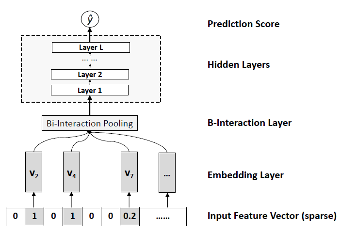

NFM
===========

Introduction
---------------------

`[paper] <https://dl.acm.org/doi/abs/10.1145/3077136.3080777>`_

**Title:** Neural Factorization Machines for Sparse Predictive Analytics

**Authors:** Xiangnan He, Tat-Seng Chua

**Abstract:**  Many predictive tasks of web applications need to model categorical variables, such as user IDs and demographics like genders and occupations. To apply standard machine learning techniques, these categorical predictors are always converted to a set of binary features via one-hot encoding, making the resultant feature vector highly sparse. To learn from such sparse data effectively, it is crucial to account for the interactions between features.

*Factorization Machines* (FMs) are a popular solution for efficiently using the second-order feature interactions. However, FM models feature interactions in a linear way, which can be insufficient for capturing the non-linear and complex inherent structure of real-world data. While deep neural networks have recently been applied to learn non-linear feature interactions in industry, such as the *Wide&Deep* by Google and *DeepCross* by Microsoft, the deep structure meanwhile makes them difficult to train.

In this paper, we propose a novel model *Neural Factorization Machine* (NFM) for prediction under sparse settings. NFM seamlessly combines the linearity of FM in modelling second-order feature interactions and the non-linearity of neural network in modelling higher-order feature interactions. Conceptually, NFM is more expressive than FM since FM can be seen as a special case of NFM without hidden layers. Empirical results on two regression tasks show that with one hidden layer only, NFM significantly outperforms FM with a 7.3% relative improvement. Compared to the recent deep learning methods Wide&Deep and DeepCross, our NFM uses a shallower structure but offers better performance, being much easier to train and tune in practice.

Quick Start with RecBole
-------------------------

**Model Hyper-Parameters:**

- ``embedding_size (int)`` : The embedding size of features. Defaults to ``10``.
- ``mlp_hidden_size (list of int)`` : The hidden size of MLP layers. Defaults to ``[64, 64, 64]``.
- ``dropout_prob (float)`` : The dropout rate. Defaults to ``0.0``.

**A Running Example:**

Write the following code to a python file, such as `run.py`

.. code:: python

   from recbole.quick_start import run_recbole

   run_recbole(model='NFM', dataset='ml-100k')

And then:

.. code:: bash

   python run.py

Tuning Hyper Parameters
-------------------------

If you want to use ``HyperTuning`` to tune hyper parameters of this model, you can copy the following settings and name it as ``hyper.test``.

.. code::

   learning_rate choice [0.01,0.005,0.001,0.0005,0.0001]
   dropout_prob choice [0.0,0.1,0.2,0.3,0.4,0.5]
   mlp_hidden_size choice ['[10,10]','[20,20]','[30,30]','[40,40]','[50,50]',[20,20,20]','[30,30,30]','[40,40,40]','[50,50,50]']
   
Note that we just provide these hyper parameter ranges for reference only, and we can not guarantee that they are the optimal range of this model.

Then, with the source code of RecBole (you can download it from GitHub), you can run the ``run_hyper.py`` to tuning:

.. code:: bash

	python run_hyper.py --model=[model_name] --dataset=[dataset_name] --config_files=[config_files_path] --params_file=hyper.test

For more details about Parameter Tuning, refer to :doc:`../../../user_guide/usage/parameter_tuning`.

If you want to change parameters, dataset or evaluation settings, take a look at

- :doc:`../../../user_guide/config_settings`
- :doc:`../../../user_guide/data_intro`
- :doc:`../../../user_guide/train_eval_intro`
- :doc:`../../../user_guide/usage`
