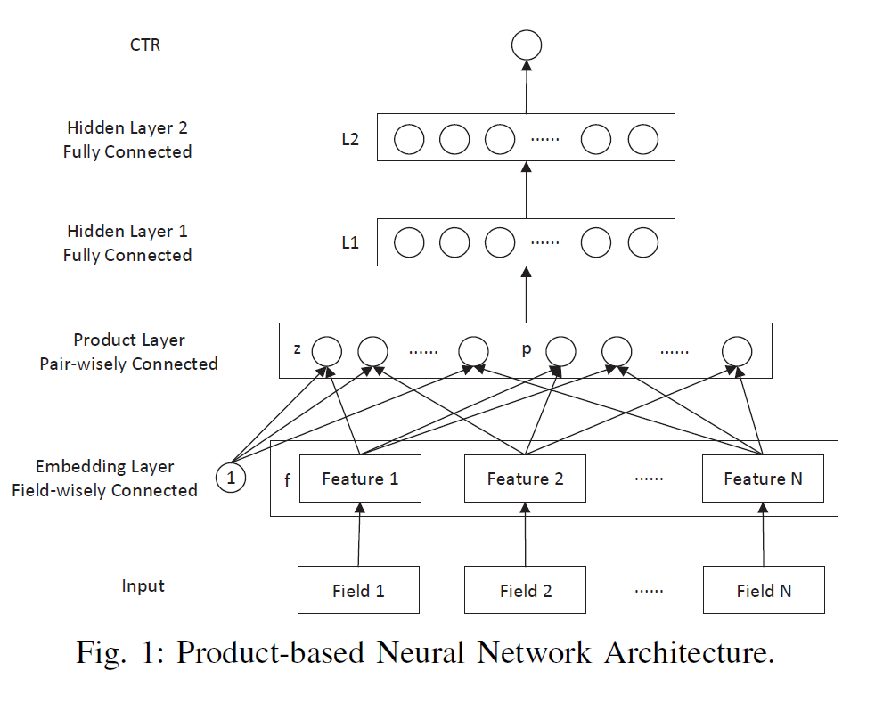

PNN
===========

Introduction
---------------------

`[paper] <https://ieeexplore.ieee.org/abstract/document/7837964/>`_

**Title:** Product-based neural networks for user response prediction

**Authors:** Yanru Qu, Han Cai, Kan Ren, Weinan Zhang, Yong Yu, Ying Wen, Jun Wang

**Abstract:**  Predicting user responses, such as clicks and conversions, is of great importance and has found its usage inmany Web applications including recommender systems, webs earch and online advertising. The data in those applications is mostly categorical and contains multiple fields, a typical representation is to transform it into a high-dimensional sparse binary feature representation via one-hot encoding. Facing with the extreme sparsity, traditional models may limit their capacity of mining shallow patterns from the data, i.e. low-order feature combinations. Deep models like deep neural networks, on the other hand, cannot be directly applied for the high-dimensional input because of the huge feature space. In this paper, we propose a Product-based Neural Networks (PNN) with an embedding layer to learn a distributed representation of the categorical data, a product layer to capture interactive patterns between interfieldcategories, and further fully connected layers to explore high-order feature interactions. Our experimental results on two-large-scale real-world ad click datasets demonstrate that PNNs consistently outperform the state-of-the-art models on various metrics.

Quick Start with RecBole
-------------------------

**Model Hyper-Parameters:**

- ``embedding_size (int)`` : The embedding size of features. Defaults to ``10``.
- ``mlp_hidden_size (list of int)`` : The hidden size of MLP layers. Defaults to ``[128, 256, 128]``.
- ``dropout_prob (float)`` : The dropout rate. Defaults to ``0.0``.
- ``use_inner (bool)`` :  Whether to use the inner product in the model. Defaults to ``True``.
- ``use_outer (bool)`` : Whether to use the outer product in the model. Defaults to ``False``.
- ``reg_weight (float)`` : The L2 regularization weight. Defaults to ``0.0``.

**A Running Example:**

Write the following code to a python file, such as `run.py`

.. code:: python

   from recbole.quick_start import run_recbole

   run_recbole(model='PNN', dataset='ml-100k')

And then:

.. code:: bash

   python run.py

Tuning Hyper Parameters
-------------------------

If you want to use ``HyperTuning`` to tune hyper parameters of this model, you can copy the following settings and name it as ``hyper.test``.

.. code:: bash

   learning_rate choice [0.01,0.005,0.001,0.0005,0.0001]
   dropout_prob choice [0.0,0.1,0.2,0.3,0.4,0.5]
   mlp_hidden_size choice ['[64,64,64]','[128,128,128]','[256,256,256]']
   reg_weight choice [0.0]
   
Note that we just provide these hyper parameter ranges for reference only, and we can not guarantee that they are the optimal range of this model.

Then, with the source code of RecBole (you can download it from GitHub), you can run the ``run_hyper.py`` to tuning:

.. code:: bash

	python run_hyper.py --model=[model_name] --dataset=[dataset_name] --config_files=[config_files_path] --params_file=hyper.test

For more details about Parameter Tuning, refer to :doc:`../../../user_guide/usage/parameter_tuning`.

If you want to change parameters, dataset or evaluation settings, take a look at

- :doc:`../../../user_guide/config_settings`
- :doc:`../../../user_guide/data_intro`
- :doc:`../../../user_guide/train_eval_intro`
- :doc:`../../../user_guide/usage`
