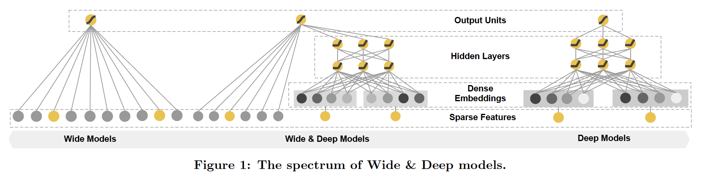

WideDeep
===========

Introduction
---------------------

`[paper] <https://dl.acm.org/doi/10.1145/2988450.2988454>`_

**Title:** Wide & Deep Learning for Recommender Systems

**Authors:** Heng-Tze Cheng, Levent Koc, Jeremiah Harmsen, Tal Shaked, Tushar Chandra, Hrishi Aradhye, Glen Anderson, Greg Corrado, Wei Chai, Mustafa Ispir, Rohan Anil, Zakaria Haque, Lichan Hong, Vihan Jain, Xiaobing Liu, Hemal Shah

**Abstract:**  Generalized linear models with nonlinear feature transformations are widely used for large-scale regression and classification problems with sparse inputs. Memorization of feature interactions through a wide set of cross-product feature transformations are effective and interpretable, while generalization requires more feature engineering effort. With less feature engineering, deep neural networks can generalize better to unseen feature combinations through low-dimensional dense embeddings learned for the sparse features. However, deep neural networks with embeddings can over-generalize and recommend less relevant items when the user-item interactions are sparse and high-rank. In this paper, we present Wide & Deep learning---jointly trained wide linear models and deep neural networks---to combine the benefits of memorization and generalization for recommender systems. We productionized and evaluated the system on Google Play, a commercial mobile app store with over one billion active users and over one million apps. Online experiment results show that Wide & Deep significantly increased app acquisitions compared with wide-only and deep-only models. We have also open-sourced our implementation in TensorFlow.

Quick Start with RecBole
-------------------------

**Model Hyper-Parameters:**

- ``embedding_size (int)`` : The embedding size of features. Defaults to ``10``.
- ``mlp_hidden_size (list of int)`` : The hidden size of MLP layers. Defaults to ``[32, 16, 8]``.
- ``dropout_prob (float)`` : The dropout rate. Defaults to ``0.1``.

**A Running Example:**

Write the following code to a python file, such as `run.py`

.. code:: python

   from recbole.quick_start import run_recbole

   run_recbole(model='WideDeep', dataset='ml-100k')

And then:

.. code:: bash

   python run.py

Tuning Hyper Parameters
-------------------------

If you want to use ``HyperTuning`` to tune hyper parameters of this model, you can copy the following settings and name it as ``hyper.test``.

.. code:: bash

   learning_rate choice [0.01,0.005,0.001,0.0005,0.0001]
   dropout_prob choice [0.0,0.1,0.2,0.3,0.4,0.5]
   mlp_hidden_size choice ['[64,64,64]','[128,128,128]','[256,256,256]','[512,512,512]']
   
Note that we just provide these hyper parameter ranges for reference only, and we can not guarantee that they are the optimal range of this model.

Then, with the source code of RecBole (you can download it from GitHub), you can run the ``run_hyper.py`` to tuning:

.. code:: bash

	python run_hyper.py --model=[model_name] --dataset=[dataset_name] --config_files=[config_files_path] --params_file=hyper.test

For more details about Parameter Tuning, refer to :doc:`../../../user_guide/usage/parameter_tuning`.

If you want to change parameters, dataset or evaluation settings, take a look at

- :doc:`../../../user_guide/config_settings`
- :doc:`../../../user_guide/data_intro`
- :doc:`../../../user_guide/train_eval_intro`
- :doc:`../../../user_guide/usage`

