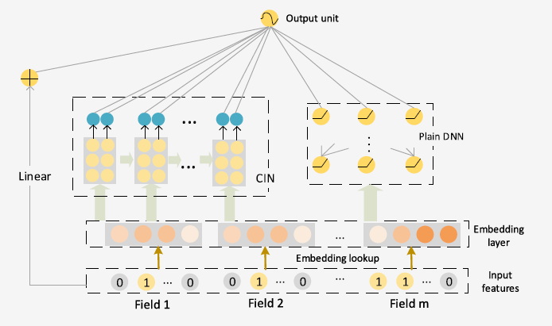

xDeepFM
===========

Introduction
---------------------

`[paper] <https://dl.acm.org/doi/10.1145/3219819.3220023>`_

**Title:** xDeepFM: Combining Explicit and Implicit Feature Interactions for Recommender Systems

**Authors:** Jianxun Lian, Xiaohuan Zhou, Fuzheng Zhang,
Zhongxia Chen, Xing Xie, Guangzhong Sun

**Abstract:** Combinatorial features are essential for the success of many commercial
models. Manually crafting these features usually comes
with high cost due to the variety, volume and velocity of raw data
in web-scale systems. Factorization based models, which measure
interactions in terms of vector product, can learn patterns of combinatorial
features automatically and generalize to unseen features
as well. With the great success of deep neural networks (DNNs)
in various fields, recently researchers have proposed several DNN-based
factorization model to learn both low- and high-order feature
interactions. Despite the powerful ability of learning an arbitrary
function from data, plain DNNs generate feature interactions implicitly
and at the bit-wise level. In this paper, we propose a novel
Compressed Interaction Network (CIN), which aims to generate
feature interactions in an explicit fashion and at the vector-wise
level. We show that the CIN share some functionalities with convolutional
neural networks (CNNs) and recurrent neural networks
(RNNs). We further combine a CIN and a classical DNN into one
unified model, and named this new model eXtreme Deep Factorization
Machine (xDeepFM). On one hand, the xDeepFM is able
to learn certain bounded-degree feature interactions explicitly; on
the other hand, it can learn arbitrary low- and high-order feature
interactions implicitly. We conduct comprehensive experiments on
three real-world datasets. Our results demonstrate that xDeepFM
outperforms state-of-the-art models.

Quick Start with RecBole
-------------------------

**Model Hyper-Parameters:**

- ``embedding_size (int)`` : The embedding size of features. Defaults to ``10``.
- ``mlp_hidden_size (list of int)`` : The hidden size of MLP layers. Defaults to ``[128,128,128]``.
- ``reg_weight (float)`` : The L2 regularization weight. Defaults to ``5e-4``.
- ``dropout_prob (float)`` : The dropout rate. Defaults to ``0.2``.
- ``direct (bool)`` : Whether the output of the current layer will be output directly or not. When it is set to ``False``, the output of the current layer will be equally devided into two parts, one part will be the input of the next hidden layer, and the other part will be output directly. Defaults to ``False``.
- ``cin_layer_size (list of int)`` : The size of CIN layers. Defaults to ``[100,100,100]``

**A Running Example:**

Write the following code to a python file, such as `run.py`

.. code:: python

   from recbole.quick_start import run_recbole

   run_recbole(model='xDeepFM', dataset='ml-100k')

And then:

.. code:: bash

   python run.py

Tuning Hyper Parameters
-------------------------

If you want to use ``HyperTuning`` to tune hyper parameters of this model, you can copy the following settings and name it as ``hyper.test``.

.. code:: bash

   learning_rate choice [0.01,0.005,0.001,0.0005,0.0001]
   dropout_prob choice [0.0,0.1,0.2,0.3,0.4,0.5]
   mlp_hidden_size choice ['[64,64,64]','[128,128,128]','[256,256,256]','[512,512,512]']
   cin_layer_size choice ['[60,60,60]','[80,80,80]','[100,100,100]','[120,120,120]']
   reg_weight choice [1e-7,1e-5,5e-4,1e-3]

Note that we just provide these hyper parameter ranges for reference only, and we can not guarantee that they are the optimal range of this model.

Then, with the source code of RecBole (you can download it from GitHub), you can run the ``run_hyper.py`` to tuning:

.. code:: bash

	python run_hyper.py --model=[model_name] --dataset=[dataset_name] --config_files=[config_files_path] --params_file=hyper.test

For more details about Parameter Tuning, refer to :doc:`../../../user_guide/usage/parameter_tuning`.

If you want to change parameters, dataset or evaluation settings, take a look at

- :doc:`../../../user_guide/config_settings`
- :doc:`../../../user_guide/data_intro`
- :doc:`../../../user_guide/train_eval_intro`
- :doc:`../../../user_guide/usage`

