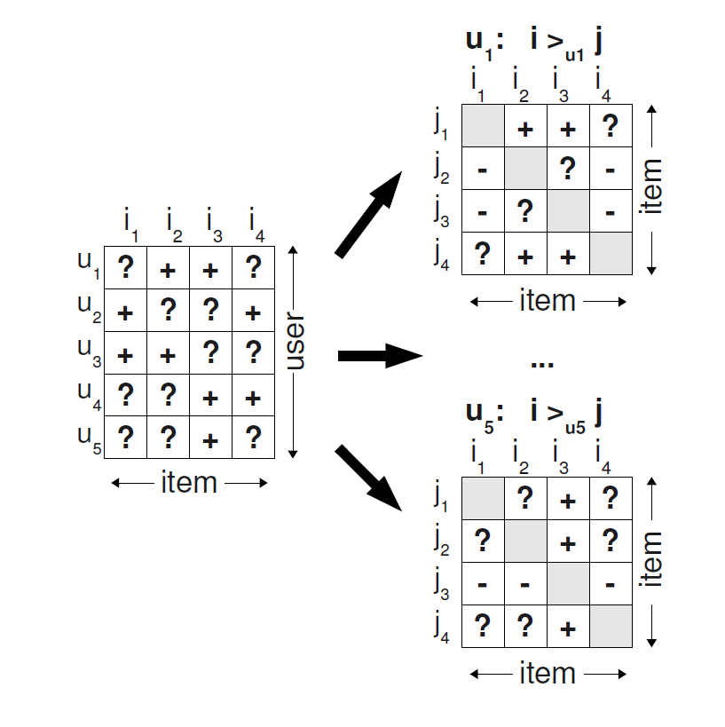

BPR
===========

Introduction
---------------------

`[paper] <https://dl.acm.org/doi/10.5555/1795114.1795167>`_

**Title:** BPR Bayesian Personalized Ranking from Implicit Feedback

**Authors:** Steffen Rendle, Christoph Freudenthaler, Zeno Gantner and Lars Schmidt-Thieme

**Abstract:** Item recommendation is the task of predicting a personalized ranking on a set of items (e.g. websites, movies, products).
In this paper, we investigate the most common scenario with implicit feedback (e.g. clicks, purchases).
There are many methods for item recommendation from implicit feedback like matrix factorization (MF) or
adaptive knearest-neighbor (kNN). Even though these methods are designed for the item prediction task of personalized
ranking, none of them is directly optimized for ranking. In this paper we present a generic optimization criterion
BPR-Opt for personalized ranking that is the maximum posterior estimator derived from a Bayesian analysis of the problem.
We also provide a generic learning algorithm for optimizing models with respect to BPR-Opt. The learning method is based
on stochastic gradient descent with bootstrap sampling. We show how to apply our method to two state-of-the-art
recommender models: matrix factorization and adaptive kNN. Our experiments indicate that for the task of personalized
ranking our optimization method outperforms the standard learning techniques for MF and kNN. The results show the
importance of optimizing models for the right criterion.

Running with RecBole
-------------------------

**Model Hyper-Parameters:**

- ``embedding_size (int)`` : The embedding size of users and items. Defaults to ``64``.

**A Running Example:**

Write the following code to a python file, such as `run.py`

.. code:: python

   from recbole.quick_start import run_recbole

   run_recbole(model='BPR', dataset='ml-100k')

And then:

.. code:: bash

   python run.py

Tuning Hyper Parameters
-------------------------

If you want to use ``HyperTuning`` to tune hyper parameters of this model, you can copy the following settings and name it as ``hyper.test``.

.. code:: bash

   learning_rate choice [0.01,0.005,0.001,0.0005,0.0001]

Note that we just provide these hyper parameter ranges for reference only, and we can not guarantee that they are the optimal range of this model.

Then, with the source code of RecBole (you can download it from GitHub), you can run the ``run_hyper.py`` to tuning:

.. code:: bash

	python run_hyper.py --model=[model_name] --dataset=[dataset_name] --config_files=[config_files_path] --params_file=hyper.test

For more details about Parameter Tuning, refer to :doc:`../../../user_guide/usage/parameter_tuning`.

If you want to change parameters, dataset or evaluation settings, take a look at

- :doc:`../../../user_guide/config_settings`
- :doc:`../../../user_guide/data_intro`
- :doc:`../../../user_guide/train_eval_intro`
- :doc:`../../../user_guide/usage`