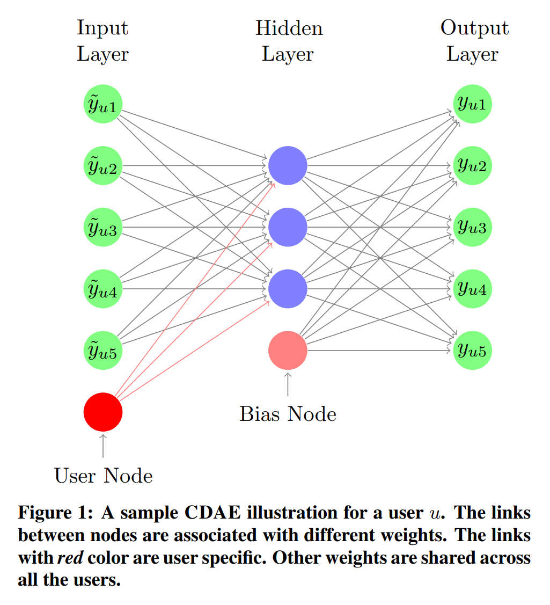

CDAE
===========

Introduction
---------------------

`[paper] <https://dl.acm.org/doi/10.1145/2835776.2835837>`_

**Title:** Collaborative Denoising Auto-Encoders for Top-N Recommender Systems

**Authors:** Yao Wu, Christopher DuBois, Alice X. Zheng, Martin Ester

**Abstract:** Most real-world recommender services measure their performance based on the top-N results shown to the end users. Thus, advances in top-N recommendation have far-ranging consequences in practical applications. In this paper, we present a novel method, called Collaborative Denoising Auto-Encoder (CDAE), for top-N recommendation that utilizes the idea of Denoising Auto-Encoders. We demonstrate that the proposed model is a generalization of several well-known collaborative filtering models but with more flexible components. Thorough experiments are conducted to understand the performance of CDAE under various component settings. Furthermore, experimental results on several public datasets demonstrate that CDAE consistently outperforms state-of-the-art top-N recommendation methods on a variety of common evaluation metrics.

Running with RecBole
-------------------------

**Model Hyper-Parameters:**

- ``loss_type (str)`` : The loss function of model, now we support ``[BCE, MSE]``. Defaults to ``BCE``.
- ``hid_activation (str)`` : The hidden layer activation function, now we support ``[sigmoid, relu, tanh]`` Defaults to ``relu``.
- ``out_activation (str)`` : The output layer activation function, now we support ``[sigmoid, relu]``. Defaults to ``sigmoid``.
- ``corruption_ratio (float)`` : The corruption ratio of the input. Defaults to ``0.5``.
- ``embedding_size (int)`` : The embedding size of user. Defaults to ``64``.
- ``reg_weight_1 (float)`` : L1-regularization weight. Defaults to ``0.``.
- ``reg_weight_2 (float)`` : L2-regularization weight. Defaults to ``0.01``.

**A Running Example:**

Write the following code to a python file, such as `run.py`

.. code:: python

   from recbole.quick_start import run_recbole

   parameter_dict = {
      'neg_sampling': None,
   }
   run_recbole(model='CDAE', dataset='ml-100k', config_dict=parameter_dict)

And then:

.. code:: bash

   python run.py

**Note**: Because this model is a non-sampling model, so you must set ``neg_sampling=None`` when you run this model.

Tuning Hyper Parameters
-------------------------

If you want to use ``HyperTuning`` to tune hyper parameters of this model, you can copy the following settings and name it as ``hyper.test``.

.. code:: bash

   learning_rate choice [0.01,0.005,0.001,0.0005,0.0001]

Note that we just provide these hyper parameter ranges for reference only, and we can not guarantee that they are the optimal range of this model.

Then, with the source code of RecBole (you can download it from GitHub), you can run the ``run_hyper.py`` to tuning:

.. code:: bash

	python run_hyper.py --model=[model_name] --dataset=[dataset_name] --config_files=[config_files_path] --params_file=hyper.test

If you want to change parameters, dataset or evaluation settings, take a look at

- :doc:`../../../user_guide/config_settings`
- :doc:`../../../user_guide/data_intro`
- :doc:`../../../user_guide/train_eval_intro`
- :doc:`../../../user_guide/usage`