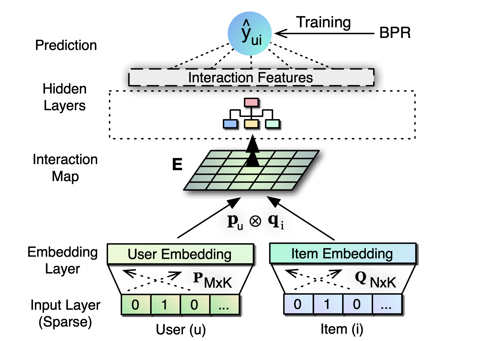

ConvNCF
===========

Introduction
---------------------

`[paper] <https://www.ijcai.org/Proceedings/2018/308>`_

**Title:** Outer Product-based Neural Collaborative Filtering

**Authors:** Xiangnan He, Xiaoyu Du, Xiang Wang, Feng Tian, Jinhui Tang and Tat-Seng Chua

**Abstract:** In this work, we contribute a new multi-layer neural network architecture named ONCF to perform collaborative filtering. The idea is to use an outer product to explicitly model the pairwise correlations between the dimensions of the embedding space. In contrast to existing neural recommender models that combine user embedding and item embedding via a simple concatenation or element-wise product, our proposal of using outer product above the embedding layer results in a two-dimensional interaction map that is more expressive and semantically plausible.
Above the interaction map obtained by outer product, we propose to employ a convolutional neural network to learn high-order correlations among embedding dimensions. Extensive experiments on two public implicit feedback data demonstrate the effectiveness of our proposed ONCF framework, in particular, the positive effect of using outer product to model the correlations between embedding dimensions in the low level of multi-layer neural recommender model.

Running with RecBole
-------------------------

**Model Hyper-Parameters:**

- ``embedding_size (int)`` : The embedding size of users and items. Defaults to ``64``.
- ``cnn_channels (list)`` : The number of channels in each convolutional neural network layer. Defaults to ``[1, 32, 32, 32, 32]``.
- ``cnn_kernels (list)`` : The size of convolutional kernel in each convolutional neural network layer. Defaults to ``[4, 4, 2, 2]``.
- ``cnn_strides (list)`` : The strides of convolution in each convolutional neural network layer. Defaults to ``[4, 4, 2, 2]``.
- ``dropout_prob (float)`` : The dropout rate in the linear predict layer. Defaults to ``0.2``.
- ``reg_weights (list)`` : The L2 regularization weights. Defaults to ``[0.1, 0.1]``.
- ``train_method (list)`` : The training method. Defaults to ``'no_pretrain'``. Range in ``['after_pretrain', 'no_pretrain']``.
- ``pre_model_path (str)`` : The path of pretrained model. Defaults to ``''``.

**A Running Example:**

ConvNCF may have better performance by pretraining the embedding layer with BPR-MF according to the original paper. If you want to use ConvNCF without pretrain, please set ``train_method`` to ``'no_pretrain'`` and just run.
Write the following code to a python file, such as `run.py`

.. code:: python

   from recbole.quick_start import run_recbole

   config_dict = {
        'train_method': 'no_pretrain',
   }
   run_recbole(model='ConvNCF', dataset='ml-100k', config_dict=config_dict)

And then:

.. code:: bash

   python run.py

Otherwise, you should run BPR model first to pretrain the embedding layer.
Write the following code to a python file, such as `run_pretrain.py`

.. code:: python

   from recbole.quick_start import run_recbole

   run_recbole(model='BPR', dataset='ml-100k')

And then:

.. code:: bash

   python run_pretrain.py

Then you can get the saved checkpoint path, for example, ``'./saved/BPR-Feb-16-2023_19-23-29.pth'``. Set ``train_method`` to ``'no_pretrain'``.
Write the following code to `run_train.py`

.. code:: python

   from recbole.quick_start import run_recbole

   config_dict = {
        'train_method': 'after_pretrain',
        'pre_model_path': './saved/BPR-Feb-16-2023_19-23-29.pth',
   }
   run_recbole(model='ConvNCF', dataset='ml-100k', config_dict=config_dict)

And then:

.. code:: bash

   python run_train.py

Tuning Hyper Parameters
-------------------------

If you want to use ``HyperTuning`` to tune hyper parameters of this model, you can copy the following settings and name it as ``hyper.test``.

.. code:: bash

   learning_rate choice [0.01,0.005,0.001,0.0005,0.0001]
   dropout_prob choice [0.0,0.1,0.2,0.3,0.4,0.5]
   cnn_channels choice ['[1,128,128,64,32]','[1,32,32,32,32,32,32]','[1,64,32,32,32,32]','[1,64,32,32,32]']
   cnn_kernels choice ['[4,4,2,2]','[2,2,2,2,2,2]','[4,2,2,2,2]','[8,4,2]']
   cnn_strides choice ['[4,4,2,2]','[2,2,2,2,2,2]','[4,2,2,2,2]','[8,4,2]']
   reg_weights choice ['[0.1,0.1]','[0.2,0.2]']

Note that we just provide these hyper parameter ranges for reference only, and we can not guarantee that they are the optimal range of this model.

Then, with the source code of RecBole (you can download it from GitHub), you can run the ``run_hyper.py`` to tuning:

.. code:: bash

	python run_hyper.py --model=[model_name] --dataset=[dataset_name] --config_files=[config_files_path] --params_file=hyper.test

For more details about Parameter Tuning, refer to :doc:`../../../user_guide/usage/parameter_tuning`.

If you want to change parameters, dataset or evaluation settings, take a look at

- :doc:`../../../user_guide/config_settings`
- :doc:`../../../user_guide/data_intro`
- :doc:`../../../user_guide/train_eval_intro`
- :doc:`../../../user_guide/usage`