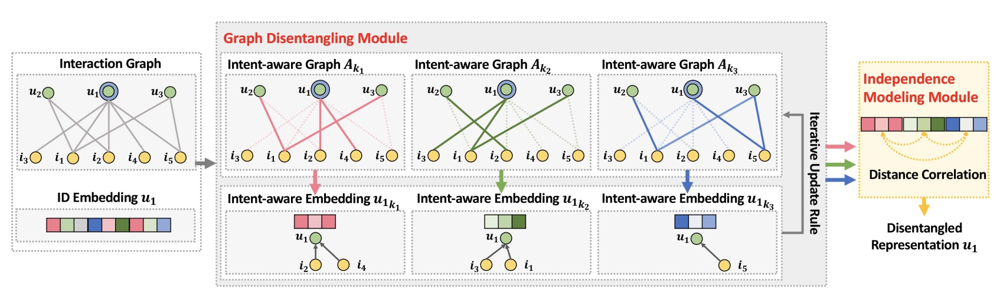

DGCF
===========

Introduction
---------------------

`[paper] <https://dl.acm.org/doi/10.1145/3397271.3401137>`_

**Title:** Disentangled Graph Collaborative Filtering

**Authors:** Xiang Wang, Hongye Jin, An Zhang, Xiangnan He, Tong Xu, Tat-Seng Chua

**Abstract:** Learning informative representations of users and items from the
interaction data is of crucial importance to collaborative filtering
(CF). Present embedding functions exploit user-item relationships
to enrich the representations, evolving from a single user-item
instance to the holistic interaction graph. Nevertheless, they largely
model the relationships in a uniform manner, while neglecting
the diversity of user intents on adopting the items, which could
be to pass time, for interest, or shopping for others like families.
Such uniform approach to model user interests easily results in
suboptimal representations, failing to model diverse relationships
and disentangle user intents in representations.

In this work, we pay special attention to user-item relationships
at the finer granularity of user intents. We hence devise a new
model, Disentangled Graph Collaborative Filtering (DGCF), to
disentangle these factors and yield disentangled representations.
Specifically, by modeling a distribution over intents for each
user-item interaction, we iteratively refine the intent-aware
interaction graphs and representations. Meanwhile, we encourage
independence of different intents. This leads to disentangled
representations, effectively distilling information pertinent to each
intent. We conduct extensive experiments on three benchmark
datasets, and DGCF achieves significant improvements over several
state-of-the-art models like NGCF, DisenGCN, and
MacridVAE. Further analyses offer insights into the advantages
of DGCF on the disentanglement of user intents and interpretability
of representations.

Running with RecBole
-------------------------

**Model Hyper-Parameters:**

- ``embedding_size (int)`` : The embedding size of users and items. Defaults to ``64``.
- ``n_factors (int)`` : The number of factors for disentanglement. Defaults to ``4``.
- ``n_iterations (int)`` : The number of iterations for each layer. Defaults to ``2``.
- ``n_layers (int)`` : The number of reasoning layers. Defaults to ``1``.
- ``reg_weight (float)`` : The L2 regularization weight. Defaults to ``1e-03``.
- ``cor_weight (float)`` : The correlation loss weight. Defaults to ``0.01``.

**A Running Example:**

Write the following code to a python file, such as `run.py`

.. code:: python

   from recbole.quick_start import run_recbole

   run_recbole(model='DGCF', dataset='ml-100k')

And then:

.. code:: bash

   python run.py

**Notes:**

- ``embedding_size`` needs to be exactly divisible by ``n_factors``

Tuning Hyper Parameters
-------------------------

If you want to use ``HyperTuning`` to tune hyper parameters of this model, you can copy the following settings and name it as ``hyper.test``.

.. code:: bash

   learning_rate choice [0.01,0.005,0.001,0.0005,0.0001]
   n_factors choice [2,4,8] 
   reg_weight choice [1e-03] 
   cor_weight choice [0.005,0.01,0.02,0.05]
   n_layers choice [1]
   n_iterations choice [2]
   delay choice [1e-03] 
   cor_delay choice [1e-02]

Note that we just provide these hyper parameter ranges for reference only, and we can not guarantee that they are the optimal range of this model.

Then, with the source code of RecBole (you can download it from GitHub), you can run the ``run_hyper.py`` to tuning:

.. code:: bash

	python run_hyper.py --model=[model_name] --dataset=[dataset_name] --config_files=[config_files_path] --params_file=hyper.test

For more details about Parameter Tuning, refer to :doc:`../../../user_guide/usage/parameter_tuning`.

If you want to change parameters, dataset or evaluation settings, take a look at

- :doc:`../../../user_guide/config_settings`
- :doc:`../../../user_guide/data_intro`
- :doc:`../../../user_guide/train_eval_intro`
- :doc:`../../../user_guide/usage`