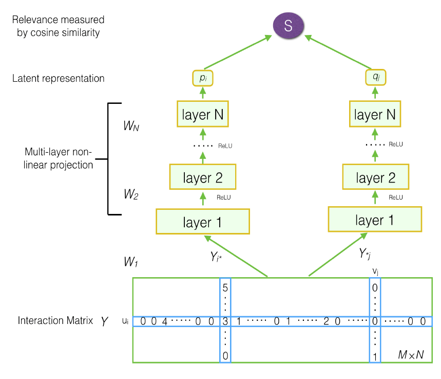

DMF
===========

Introduction
---------------------

`[paper] <https://www.ijcai.org/Proceedings/2017/447>`_

**Title:** Deep Matrix Factorization Models for Recommender Systems

**Authors:** Hong-Jian Xue, Xin-Yu Dai, Jianbing Zhang, Shujian Huang, Jiajun Chen

**Abstract:** Recommender systems usually make personalized recommendation with user-item interaction ratings, implicit feedback and auxiliary information. Matrix factorization is the basic idea to predict a personalized ranking over a set of items for an individual user with the similarities among users and items. In this paper, we propose a novel matrix factorization model with neural network architecture. Firstly, we construct a user-item matrix with explicit ratings and non-preference implicit feedback. With this matrix as the input, we present a deep structure learning architecture to learn a common low dimensional space for the representations of users and items. Secondly, we design a new loss function based on binary cross entropy, in which we consider both explicit ratings and implicit feedback for a better optimization. The experimental results show the effectiveness of both our proposed model and the loss function. On several benchmark datasets, our model outperformed other state-of-the-art methods. We also conduct extensive experiments to evaluate the performance within different experimental settings.

Running with RecBole
-------------------------

**Model Hyper-Parameters:**

- ``user_embedding_size (int)`` : The initial embedding size of users. Defaults to ``64``.
- ``item_embedding_size (int)`` : The initial embedding size of items. Defaults to ``64``.
- ``user_hidden_size_list (list)`` : The hidden size of each layer in MLP for users, the length of list is equal to the number of layers. Defaults to ``[64,64]``.
- ``item_hidden_size_list (list)`` : The hidden size of each layer in MLP for items, the length of list is equal to the number of layers. Defaults to ``[64,64]``.
- ``inter_matrix_type (str)`` : Use the implicit interaction matrix or the rating matrix. Defaults to ``'01'``. Range in ``['01', 'rating']``.

**A Running Example:**

Write the following code to a python file, such as `run.py`

.. code:: python

   from recbole.quick_start import run_recbole

   run_recbole(model='DMF', dataset='ml-100k')

And then:

.. code:: bash

   python run.py

**Notes:**

- The last value in ``user_hidden_size_list`` and ``item_hidden_size_list`` must be the same, which is the final embedding size of users and items.

- If you set ``inter_matrix_type='rating'``, the 'rating' field from \*.inter atomic files must be remained
  which means that the `rating` cannot be included in ``unload_col`` or ``unused_col``.

Tuning Hyper Parameters
-------------------------

If you want to use ``HyperTuning`` to tune hyper parameters of this model, you can copy the following settings and name it as ``hyper.test``.

.. code:: bash

   learning_rate choice [0.01,0.005,0.001,0.0005,0.0001]
   user_layers_dim choice ['[64, 64]','[64, 32]','[128,64']] 
   item_layers_dim choice ['[64, 64]','[64, 32]','[128,64']]

Note that we just provide these hyper parameter ranges for reference only, and we can not guarantee that they are the optimal range of this model.

Then, with the source code of RecBole (you can download it from GitHub), you can run the ``run_hyper.py`` to tuning:

.. code:: bash

	python run_hyper.py --model=[model_name] --dataset=[dataset_name] --config_files=[config_files_path] --params_file=hyper.test

For more details about Parameter Tuning, refer to :doc:`../../../user_guide/usage/parameter_tuning`.

If you want to change parameters, dataset or evaluation settings, take a look at

- :doc:`../../../user_guide/config_settings`
- :doc:`../../../user_guide/data_intro`
- :doc:`../../../user_guide/train_eval_intro`
- :doc:`../../../user_guide/usage`