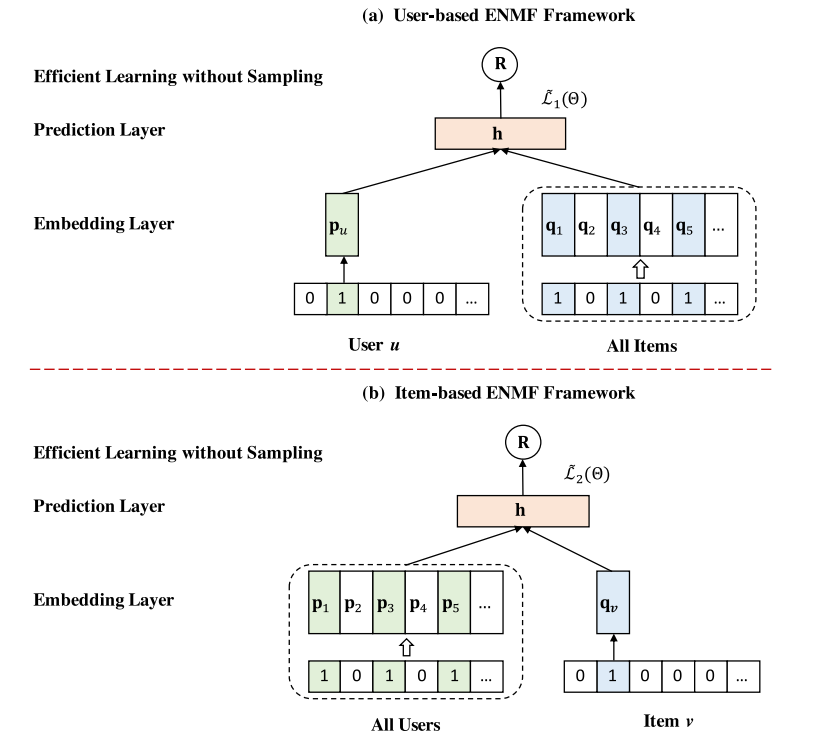

ENMF
===========

Introduction
---------------------

`[paper] <https://dl.acm.org/doi/abs/10.1145/3373807>`_

**Title:** Efficient Neural Matrix Factorization without Sampling for Recommendation

**Authors:** Chen, Chong and Zhang, Min and Wang, Chenyang and Ma, Weizhi and Li, Minming and Liu, Yiqun and Ma, Shaoping

**Abstract:** Recommendation systems play a vital role to keep users engaged with personalized contents in modern online platforms. Recently, deep learning has revolutionized many research fields and there is a surge of interest in applying it for recommendation. However, existing studies have largely focused on exploring complex deep-learning architectures for recommendation task, while typically applying the negative sampling strategy for model learning. Despite effectiveness, we argue that these methods suffer from two important limitations: (1) the methods with complex network structures have a substantial number of parameters, and require expensive computations even with a sampling-based learning strategy; (2) the negative sampling strategy is not robust, making sampling-based methods difficult to achieve the optimal performance in practical applications.

In this work, we propose to learn neural recommendation models from the whole training data without sampling. However, such a non-sampling strategy poses strong challenges to learning efficiency. To address this, we derive three new optimization methods through rigorous mathematical reasoning, which can efficiently learn model parameters from the whole data (including all missing data) with a rather low time complexity. Moreover, based on a simple Neural Matrix Factorization architecture, we present a general framework named ENMF, short for *Efficient Neural Matrix Factorization*. Extensive experiments on three real-world public datasets indicate that the proposed ENMF framework consistently and significantly outperforms the state-of-the-art methods on the Top-K recommendation task. Remarkably, ENMF also shows significant advantages in training efficiency, which makes it more applicable to real-world large-scale systems.

Running with RecBole
-------------------------

**Model Hyper-Parameters:**

- ``dropout_prob (float)`` : The dropout ratio of the embedding. Defaults to ``0.7``.
- ``embedding_size (int)`` : The embedding size of user. Defaults to ``64``.
- ``reg_weight (float)`` : L2-regularization weight. Defaults to ``0.``.
- ``negative_weight (float)`` : The weight of non-observed data. Defaults to ``0.5``.

**A Running Example:**

Write the following code to a python file, such as `run.py`

.. code:: python

   from recbole.quick_start import run_recbole

   parameter_dict = {
      'neg_sampling': None,
   }
   run_recbole(model='ENMF', dataset='ml-100k', config_dict=parameter_dict)

And then:

.. code:: bash

   python run.py

**Note**: Because this model is a non-sampling model, so you must set ``neg_sampling=None`` when you run this model.

Tuning Hyper Parameters
-------------------------

If you want to use ``HyperTuning`` to tune hyper parameters of this model, you can copy the following settings and name it as ``hyper.test``.

.. code:: bash

   learning_rate choice [0.01,0.005,0.001,0.0005,0.0001]

   dropout_prob choice [0.0,0.1,0.2,0.3,0.4,0.5]

   negative_weight choice [0.001,0.005,0.01,0.02,0.05,0.1,0.2,0.5]

Note that we just provide these hyper parameter ranges for reference only, and we can not guarantee that they are the optimal range of this model.

Then, with the source code of RecBole (you can download it from GitHub), you can run the ``run_hyper.py`` to tuning:

.. code:: bash

	python run_hyper.py --model=[model_name] --dataset=[dataset_name] --config_files=[config_files_path] --params_file=hyper.test

If you want to change parameters, dataset or evaluation settings, take a look at

- :doc:`../../../user_guide/config_settings`
- :doc:`../../../user_guide/data_intro`
- :doc:`../../../user_guide/train_eval_intro`
- :doc:`../../../user_guide/usage`