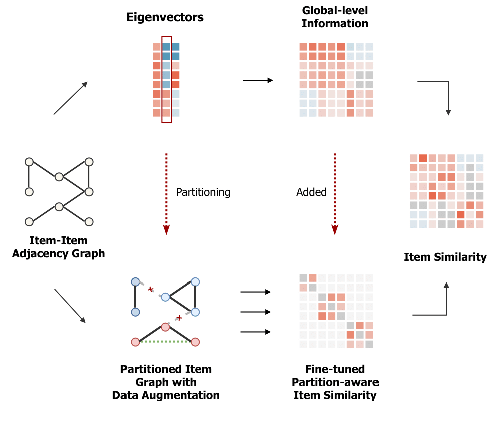

FPSR
===========

Introduction
---------------------

`[paper] <https://arxiv.org/abs/2207.05959>`_

**Title:** Fine-tuning Partition-aware Item Similarities for Efficient and Scalable Recommendation

**Authors:** Tianjun Wei, Jianghong Ma, Tommy W. S. Chow

**Abstract:**  Collaborative filtering (CF) is widely searched in recommendation with various types of 
solutions. Recent success of Graph Convolution Networks (GCN) in CF demonstrates the effectiveness of 
modeling high-order relationships through graphs, while repetitive graph convolution and iterative batch 
optimization limit their efficiency. Instead, item similarity models attempt to construct direct 
relationships through efficient interaction encoding. Despite their great performance, the growing item 
numbers result in quadratic growth in similarity modeling process, posing critical scalability problems. 
In this paper, we investigate the graph sampling strategy adopted in latest GCN model for efficiency 
improving, and identify the potential item group structure in the sampled graph. Based on this, we propose 
a novel item similarity model which introduces graph partitioning to restrict the item similarity modeling 
within each partition. Specifically, we show that the spectral information of the original graph is well 
in preserving global-level information. Then, it is added to fine-tune local item similarities with a new 
data augmentation strategy acted as partition-aware prior knowledge, jointly to cope with the information 
loss brought by partitioning. Experiments carried out on 4 datasets show that the proposed model 
outperforms state-of-the-art GCN models with 10x speed-up and item similarity models with 95% parameter 
storage savings.

Running with RecBole
-------------------------

**Model Hyper-Parameters:**

- ``eigenvectors (int)`` : The number of top eigenvectors of item-item adjacency matrix. Defaults to ``256``.
- ``lambda (float)`` : Control the relative weights of global-level information and partition-aware item similarities. Range in ``[0, 1]``. Defaults to ``0.5``.
- ``rho (float)`` : The penalty parameter that applies to the squared difference between primal variables. Defaults to ``5000.0``.
- ``theta_1 (float)`` : L1-norm regularization parameter. Defaults to ``0.1``.
- ``theta_2 (float)`` : L2-norm regularization parameter. Defaults to ``1.0``.
- ``eta (float)`` : The weight for intra-partition data augmentation. Defaults to ``1.0``.
- ``tol (float)`` : The threshold to filter out values in the learned partition-aware similarity matrix. Defaults to ``5.0e-3``.
- ``tau (float)`` : The size ratio of the item-item graph partitioning. Range in ``[0, 1]``. Defaults to ``0.2``.

**A Running Example:**

Write the following code to a python file, such as `run.py`

.. code:: python

  from recbole.quick_start import run_recbole

  run_recbole(model='FPSR', dataset='ml-100k')

And then:

.. code:: bash

  python run.py

Tuning Hyper Parameters
-------------------------

If you want to use ``HyperTuning`` to tune hyper parameters of this model, you can copy the following settings and name it as ``hyper.test``.

.. code:: bash

  lambda choice [0.0,0.1,0.2,0.3,0.4,0.5]
  theta_2 choice [1e-3,1e-2,1e-1,1.0]
  eta choice [1e-3,1e-2,1e-1,1.0]

Note that we just provide these hyper parameter ranges for reference only, and we can not guarantee that they are the optimal range of this model.

Then, with the source code of RecBole (you can download it from GitHub), you can run the ``run_hyper.py`` to tuning:

.. code:: bash

	python run_hyper.py --model=[model_name] --dataset=[dataset_name] --config_files=[config_files_path] --params_file=hyper.test

For more details about Parameter Tuning, refer to :doc:`../../../user_guide/usage/parameter_tuning`.

If you want to change parameters, dataset or evaluation settings, take a look at

- :doc:`../../../user_guide/config_settings`
- :doc:`../../../user_guide/data_intro`
- :doc:`../../../user_guide/train_eval_intro`
- :doc:`../../../user_guide/usage`FPSR
===========

Introduction
---------------------

`[paper] <https://arxiv.org/abs/2207.05959>`_

**Title:** Fine-tuning Partition-aware Item Similarities for Efficient and Scalable Recommendation

**Authors:** Tianjun Wei, Jianghong Ma, Tommy W. S. Chow

**Abstract:**  Collaborative filtering (CF) is widely searched in recommendation with various types of 
solutions. Recent success of Graph Convolution Networks (GCN) in CF demonstrates the effectiveness of 
modeling high-order relationships through graphs, while repetitive graph convolution and iterative batch 
optimization limit their efficiency. Instead, item similarity models attempt to construct direct 
relationships through efficient interaction encoding. Despite their great performance, the growing item 
numbers result in quadratic growth in similarity modeling process, posing critical scalability problems. 
In this paper, we investigate the graph sampling strategy adopted in latest GCN model for efficiency 
improving, and identify the potential item group structure in the sampled graph. Based on this, we propose 
a novel item similarity model which introduces graph partitioning to restrict the item similarity modeling 
within each partition. Specifically, we show that the spectral information of the original graph is well 
in preserving global-level information. Then, it is added to fine-tune local item similarities with a new 
data augmentation strategy acted as partition-aware prior knowledge, jointly to cope with the information 
loss brought by partitioning. Experiments carried out on 4 datasets show that the proposed model 
outperforms state-of-the-art GCN models with 10x speed-up and item similarity models with 95% parameter 
storage savings.

Running with RecBole
-------------------------

**Model Hyper-Parameters:**

- ``eigenvectors (int)`` : The number of top eigenvectors of item-item adjacency matrix. Defaults to ``256``.
- ``lambda (float)`` : Control the relative weights of global-level information and partition-aware item similarities. Range in ``[0, 1]``. Defaults to ``0.5``.
- ``rho (float)`` : The penalty parameter that applies to the squared difference between primal variables. Defaults to ``5000.0``.
- ``theta_1 (float)`` : L1-norm regularization parameter. Defaults to ``0.1``.
- ``theta_2 (float)`` : L2-norm regularization parameter. Defaults to ``1.0``.
- ``eta (float)`` : The weight for ntra-partition data augmentation. Defaults to ``1.0``.
- ``tol (float)`` : The threshold to filter out values in the learned partition-aware similarity matrix. Defaults to ``5.0e-3``.
- ``tau (float)`` : The size ratio of the item-item graph partitioning. Range in ``[0, 1]``. Defaults to ``0.2``.

**A Running Example:**

Write the following code to a python file, such as `run.py`

.. code:: python

  from recbole.quick_start import run_recbole

  run_recbole(model='FPSR', dataset='ml-100k')

And then:

.. code:: bash

  python run.py

Tuning Hyper Parameters
-------------------------

If you want to use ``HyperTuning`` to tune hyper parameters of this model, you can copy the following settings and name it as ``hyper.test``.

.. code:: bash

  lambda choice [0.0,0.1,0.2,0.3,0.4,0.5]
  theta_2 choice [1e-3,1e-2,1e-1,1.0]
  eta choice [1e-3,1e-2,1e-1,1.0]

Note that we just provide these hyper parameter ranges for reference only, and we can not guarantee that they are the optimal range of this model.

Then, with the source code of RecBole (you can download it from GitHub), you can run the ``run_hyper.py`` to tuning:

.. code:: bash

	python run_hyper.py --model=[model_name] --dataset=[dataset_name] --config_files=[config_files_path] --params_file=hyper.test

For more details about Parameter Tuning, refer to :doc:`../../../user_guide/usage/parameter_tuning`.

If you want to change parameters, dataset or evaluation settings, take a look at

- :doc:`../../../user_guide/config_settings`
- :doc:`../../../user_guide/data_intro`
- :doc:`../../../user_guide/train_eval_intro`
- :doc:`../../../user_guide/usage`