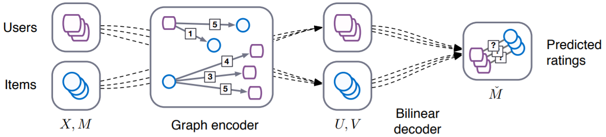

GCMC
===========

Introduction
---------------------

`[paper] <https://arxiv.org/abs/1706.02263>`_

**Title:** Graph Convolutional Matrix Completion

**Authors:** Rianne van den Berg, Thomas N. Kipf, Max Welling

**Abstract:**  We consider matrix completion for recommender systems from the point of view of
link prediction on graphs. Interaction data
such as movie ratings can be represented by a
bipartite user-item graph with labeled edges
denoting observed ratings. Building on recent
progress in deep learning on graph-structured
data, we propose a graph auto-encoder framework based on differentiable message passing
on the bipartite interaction graph. Our model
shows competitive performance on standard
collaborative filtering benchmarks. In settings
where complimentary feature information or
structured data such as a social network is
available, our framework outperforms recent
state-of-the-art methods.

Running with RecBole
-------------------------

**Model Hyper-Parameters:**

- ``accum (str)`` : The accumulation function in the GCN layers. Defaults to ``'stack'``. Range in ``['sum', 'stack']``.
- ``dropout_prob (float)`` : The dropout rate. Defaults to ``0.3``.
- ``gcn_output_dim (int)`` : The output dimension of GCN layer in GCN encoder. Defaults to ``500``.
- ``embedding_size (int)`` : The embedding size of user and item. Defaults to ``64``.
- ``sparse_feature (bool)`` : Whether to use sparse tensor to represent the features. Defaults to ``True``.
- ``class_num (int)`` : Number of rating types. Defaults to ``2``.
- ``num_basis_functions (int)`` : Number of basis functions for BiDecoder. Defaults to ``2``.

**A Running Example:**

Write the following code to a python file, such as `run.py`

.. code:: python

   from recbole.quick_start import run_recbole

   run_recbole(model='GCMC', dataset='ml-100k')

And then:

.. code:: bash

   python run.py

Tuning Hyper Parameters
-------------------------

If you want to use ``HyperTuning`` to tune hyper parameters of this model, you can copy the following settings and name it as ``hyper.test``.

.. code:: bash

   learning_rate choice [0.01,0.005,0.001,0.0005,0.0001]
   dropout_prob choice [0.0,0.1,0.2,0.3,0.4,0.5]
   accum choice ['stack','sum'] 
   gcn_output_dim choice [500,256,1024] 
   num_basis_functions choice ['2']

Note that we just provide these hyper parameter ranges for reference only, and we can not guarantee that they are the optimal range of this model.

Then, with the source code of RecBole (you can download it from GitHub), you can run the ``run_hyper.py`` to tuning:

.. code:: bash

	python run_hyper.py --model=[model_name] --dataset=[dataset_name] --config_files=[config_files_path] --params_file=hyper.test

For more details about Parameter Tuning, refer to :doc:`../../../user_guide/usage/parameter_tuning`.

If you want to change parameters, dataset or evaluation settings, take a look at

- :doc:`../../../user_guide/config_settings`
- :doc:`../../../user_guide/data_intro`
- :doc:`../../../user_guide/train_eval_intro`
- :doc:`../../../user_guide/usage`
