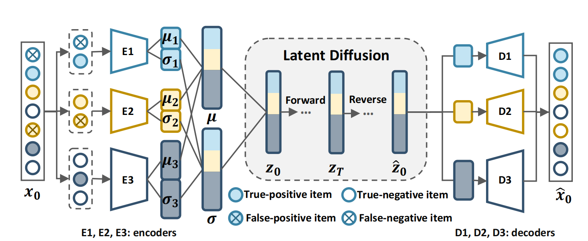

LDiffRec
===========

Introduction
---------------------

`[paper] <https://dl.acm.org/doi/10.1145/3539618.3591663>`_

**Title:** Diffusion Recommender Model

**Authors:** Wenjie Wang, Yiyan Xu, Fuli Feng, Xinyu Lin, Xiangnan He, Tat-Seng Chua

**Abstract:** Generative models such as Generative Adversarial Networks (GANs) and Variational Auto-Encoders (VAEs) are widely utilized to model the generative process of user interactions. However, they suffer from intrinsic limitations such as the instability of GANs and the restricted representation ability of VAEs. Such limitations hinder the accurate modeling of the complex user interaction generation procedure, such as noisy interactions caused by various interference factors. In light of the impressive advantages of Diffusion Models (DMs) over traditional generative models in image synthesis, we propose a novel Diffusion Recommender Model (named DiffRec) to learn the generative process in a denoising manner. To retain personalized information in user interactions, DiffRec reduces the added noises and avoids corrupting users’ interactions into pure noises like in image synthesis. In addition, we extend traditional DMs to tackle the unique challenges in recommendation: high resource costs for large-scale item prediction and temporal shifts of user preference. To this end, we propose two extensions of DiffRec: L-DiffRec clusters items for dimension compression and conducts the diffusion processes in the latent space; and T-DiffRec reweights user interactions based on the interaction timestamps to encode temporal information. We conduct extensive experiments on three datasets under multiple settings (e.g., clean training, noisy training, and temporal training). The empirical results validate the superiority of DiffRec with two extensions over competitive baselines.

Running with RecBole
-------------------------

**Model Hyper-Parameters:**

- ``noise_schedule (str)`` : The schedule for noise generating: [linear, linear-var, cosine, binomial]. Defaults to ``'linear'``.
- ``noise_scale (int)`` : The scale for noise generating. Defaults to ``0.1``.
- ``noise_min (int)`` : Noise lower bound for noise generating. Defaults to ``0.001``.
- ``noise_max (int)`` : 0.005 Noise upper bound for noise generating. Defaults to ``0.005``.
- ``sampling_noise (bool)`` : Whether to use sampling noise. Defaults to ``False``.
- ``sampling_steps (int)`` : Steps of the forward process during inference. Defaults to ``0``.
- ``reweight (bool)`` : Assign different weight to different timestep or not. Defaults to ``True``.
- ``mean_type (str)`` : MeanType for diffusion: ['x0', 'eps']. Defaults to ``'x0'``.
- ``steps (int)`` : Diffusion steps. Defaults to ``5``.
- ``history_num_per_term (int)`` : The number of history items needed to calculate loss weight. Defaults to ``10``.
- ``beta_fixed (bool)`` : Whether to fix the variance of the first step to prevent overfitting. Defaults to ``True``.
- ``dims_dnn (list of int)`` : The dims for the DNN. Defaults to ``[300]``.
- ``embedding_size (int)`` : Timestep embedding size. Defaults to ``10``.
- ``mlp_act_func (str)`` : Activation function for MLP. Defaults to ``'tanh'``.
- ``time-aware (bool)`` : LT-DiffRec or not. Defaults to ``False``.
- ``w_max (int)`` : The upper bound of the time-aware interaction weight. Defaults to ``1``.
- ``w_min (int)`` : The lower bound of the time-aware interaction weight. Defaults to ``0.1``.
- ``n_cate (int)`` : Category num of items. Defaults to ``1``.
- ``reparam (bool) `` : Autoencoder with variational inference or not. Defaults to ``True``.
- ``in_dims (list of int)`` : The dims for the encoder. Defaults to ``[300]``.
- ``out_dims (list of int)`` : The hidden dims for the decoder. Defaults to ``[]``.
- ``ae_act_func (str)`` : Activation function for AutoEncoder. Defaults to ``'tanh'``.
- ``lamda (float)`` : Hyper-parameter of multinomial log-likelihood for AE. Defaults to ``0.03``.
- ``anneal_cap (float)`` : The upper bound of the annealing weight. Defaults to ``0.005``.
- ``anneal_steps (int)`` : The steps of annealing. Defaults to ``1000``.
- ``vae_anneal_cap (float)`` : The upper bound of the VAE annealing weight. Defaults to ``0.3``.
- ``vae_anneal_steps (int)`` : The steps of VAE annealing. Defaults to ``200``.

**A Running Example:**

Write the following code to a python file, such as `run.py`

.. code:: python

   from recbole.quick_start import run_recbole

   run_recbole(model='LDiffRec', dataset='ml-100k')

And then:

.. code:: bash

   python run.py

**Notes:**

- ``w_max`` and ``w_min`` are unused when ``time-aware`` is False.

- The item embedding file is needed if ``n_cate`` is greater than 1.

Tuning Hyper Parameters
-------------------------

If you want to use ``HyperTuning`` to tune hyper parameters of this model, you can copy the following settings and name it as ``hyper.test``.

.. code:: bash

   learning_rate choice [1e-3,1e-4,1e-5]
   dims_dnn choice ['[300]','[200,600]','[1000]']
   steps choice [2,5,10,50]
   noice_scale choice [0,1e-5,1e-4,1e-3,1e-2,1e-1]
   noice_min choice [5e-4,1e-3,5e-3]
   noice_max choice [5e-3,1e-2]
   w_min choice [0.1,0.2,0.3]

Note that we just provide these hyper parameter ranges for reference only, and we can not guarantee that they are the optimal range of this model.

Then, with the source code of RecBole (you can download it from GitHub), you can run the ``run_hyper.py`` to tuning:

.. code:: bash

	python run_hyper.py --model=[model_name] --dataset=[dataset_name] --config_files=[config_files_path] --params_file=hyper.test

For more details about Parameter Tuning, refer to :doc:`../../../user_guide/usage/parameter_tuning`.

If you want to change parameters, dataset or evaluation settings, take a look at

- :doc:`../../../user_guide/config_settings`
- :doc:`../../../user_guide/data_intro`
- :doc:`../../../user_guide/train_eval_intro`
- :doc:`../../../user_guide/usage`