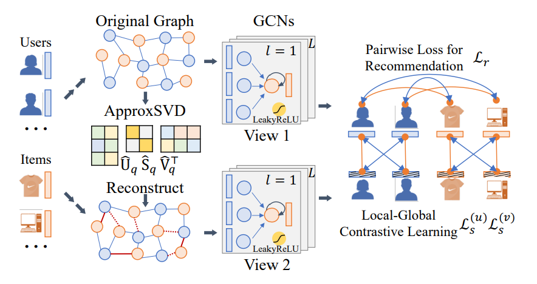

LightGCL
============

Introduction
------------------

`[paper] <https://doi.org/10.48550/arXiv.2302.08191>`_

**Title:** LightGCL: Simple Yet Effective Graph Contrastive Learning for Recommendation

**Authors:** Xuheng Cai, Chao Huang, Lianghao Xia, Xubin Ren

**Abstract:**
Graph neural network (GNN) is a powerful learning approach for graph-based
recommender systems. Recently, GNNs integrated with contrastive learning
have shown superior performance in recommendation with their data augmentation
schemes, aiming at dealing with highly sparse data. Despite their success,
most existing graph contrastive learning methods either perform stochastic
augmentation (e.g., node/edge perturbation) on the user-item interaction graph,
or rely on the heuristic-based augmentation techniques (e.g., user clustering)
for generating contrastive views. We argue that these methods cannot well
preserve the intrinsic semantic structures and are easily biased by the noise
perturbation. In this paper, we propose a simple yet effective graph contrastive
learning paradigm LightGCL that mitigates these issues impairing the generality
and robustness of CL-based recommenders. Our model exclusively utilizes singular
value decomposition for contrastive augmentation, which enables the unconstrained
structural refinement with global collaborative relation modeling. Experiments
conducted on several benchmark datasets demonstrate the significant improvement
in performance of our model over the state-of-the-arts. Further analyses demonstrate
the superiority of LightGCL's robustness against data sparsity and popularity bias.

Running with RecBole
-------------------------

**Model Hyper-Parameters:**

- ``embedding_size (int)`` : The embedding size of users and items. Defaults to ``64``.
- ``n_layers (int)`` : The number of layers in LightGCL. Defaults to ``2``.
- ``dropout (float)`` : The dropout ratio. Defaults to ``0.0``.
- ``temp (float)`` : The temperature in softmax. Defaults to ``0.8``.
- ``lambda1 (float)`` : The hyperparameter to control the strengths of SSL. Defaults to ``0.01``.
- ``lambda2 (float)`` : The L2 regularization weight. Defaults to ``1e-05``.
- ``q (int)`` : A slightly overestimated rank of the adjacency matrix. Defaults to ``5``.

**A Running Example:**

Write the following code to a python file, such as `run.py`

.. code:: python

   from recbole.quick_start import run_recbole

   run_recbole(model='LightGCL', dataset='ml-100k')

And then:

.. code:: bash

   python run.py

Tuning Hyper Parameters
-------------------------

If you want to use ``HyperTuning`` to tune hyper parameters of this model, you can copy the following settings and name it as ``hyper.test``.

.. code:: bash

   temp choice [0.2,0.5,0.8]
   lambda1 choice [0.01,0.001,1e-4]
   lambda2 choice [1e-4,1e-5]
   dropout choice [0.0,0.1]

Note that we just provide these hyper parameter ranges for reference only, and we can not guarantee that they are the optimal range of this model.

Then, with the source code of RecBole (you can download it from GitHub), you can run the ``run_hyper.py`` to tuning:

.. code:: bash

	python run_hyper.py --model=[model_name] --dataset=[dataset_name] --config_files=[config_files_path] --params_file=hyper.test

For more details about Parameter Tuning, refer to :doc:`../../../user_guide/usage/parameter_tuning`.

If you want to change parameters, dataset or evaluation settings, take a look at

- :doc:`../../../user_guide/config_settings`
- :doc:`../../../user_guide/data_intro`
- :doc:`../../../user_guide/train_eval_intro`
- :doc:`../../../user_guide/usage`

