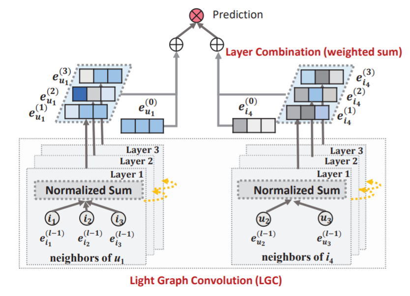

LightGCN
============

Introduction
------------------

`[paper] <https://dl.acm.org/doi/abs/10.1145/3397271.3401063>`_

**Title:** LightGCN: Simplifying and Powering Graph Convolution Network for Recommendation

**Authors:** Xiangnan He, Kuan Deng, Xiang Wang, Yan Li, Yongdong Zhang, Meng Wang

**Abstract:**
Graph Convolution Network (GCN) has become new state-of-the-art for collaborative filtering. Nevertheless, the reasons of
its effectiveness for recommendation are not well understood.
Existing work that adapts GCN to recommendation lacks thorough
ablation analyses on GCN, which is originally designed for graph
classification tasks and equipped with many neural network
operations. However, we empirically find that the two most
common designs in GCNs — feature transformation and nonlinear
activation — contribute little to the performance of collaborative
filtering. Even worse, including them adds to the difficulty of
training and degrades recommendation performance.

In this work, we aim to simplify the design of GCN to
make it more concise and appropriate for recommendation. We
propose a new model named LightGCN, including only the most
essential component in GCN — neighborhood aggregation — for
collaborative filtering. Specifically, LightGCN learns user and
item embeddings by linearly propagating them on the user-item
interaction graph, and uses the weighted sum of the embeddings
learned at all layers as the final embedding. Such simple, linear,
and neat model is much easier to implement and train, exhibiting
substantial improvements (about 16.0% relative improvement on
average) over Neural Graph Collaborative Filtering (NGCF) — a
state-of-the-art GCN-based recommender model — under exactly
the same experimental setting. Further analyses are provided
towards the rationality of the simple LightGCN from both analytical
and empirical perspectives.

Running with RecBole
-------------------------

**Model Hyper-Parameters:**

- ``embedding_size (int)`` : The embedding size of users and items. Defaults to ``64``.
- ``n_layers (int)`` : The number of layers in LightGCN. Defaults to ``2``.
- ``reg_weight (float)`` : The L2 regularization weight. Defaults to ``1e-05``.

**A Running Example:**

Write the following code to a python file, such as `run.py`

.. code:: python

   from recbole.quick_start import run_recbole

   run_recbole(model='LightGCN', dataset='ml-100k')

And then:

.. code:: bash

   python run.py

Tuning Hyper Parameters
-------------------------

If you want to use ``HyperTuning`` to tune hyper parameters of this model, you can copy the following settings and name it as ``hyper.test``.

.. code:: bash

   learning_rate choice [0.01,0.005,0.001,0.0005,0.0001]
   n_layers choice [1,2,3,4]
   reg_weight choice [1e-05,1e-04,1e-03,1e-02]
   

Note that we just provide these hyper parameter ranges for reference only, and we can not guarantee that they are the optimal range of this model.

Then, with the source code of RecBole (you can download it from GitHub), you can run the ``run_hyper.py`` to tuning:

.. code:: bash

	python run_hyper.py --model=[model_name] --dataset=[dataset_name] --config_files=[config_files_path] --params_file=hyper.test

For more details about Parameter Tuning, refer to :doc:`../../../user_guide/usage/parameter_tuning`.

If you want to change parameters, dataset or evaluation settings, take a look at

- :doc:`../../../user_guide/config_settings`
- :doc:`../../../user_guide/data_intro`
- :doc:`../../../user_guide/train_eval_intro`
- :doc:`../../../user_guide/usage`

