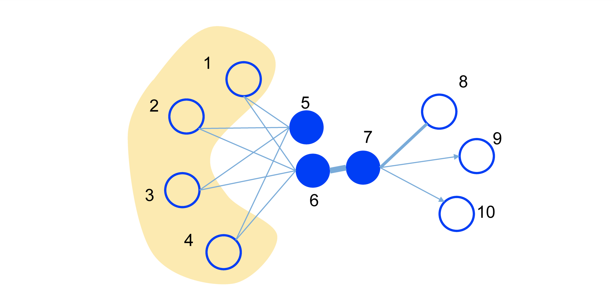

LINE
===========

Introduction
---------------------

`[paper] <https://dl.acm.org/doi/10.1145/2736277.2741093>`_

**Title:** LINE: Large-scale Information Network Embedding

**Authors:** Jian Tang, Meng Qu, Mingzhe Wang, Ming Zhang, Jun Yan, Qiaozhu Mei

**Abstract:** This paper studies the problem of embedding very large information networks into low-dimensional vector spaces, which is useful in many tasks such as visualization, node classification, and link prediction. Most existing graph embedding methods do not scale for real world information networks which usually contain millions of nodes. In this paper, we propose a novel network embedding method called the ``LINE``, which is suitable for arbitrary types of information networks: undirected, directed, and/or weighted. The method optimizes a carefully designed objective function that preserves both the local and global network structures. An edge-sampling algorithm is proposed that addresses the limitation of the classical stochastic gradient descent and improves both the effectiveness and the efficiency of the inference. Empirical experiments prove the effectiveness of the LINE on a variety of real-world information networks, including language networks, social networks, and citation networks. The algorithm is very efficient, which is able to learn the embedding of a network with millions of vertices and billions of edges in a few hours on a typical single machine. The source code of the LINE is available.

Running with RecBole
-------------------------

**Model Hyper-Parameters:**

- ``embedding_size (int)`` : The embedding size of users and items. Defaults to ``64``.
- ``order (int)`` : The order of proximity of the model. Defaults to ``2``.
- ``second_order_loss_weight (float)`` : The hyper parameter of the loss of second proximity loss. Defaults to ``1.0``.

**A Running Example:**

Write the following code to a python file, such as `run.py`

.. code:: python

   from recbole.quick_start import run_recbole

   run_recbole(model='LINE', dataset='ml-100k')

And then:

.. code:: bash

   python run.py

Tuning Hyper Parameters
-------------------------

If you want to use ``HyperTuning`` to tune hyper parameters of this model, you can copy the following settings and name it as ``hyper.test``.

.. code:: bash

   learning_rate choice [0.01,0.005,0.001,0.0005,0.0001]
   train_neg_sample_args choice [{'uniform':1}, {'uniform':3}, {'uniform':5}]
   second_order_loss_weight choice [0.3,0.6,1]

Note that we just provide these hyper parameter ranges for reference only, and we can not guarantee that they are the optimal range of this model.

Then, with the source code of RecBole (you can download it from GitHub), you can run the ``run_hyper.py`` to tuning:

.. code:: bash

	python run_hyper.py --model=[model_name] --dataset=[dataset_name] --config_files=[config_files_path] --params_file=hyper.test

For more details about Parameter Tuning, refer to :doc:`../../../user_guide/usage/parameter_tuning`.

If you want to change parameters, dataset or evaluation settings, take a look at

- :doc:`../../../user_guide/config_settings`
- :doc:`../../../user_guide/data_intro`
- :doc:`../../../user_guide/train_eval_intro`
- :doc:`../../../user_guide/usage`