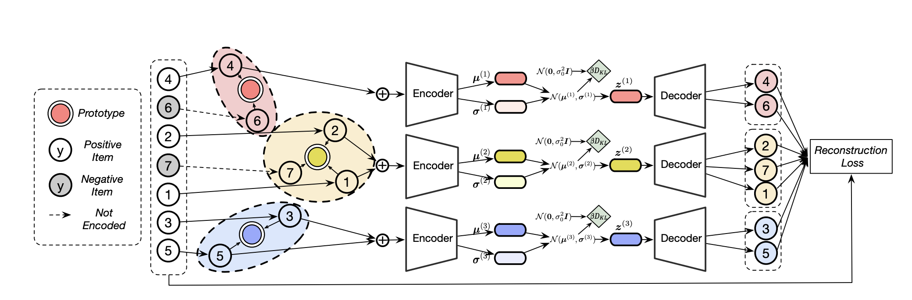

MacridVAE
===========

Introduction
---------------------

`[paper] <https://jianxinma.github.io/assets/disentangle-recsys.pdf>`_

**Title:** Learning Disentangled Representations for Recommendation

**Authors:** Jianxin Ma, Chang Zhou, Peng Cui, Hongxia Yang, Wenwu Zhu

**Abstract:** User behavior data in recommender systems are driven by the complex interactions
of many latent factors behind the users’ decision making processes. The factors are
highly entangled, and may range from high-level ones that govern user intentions,
to low-level ones that characterize a user’s preference when executing an intention.
Learning representations that uncover and disentangle these latent factors can bring
enhanced robustness, interpretability, and controllability. However, learning such
disentangled representations from user behavior is challenging, and remains largely
neglected by the existing literature. In this paper, we present the MACRo-mIcro
Disentangled Variational Auto-Encoder (MacridVAE) for learning disentangled
representations from user behavior. Our approach achieves macro disentanglement
by inferring the high-level concepts associated with user intentions (e.g., to buy
a shirt or a cellphone), while capturing the preference of a user regarding the
different concepts separately. A micro-disentanglement regularizer, stemming
from an information-theoretic interpretation of VAEs, then forces each dimension
of the representations to independently reflect an isolated low-level factor (e.g.,
the size or the color of a shirt). Empirical results show that our approach can
achieve substantial improvement over the state-of-the-art baselines. We further
demonstrate that the learned representations are interpretable and controllable,
which can potentially lead to a new paradigm for recommendation where users are given 
fine-grained control over targeted aspects of the recommendation lists.

Running with RecBole
-------------------------

**Model Hyper-Parameters:**

- ``embedding_size (int)`` : The latent dimension of auto-encoder. Defaults to ``64``.
- ``dropout_prob (float)`` : The drop out probability of input. Defaults to ``0.5``.
- ``kfac (int)`` : Number of facets (macro concepts). ``10``.
- ``nogb (boolean)`` : Disable Gumbel-Softmax sampling. ``False``.
- ``std (float)`` : Standard deviation of the Gaussian prior. ``0.01``.
- ``encoder_hidden_size (list)`` : The MLP hidden layer. Defaults to ``[600]``.
- ``tau (float)`` : Temperature of sigmoid/softmax, in (0,oo). Defaults to ``0.1``.
- ``anneal_cap (float)`` : The hyper parameter of the weight of KL loss. Defaults to ``0.2``.
- ``total_anneal_steps (int)`` : The maximum steps of anneal update. Defaults to ``200000``.
- ``reg_weights (list)`` : List of L2 regularization weights. Defaults to ``[0.0,0.0]``.

**A Running Example:**

Write the following code to a python file, such as `run.py`

.. code:: python

   from recbole.quick_start import run_recbole

   parameter_dict = {
      'train_neg_sample_args': None,
   }
   run_recbole(model='MacridVAE', dataset='ml-100k', config_dict=parameter_dict)

And then:

.. code:: bash

   python run.py

**Note**: Because this model is a non-sampling model, so you must set ``train_neg_sample_args=None`` when you run this model.

Tuning Hyper Parameters
-------------------------

If you want to use ``HyperTuning`` to tune hyper parameters of this model, you can copy the following settings and name it as ``hyper.test``.

.. code:: bash

   learning_rate choice [0.01,0.005,0.001,0.0005,0.0001]
   kafc choice [3,5,10,20]

Note that we just provide these hyper parameter ranges for reference only, and we can not guarantee that they are the optimal range of this model.

Then, with the source code of RecBole (you can download it from GitHub), you can run the ``run_hyper.py`` to tuning:

.. code:: bash

	python run_hyper.py --model=[model_name] --dataset=[dataset_name] --config_files=[config_files_path] --params_file=hyper.test

For more details about Parameter Tuning, refer to :doc:`../../../user_guide/usage/parameter_tuning`.

If you want to change parameters, dataset or evaluation settings, take a look at

- :doc:`../../../user_guide/config_settings`
- :doc:`../../../user_guide/data_intro`
- :doc:`../../../user_guide/train_eval_intro`
- :doc:`../../../user_guide/usage`