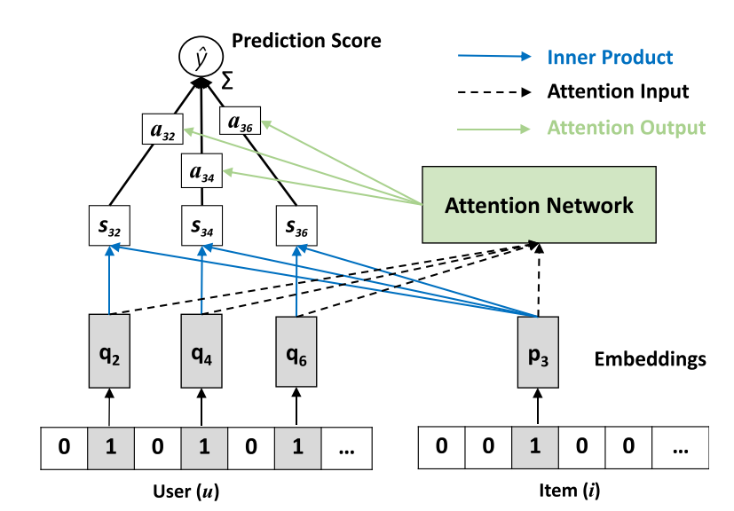

NAIS
===========

Introduction
---------------------

`[paper] <https://doi.ieeecomputersociety.org/10.1109/TKDE.2018.2831682>`_

**Title:** NAIS: Neural Attentive Item Similarity Model for Recommendation

**Authors:** Xiangnan He, Zhankui He, Jingkuan Song, Zhenguang Liu, Yu-Gang Jiang, and Tat-Seng Chua

**Abstract:** Item-to-item collaborative filtering (aka.item-based CF) has been long used for building
recommender systems in industrial settings, owing to its interpretability and efficiency in real-time
personalization. It builds a user’s profile as her historically interacted items, recommending new items
that are similar to the user’s profile. As such, the key to an item-based CF method is in the estimation
of item similarities. Early approaches use statistical measures such as cosine similarity and Pearson
coefficient to estimate item similarities, which are less accurate since they lack tailored optimization
for the recommendation task. In recent years, several works attempt to learn item similarities from data,
by expressing the similarity as an underlying model and estimating model parameters by optimizing a
recommendation-aware objective function. While extensive efforts have been made to use shallow linear
models for learning item similarities, there has been relatively less work exploring nonlinear neural
network models for item-based CF. In this work, we propose a neural network model named Neural Attentive
Item Similaritymodel(NAIS) for item-based CF. The key to our design of NAIS is an attention network,
which is capable of distinguishing which historical items in a user profile are more important for a prediction.
Compared to the state-of-the-art item-based CF method FactoredItem SimilarityModel(FISM), our NAIS has
stronger representation power with only a few additional parameters brought by the attention network.
Extensive experiments on two public benchmarks demonstrate the effectiveness of NAIS. This work is the first
attempt that designs neural network models for item-based CF, opening up new research possibilities for future
developments of neural recommender systems.

Running with RecBole
-------------------------

**Model Hyper-Parameters:**

- ``embedding_size (int)`` : The embedding size of users and items. Defaults to ``64``.
- ``weight_size (int)`` : The vector that projects the hidden layer into an output attention weight. Defaults to ``64``.
- ``algorithm (str)`` : The attention method. Defaults to ``'prod'``. Range in ``['prod', 'concat']``.
- ``split_to (int)`` : This is a parameter used to reduce the GPU memory usage during the evaluation. The larger the value, the less the memory usage and the slower the evaluation speed. Defaults to ``0``.
- ``alpha (float)`` : It is a hyper-parameter controlling the normalization effect of the number of user history interactions when calculating the similarity. Defaults to ``0.0``.
- ``beta (float)`` : It is the smoothing exponent controlling the denominator of softmax, it will be set in the range of ``[0, 1]``. Obviously, when beta is set to ``1``,it rcovers the softmax function; when ``beta`` is smaller than ``1``,the value of denominator will be suppressed, as a result, the attention weights will not be overly punished for active users. Defaults to ``0.5``.
- ``reg_weights (list)`` : The L2 regularization weights. Defaults to ``[1e-7, 1e-7, 1e-5]``.
- ``pretrain_path (str or None)`` : The path of pre-trained model for initialization. Defaults to ``None``.

**A Running Example:**

Write the following code to a python file, such as `run.py`

.. code:: python

   from recbole.quick_start import run_recbole

   run_recbole(model='NAIS', dataset='ml-100k')

And then:

.. code:: bash

   python run.py

Tuning Hyper Parameters
-------------------------

If you want to use ``HyperTuning`` to tune hyper parameters of this model, you can copy the following settings and name it as ``hyper.test``.

.. code:: bash

   learning_rate choice [0.01,0.005,0.001,0.0005,0.0001]
   weight_size choice [64] 
   reg_weights choice ['[1e-7, 1e-7, 1e-5]','[0,0,0]'] 
   alpha choice [0] 
   beta choice [0.5]
   
Note that we just provide these hyper parameter ranges for reference only, and we can not guarantee that they are the optimal range of this model.

Then, with the source code of RecBole (you can download it from GitHub), you can run the ``run_hyper.py`` to tuning:

.. code:: bash

	python run_hyper.py --model=[model_name] --dataset=[dataset_name] --config_files=[config_files_path] --params_file=hyper.test

For more details about Parameter Tuning, refer to :doc:`../../../user_guide/usage/parameter_tuning`.

If you want to change parameters, dataset or evaluation settings, take a look at

- :doc:`../../../user_guide/config_settings`
- :doc:`../../../user_guide/data_intro`
- :doc:`../../../user_guide/train_eval_intro`
- :doc:`../../../user_guide/usage`