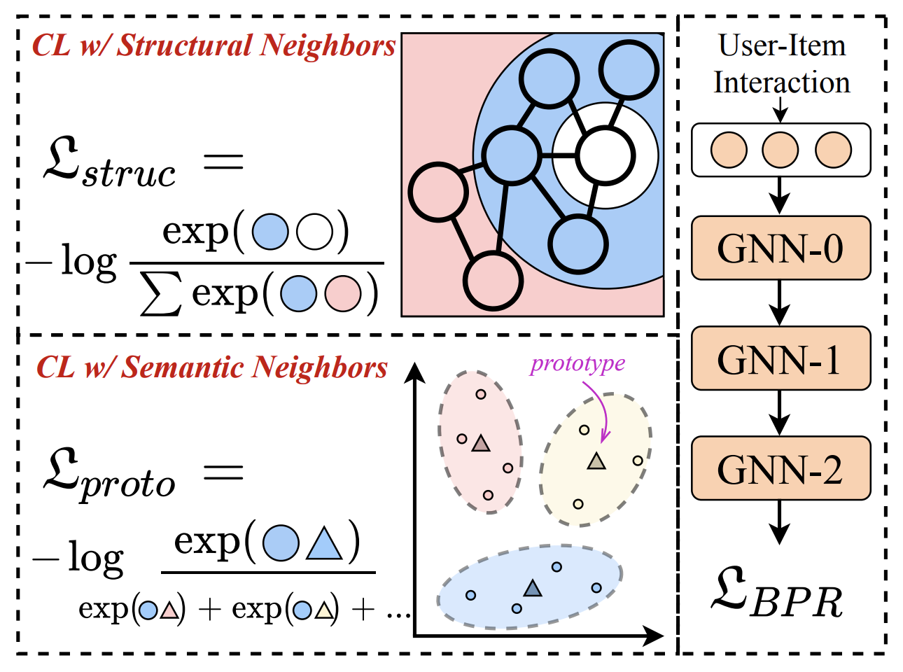

NCL
============

Introduction
------------------

`[paper] <https://arxiv.org/abs/2202.06200>`_

**Title:** Improving Graph Collaborative Filtering with Neighborhood-enriched Contrastive Learning

**Authors:** Zihan Lin, Changxin Tian, Yupeng Hou, Wayne Xin Zhao

**Abstract:**
Recently, graph collaborative filtering methods have been proposed
as an effective recommendation approach, which can capture users’
preference over items by modeling the user-item interaction graphs.
Despite the effectiveness, these methods suffer from data sparsity
in real scenarios. In order to reduce the influence of data sparsity,
contrastive learning is adopted in graph collaborative filtering for
enhancing the performance. However, these methods typically construct the contrastive pairs by random sampling, which neglect
the neighboring relations among users (or items) and fail to fully
exploit the potential of contrastive learning for recommendation.

To tackle the above issue, we propose a novel contrastive learning
approach, named Neighborhood-enriched Contrastive Learning,
named NCL, which explicitly incorporates the potential neighbors
into contrastive pairs. Specifically, we introduce the neighbors of
a user (or an item) from graph structure and semantic space respectively. For the structural neighbors on the interaction graph,
we develop a novel structure-contrastive objective that regards
users (or items) and their structural neighbors as positive contrastive pairs. In implementation, the representations of users (or
items) and neighbors correspond to the outputs of different GNN
layers. Furthermore, to excavate the potential neighbor relation
in semantic space, we assume that users with similar representations are within the semantic neighborhood, and incorporate these
semantic neighbors into the prototype-contrastive objective. The
proposed NCL can be optimized with EM algorithm and generalized to apply to graph collaborative filtering methods. Extensive
experiments on five public datasets demonstrate the effectiveness
of the proposed NCL, notably with 26% and 17% performance gain
over a competitive graph collaborative filtering base model on the
Yelp and Amazon-book datasets, respectively. Our implementation
code is available at: https://github.com/RUCAIBox/NCL.

Running with RecBole
-------------------------

**Model Hyper-Parameters:**

- ``embedding_size (int)`` : The embedding size of users and items. Defaults to ``64``.
- ``n_layers (int)`` : The number of GNN layers. Defaults to ``3``.
- ``reg_weight (float)`` : The L2 regularization weight. Defaults to ``1e-04``.
- ``ssl_temp (float)`` : Temperature for contrastive loss. Defaults to ``0.1``.
- ``ssl_reg (float)`` : The structure-contrastive loss weight. Defaults to ``1e-7``.
- ``hyper_layers (int)`` : Controlling the contrasted range for structural-contrastive loss, e.g., when set to 1, the GNN outputs for one user/item of layer 0 and 2 will be regarded as positive pairs. Defaults to ``1``.
- ``alpha (float)`` : The weight to balance self-supervised loss for users and items. Defaults to ``1``.
- ``proto_reg (float)`` : The prototype-contrastive weight. Defaults to ``8e-8``.
- ``num_clusters (int)`` : Number of prototypes. Defaults to ``1000``.
- ``m_step (int)`` : Number of M-steps for each E-step. Defaults to ``1``.
- ``warm_up_step (int)`` Number of warm up steps. Defaults to ``20``.

**A Running Example:**

Write the following code to a python file, such as `run.py`

.. code:: python

   from recbole.quick_start import run_recbole

   run_recbole(model='NCL', dataset='ml-100k')

And then:

.. code:: bash

   python run.py

Tuning Hyper Parameters
-------------------------

If you want to use ``HyperTuning`` to tune hyper parameters of this model, you can copy the following settings and name it as ``hyper.test``.

.. code:: bash

   ssl_temp choice [0.05,0.07,0.1]
   ssl_reg choice [1e-6,1e-7]
   proto_reg choice [1e-6,1e-7,1e-8]
   num_clusters choice [100,1000]

Note that we just provide these hyper parameter ranges for reference only, and we can not guarantee that they are the optimal range of this model.

Then, with the source code of RecBole (you can download it from GitHub), you can run the ``run_hyper.py`` to tuning:

.. code:: bash

	python run_hyper.py --model=[model_name] --dataset=[dataset_name] --config_files=[config_files_path] --params_file=hyper.test

For more details about Parameter Tuning, refer to :doc:`../../../user_guide/usage/parameter_tuning`.

If you want to change parameters, dataset or evaluation settings, take a look at

- :doc:`../../../user_guide/config_settings`
- :doc:`../../../user_guide/data_intro`
- :doc:`../../../user_guide/train_eval_intro`
- :doc:`../../../user_guide/usage`

