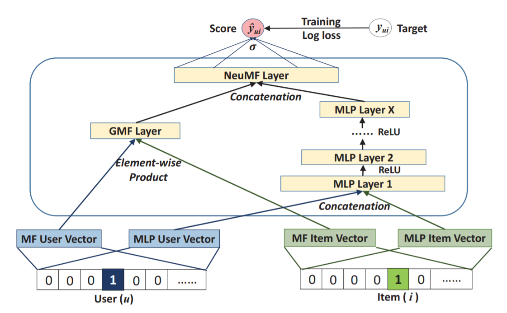

NeuMF
===========

Introduction
---------------------

`[paper] <https://dl.acm.org/doi/abs/10.1145/3038912.3052569>`_

**Title:** Neural Collaborative Filtering

**Authors:** Xiangnan He, Lizi Liao, Hanwang Zhang, Liqiang Nie, Xia Hu and Tat-Seng Chua

**Abstract:** In recent years, deep neural networks have yielded immense success on speech recognition, computer vision and natural language processing. However, the exploration of deep neural networks on recommender systems has received relatively less scrutiny. In this work, we strive to develop techniques based on neural networks to tackle the key problem in recommendation --- collaborative filtering --- on the basis of implicit feedback.

Although some recent work has employed deep learning for recommendation, they primarily used it to model auxiliary information, such as textual descriptions of items and acoustic features of musics. When it comes to model the key factor in collaborative filtering --- the interaction between user and item features, they still resorted to matrix factorization and applied an inner product on the latent features of users and items.

By replacing the inner product with a neural architecture that can learn an arbitrary function from data, we present a general framework named NCF, short for Neural network-based Collaborative Filtering. NCF is generic and can express and generalize matrix factorization under its framework. To supercharge NCF modelling with non-linearities, we propose to leverage a multi-layer perceptron to learn the user-item interaction function. Extensive experiments on two real-world datasets show significant improvements of our proposed NCF framework over the state-of-the-art methods. Empirical evidence shows that using deeper layers of neural networks offers better recommendation performance.

Running with RecBole
-------------------------

**Model Hyper-Parameters:**

- ``mf_embedding_size (int)`` : The MF embedding size of user and item. Defaults to ``64``.
- ``mlp_embedding_size (int)`` : The MLP embedding size of user and item. Defaults to ``64``.
- ``mlp_hidden_size (list)`` : The hidden size of each layer in MLP, the length of list is equal to the number of layers. Defaults to ``[128,64]``.
- ``dropout_prob (float)`` : The dropout rate in MLP layers. Defaults to ``0.1``.
- ``mf_train (bool)`` : Whether to train the MF part of the model. Defaults to ``True``.
- ``mlp_train (bool)`` : Whether to train the MLP part of the model. Defaults to ``True``.
- ``use_pretrain (bool)`` : Whether to use the pre-trained parameters for MF and MLP part. Defaults to ``False``.
- ``mf_pretrain_path (str or None)`` : The path of pre-trained MF part model. If ``use_pretrain`` is set to False, it will be ignored. Defaults to ``None``.
- ``mlp_pretrain_path (str or None)`` : The path of pre-trained MLP part model. If ``use_pretrain`` is set to False, it will be ignored. Defaults to ``None``.

**A Running Example:**

Write the following code to a python file, such as `run.py`

.. code:: python

   from recbole.quick_start import run_recbole

   run_recbole(model='NeuMF', dataset='ml-100k')

And then:

.. code:: bash

   python run.py

Tuning Hyper Parameters
-------------------------

If you want to use ``HyperTuning`` to tune hyper parameters of this model, you can copy the following settings and name it as ``hyper.test``.

.. code:: bash

   learning_rate choice [0.01,0.005,0.001,0.0005,0.0001]
   dropout_prob choice [0.0,0.1,0.2,0.3,0.4,0.5]
   mlp_hidden_size choice ['[64,32,16]','[32,16,8]']

Note that we just provide these hyper parameter ranges for reference only, and we can not guarantee that they are the optimal range of this model.

Then, with the source code of RecBole (you can download it from GitHub), you can run the ``run_hyper.py`` to tuning:

.. code:: bash

	python run_hyper.py --model=[model_name] --dataset=[dataset_name] --config_files=[config_files_path] --params_file=hyper.test

For more details about Parameter Tuning, refer to :doc:`../../../user_guide/usage/parameter_tuning`.

If you want to change parameters, dataset or evaluation settings, take a look at

- :doc:`../../../user_guide/config_settings`
- :doc:`../../../user_guide/data_intro`
- :doc:`../../../user_guide/train_eval_intro`
- :doc:`../../../user_guide/usage`