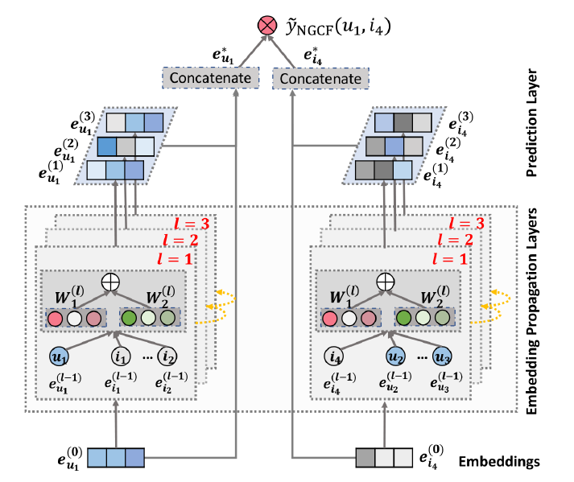

NGCF
===========

Introduction
---------------------

`[paper] <https://dl.acm.org/doi/abs/10.1145/3331184.3331267>`_

**Title:** Neural Graph Collaborative Filtering

**Authors:** Xiang Wang, Xiangnan He, Meng Wang, Fuli Feng and Tat-Seng Chua

**Abstract:** Learning vector representations (aka. embeddings) of users and items lies at the core of modern recommender systems. Ranging from early matrix factorization to recently emerged deep learning based methods, existing efforts typically obtain a user's (or an item's) embedding by mapping from pre-existing features that describe the user (or the item), such as ID and attributes. We argue that an inherent drawback of such methods is that, the collaborative signal, which is latent in user-item interactions, is not encoded in the embedding process. As such, the resultant embeddings may not be sufficient to capture the collaborative filtering effect.

In this work, we propose to integrate the user-item interactions - more specifically the bipartite graph structure - into the embedding process. We develop a new recommendation framework Neural Graph Collaborative Filtering (NGCF), which exploits the user-item graph structure by propagating embeddings on it. This leads to the expressive modeling of high-order connectivity in user-item graph, effectively injecting the collaborative signal into the embedding process in an explicit manner. We conduct extensive experiments on three public benchmarks, demonstrating significant improvements over several state-of-the-art models like HOP-Rec and Collaborative Memory Network. Further analysis verifies the importance of embedding propagation for learning better user and item representations, justifying the rationality and effectiveness of NGCF.

Running with RecBole
-------------------------

**Model Hyper-Parameters:**

- ``embedding_size (int)`` : The embedding size of users and items. Defaults to ``64``.
- ``hidden_size_list (list)`` : The hidden size of each layer in GCN layers, the length of list is equal to the number of layers. Defaults to ``[64,64,64]``.
- ``node_dropout (float)`` : The dropout rate of node in each GNN layer. Defaults to ``0.0``.
- ``message_dropout (float)`` : The dropout rate of edge in each GNN layer. Defaults to ``0.1``.
- ``reg_weight (float)`` : The L2 regularization weight. Defaults to ``1e-5``.

**A Running Example:**

Write the following code to a python file, such as `run.py`

.. code:: python

   from recbole.quick_start import run_recbole

   run_recbole(model='NGCF', dataset='ml-100k')

And then:

.. code:: bash

   python run.py

Tuning Hyper Parameters
-------------------------

If you want to use ``HyperTuning`` to tune hyper parameters of this model, you can copy the following settings and name it as ``hyper.test``.

.. code:: bash

   learning_rate choice [0.01,0.005,0.001,0.0005,0.0001]
   hidden_size_list choice ['[64,64,64]','[128,128,128]','[256,256,256]','[512,512,512]']  
   node_dropout choice [0.0,0.1,0.2]
   message_dropout choice [0.0,0.1,0.2,0.3] 
   reg_weight choice [1e-5,1e-4]
   delay choice [1e-5,1e-4,1e-4,1e-2,1e-1]

Note that we just provide these hyper parameter ranges for reference only, and we can not guarantee that they are the optimal range of this model.

Then, with the source code of RecBole (you can download it from GitHub), you can run the ``run_hyper.py`` to tuning:

.. code:: bash

	python run_hyper.py --model=[model_name] --dataset=[dataset_name] --config_files=[config_files_path] --params_file=hyper.test

For more details about Parameter Tuning, refer to :doc:`../../../user_guide/usage/parameter_tuning`.

If you want to change parameters, dataset or evaluation settings, take a look at

- :doc:`../../../user_guide/config_settings`
- :doc:`../../../user_guide/data_intro`
- :doc:`../../../user_guide/train_eval_intro`
- :doc:`../../../user_guide/usage`