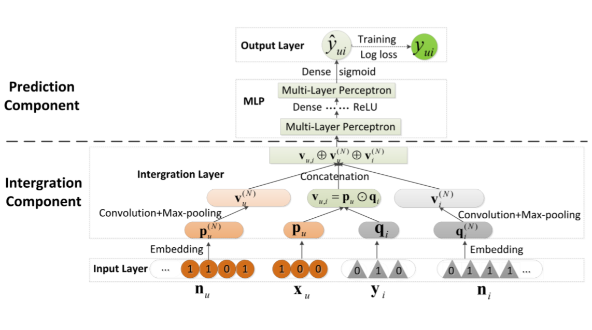

NNCF
==========

Introduction
-------------

`[paper] <https://dl.acm.org/doi/10.1145/3132847.3133083>`_

**Title:** A Neural Collaborative Filtering Model with Interaction-based Neighborhood

**Authors:** Ting Bai, Ji-Rong Wen, Jun Zhang, Wayne Xin Zhao

**Abstract:** Recently, deep neural networks have been widely applied to recommender systems. A representative work is to utilize deep learning for modeling complex user-item interactions. However, similar to traditional latent factor models by factorizing user-item interactions, they tend to be ineffective to capture localized information. Localized information, such as neighborhood, is important to recommender systems in complementing the user-item interaction data. Based on this consideration, we propose a novel Neighborhood-based Neural Collaborative Filtering model (NNCF). To the best of our knowledge, it is the first time that the neighborhood information is integrated into the neural collaborative filtering methods. Extensive experiments on three real-world datasets demonstrate the effectiveness of our model for the implicit recommendation task.

Running with RecBole
-------------------------

**Model Hyper-Parameters:**

- ``ui_embedding_size (int)``: The embedding size of user and item. Defaluts to ``64``.
- ``neigh_embedding_size (int)``: The embedding size of neighborhood information. Defaults to ``64``.
- ``num_conv_kernel (int)``: The number of kernels in convolution layer. Defaults to ``128``.
- ``conv_kernel_size (int)``: The size of kernel in convolution layer. Defaults to ``5``.
- ``pool_kernel_size (int)``: The size of kernel in pooling layer. Defaults to ``5``.
- ``mlp_hidden_size (list)``: The hidden size of each layer in MLP, the length of list is equal to the number of layers. Defaults to ``[128,64,32,16]``.
- ``neigh_num (int)``: The number of neighbors we choose. Defaults to ``20``.
- ``dropout (float)``: The dropout rate in MLP layers. Defaults to ``0.5``.
- ``resolution (float)``: The parameter in louvain algorithm, which decides the size of the community. Defaults to ``1.0``.
- ``use_random (bool)``: Whether to use random method to train neighborhood embedding. Defaults to ``True``.
- ``use_knn (bool)``: Whether to use knn method to train neighborhood embedding. Defaults to ``False``.
- ``use_louvain (bool)``: Whether to use louvain method to train neighborhood embedding. Defaults to ``False``.

**A Running Example:**

Write the following code to a python file, such as `run.py`

.. code:: python

   from recbole.quick_start import run_recbole

   run_recbole(model='NNCF', dataset='ml-100k')

And then:

.. code:: bash

   python run.py
   

Tuning Hyper Parameters
-------------------------

If you want to use ``HyperTuning`` to tune hyper parameters of this model, you can copy the following settings and name it as ``hyper.test``.

.. code:: bash

   learning_rate choice [0.0005,0.0001,0.00005]
   neigh_embedding_size choice [64,32]
   mlp_hidden_size choice ['[128,64,32,16]','[64,32,16,8]']
   num_conv_kernel choice [128,64]
   

Note that we just provide these hyper parameter ranges for reference only, and we can not guarantee that they are the optimal range of this model.

Then, with the source code of RecBole (you can download it from GitHub), you can run the ``run_hyper.py`` to tuning:

.. code:: bash

	python run_hyper.py --model=[model_name] --dataset=[dataset_name] --config_files=[config_files_path] --params_file=hyper.test

For more details about Parameter Tuning, refer to :doc:`../../../user_guide/usage/parameter_tuning`.

If you want to change parameters, dataset or evaluation settings, take a look at

- :doc:`../../../user_guide/config_settings`
- :doc:`../../../user_guide/data_intro`
- :doc:`../../../user_guide/train_eval_intro`
- :doc:`../../../user_guide/usage`
