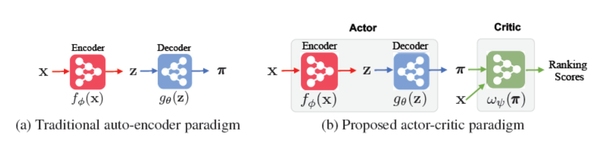

RaCT
===========

Introduction
---------------------

`[paper] <https://arxiv.org/abs/1906.04281>`_

**Title:** Towards Amortized Ranking-Critical Training for Collaborative Filtering

**Authors:** Sam Lobel, Chunyuan Li, Jianfeng Gao, Lawrence Carin

**Abstract:** Collaborative filtering is widely used in modern recommender systems. Recent research shows that variational autoencoders (VAEs) yield state-of-the-art performance by integrating flexible representations from deep neural networks into latent variable models, mitigating limitations of traditional linear factor models. VAEs are typically trained by maximizing the likelihood (MLE) of users interacting with ground-truth items. While simple and often effective, MLE-based training does not directly maximize the recommendation-quality metrics one typically cares about, such as top-N ranking. In this paper we investigate new methods for training collaborative filtering models based on actor-critic reinforcement learning, to directly optimize the non-differentiable quality metrics of interest. Specifically, we train a critic network to approximate ranking-based metrics, and then update the actor network (represented here by a VAE) to directly optimize against the learned metrics. In contrast to traditional learning-to-rank methods that require to re-run the optimization procedure for new lists, our critic-based method amortizes the scoring process with a neural network, and can directly provide the (approximate) ranking scores for new lists. Empirically, we show that the proposed methods outperform several state-of-the-art baselines, including recently-proposed deep learning approaches, on three large-scale real-world datasets.

Running with RecBole
-------------------------

**Model Hyper-Parameters:**

- ``latent_dimendion (int)`` : The latent dimension of auto-encoder. Defaults to ``256``.
- ``mlp_hidden_size (list)`` : The MLP hidden layer. Defaults to ``[600]``.
- ``dropout_prob (float)`` : The drop out probability of input. Defaults to ``0.5``.
- ``anneal_cap (float)`` : The super parameter of the weight of KL loss. Defaults to ``0.2``.
- ``total_anneal_steps (int)`` : The maximum steps of anneal update. Defaults to ``200000``.
- ``critic_layers (list)`` : The layers of critic network. Defaults to ``[100,100,10]``.
- ``metrics_k (int)`` : The parameter of NDCG for critic network training. Defaults to ``100``.
- ``train_stage (str)`` : The training stage. Defaults to ``'actor_pretrain'``. Range in ``['actor_pretrain', 'critic_pretrain', 'finetune']``.
- ``pretrain_epochs (int)`` : The pretrain epochs of actor pre-training or critic-pretraining. Defaults to '150'.
- ``save_step (int)`` : Save pre-trained model every ``save_step`` pre-training epochs. Defaults to ``10``.
- ``pre_model_path (str)`` : The path of pretrained model. Defaults to ``''``.

**A Running Example:**

1. Run actor pre-training. Write the following code to `run_actor_pretrain.py`

.. code:: python

   from recbole.quick_start import run_recbole

   config_dict = {
       'train_stage': 'actor_pretrain',
       'pretrain_epochs': 150,
       'neg_sampling': None,
   }
   run_recbole(model='RaCT', dataset='ml-100k',
        config_dict=config_dict, saved=False)

And then:

.. code:: bash

   python run_actor_pretrain.py

2. Run critic pre-training. Write the following code to `run_critic_pretrain.py`

.. code:: python

   from recbole.quick_start import run_recbole

   config_dict = {
       'train_stage': 'critic_pretrain',
       'pretrain_epochs': 50,
       'pre_model_path': './saved/RaCT-ml-100k-150.pth',
       'neg_sampling': None,
   }
   run_recbole(model='RaCT', dataset='ml-100k',
        config_dict=config_dict, saved=False)

And then:

.. code:: bash

   python run_critic_pretrain.py

3. Run fine-tuning. Write the following code to `run_finetune.py`

.. code:: python

   from recbole.quick_start import run_recbole

   config_dict = {
       'train_stage': 'finetune',
       'pre_model_path': './saved/RaCT-ml-100k-50.pth',
       'neg_sampling': None,
   }
   run_recbole(model='RaCT', dataset='ml-100k',
        config_dict=config_dict)

And then:

.. code:: bash

   python run_finetune.py

**Notes:**

- Because this model is a non-sampling model, so you must set ``neg_sampling=None`` when you run this model.

- In the actor pre-training and critic pre-training stage, the pre-trained model would be saved , named as ``RaCT-[dataset_name]-[pretrain_epochs].pth`` (e.g. RaCT-ml-100k-100.pth) and saved to ``./saved/``.

- In the fine-tuning stage, please make sure that the pre-trained model path is existed.

- Because this model needs different learning rates in different stages, we suggest setting ``learning_rate`` at ``0.0001`` in the critic pre-training stage and setting ``learning_rate`` at ``0.000002`` in the fine-tuning stage.

Tuning Hyper Parameters
-------------------------

If you want to use ``HyperTuning`` to tune hyper parameters of this model, you can copy the following settings and name it as ``hyper.test``.

.. code:: bash

   learning_rate choice [0.01,0.005,0.001,0.0005,0.0001]
   latent_dimension choice [128,200,256,400,512]

Note that we just provide these hyper parameter ranges for reference only, and we can not guarantee that they are the optimal range of this model.

Then, with the source code of RecBole (you can download it from GitHub), you can run the ``run_hyper.py`` to tuning:

.. code:: bash

	python run_hyper.py --model=[model_name] --dataset=[dataset_name] --config_files=[config_files_path] --params_file=hyper.test

For more details about Parameter Tuning, refer to :doc:`../../../user_guide/usage/parameter_tuning`.

If you want to change parameters, dataset or evaluation settings, take a look at

- :doc:`../../../user_guide/config_settings`
- :doc:`../../../user_guide/data_intro`
- :doc:`../../../user_guide/train_eval_intro`
- :doc:`../../../user_guide/usage`