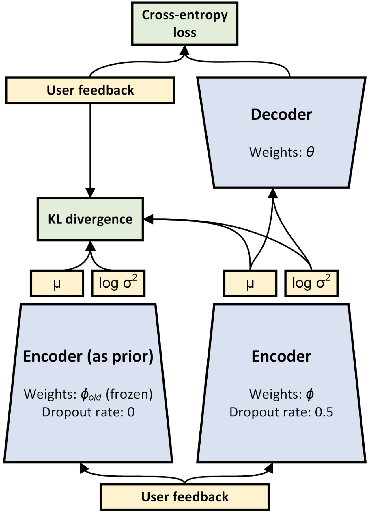

RecVAE
===========

Introduction
---------------------

`[paper] <https://dl.acm.org/doi/10.1145/3336191.3371831>`_

**Title:** RecVAE: A New Variational Autoencoder for Top-N Recommendations with Implicit Feedback

**Authors:** Ilya Shenbin, Anton Alekseev, Elena Tutubalina, Valentin Malykh, Sergey I. Nikolenko

**Abstract:** Recent research has shown the advantages of using autoencoders based on deep neural networks for collaborative filtering. In particular, the recently proposed Mult-VAE model, which used the multinomial likelihood variational autoencoders, has shown excellent results for top-N recommendations. In this work, we propose the Recommender VAE (RecVAE) model that originates from our research on regularization techniques for variational autoencoders. RecVAE introduces several novel ideas to improve Mult-VAE, including a novel composite prior distribution for the latent codes, a new approach to setting the β hyperparameter for the β-VAE framework, and a new approach to training based on alternating updates. In experimental evaluation, we show that RecVAE significantly outperforms previously proposed autoencoder-based models, including Mult-VAE and RaCT, across classical collaborative filtering datasets, and present a detailed ablation study to assess our new developments. Code and models are available at https://github.com/ilya-shenbin/RecVAE.

Running with RecBole
-------------------------

**Model Hyper-Parameters:**

- ``hidden_dimendion (list)`` : The hidden dimension of auto-encoder. Defaults to ``600``.
- ``latent_dimendion (int)`` : The latent dimension of auto-encoder. Defaults to ``200``.
- ``dropout_prob (float)`` : The drop out probability of input. Defaults to ``0.5``.
- ``beta (float)`` : The default hyperparameter of the weight of KL loss. Defaults to ``0.2``.
- ``gamma (float)`` : The hyperparameter shared across all users. Defaults to ``0.005``.
- ``mixture_weights (list)`` : The mixture weights of three composite priors. Defaults to ``[0.15, 0.75, 0.1]``.
- ``n_enc_epochs (int)`` : The training times of encoder per epoch. Defaults to ``3``.
- ``n_dec_epochs (int)`` : The training times of decoder per epoch. Defaults to ``1``.

**A Running Example:**

Write the following code to a python file, such as `run.py`

.. code:: python

   from recbole.quick_start import run_recbole

   parameter_dict = {
      'neg_sampling': None,
   }
   run_recbole(model='RecVAE', dataset='ml-100k', config_dict=parameter_dict)

And then:

.. code:: bash

   python run.py

**Note**: Because this model is a non-sampling model, so you must set ``neg_sampling=None`` when you run this model.

Tuning Hyper Parameters
-------------------------

If you want to use ``HyperTuning`` to tune hyper parameters of this model, you can copy the following settings and name it as ``hyper.test``.

.. code:: bash

   learning_rate choice [0.01,0.005,0.001,0.0005,0.0001]
   latent_dimension choice [64,100,128,150,200,256,300,400,512]

Note that we just provide these hyper parameter ranges for reference only, and we can not guarantee that they are the optimal range of this model.

Then, with the source code of RecBole (you can download it from GitHub), you can run the ``run_hyper.py`` to tuning:

.. code:: bash

	python run_hyper.py --model=[model_name] --dataset=[dataset_name] --config_files=[config_files_path] --params_file=hyper.test

For more details about Parameter Tuning, refer to :doc:`../../../user_guide/usage/parameter_tuning`.

If you want to change parameters, dataset or evaluation settings, take a look at

- :doc:`../../../user_guide/config_settings`
- :doc:`../../../user_guide/data_intro`
- :doc:`../../../user_guide/train_eval_intro`
- :doc:`../../../user_guide/usage`