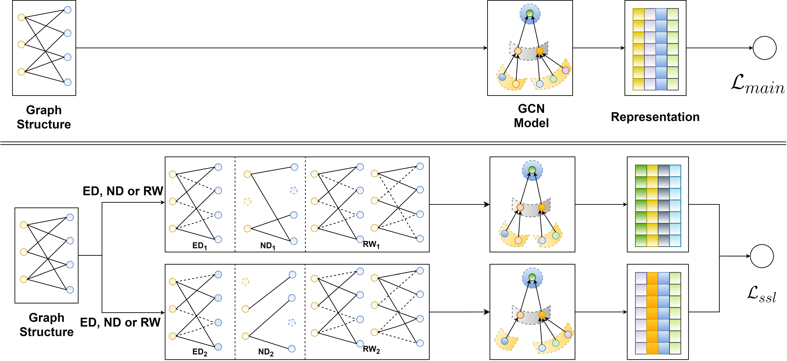

SGL
============

Introduction
------------------

`[paper] <https://dl.acm.org/doi/10.1145/3404835.3462862>`_

**Title:** Self-supervised Graph Learning for Recommendation

**Authors:** Jiancan Wu, Xiang Wang, Fuli Feng, Xiangnan He, Liang Chen, Jianxun Lian, and Xing Xie

**Abstract:**
Representation learning on user-item graph for recommendation
has evolved from using single ID or interaction history to
exploiting higher-order neighbors. This leads to the success of graph
convolution networks (GCNs) for recommendation such as PinSage
and LightGCN. Despite effectiveness, we argue that they suffer
from two limitations: (1) high-degree nodes exert larger impact on
the representation learning, deteriorating the recommendations of
low-degree (long-tail) items; and (2) representations are vulnerable
to noisy interactions, as the neighborhood aggregation scheme
further enlarges the impact of observed edges.
In this work, we explore self-supervised learning on useritem
graph, so as to improve the accuracy and robustness
of GCNs for recommendation. The idea is to supplement the
classical supervised task of recommendation with an auxiliary selfsupervised
task, which reinforces node representation learning
via self-discrimination. Specifically, we generate multiple views
of a node, maximizing the agreement between different views of
the same node compared to that of other nodes. We devise three
operators to generate the views — node dropout, edge dropout,
and random walk — that change the graph structure in different
manners. We term this new learning paradigm as Self-supervised
Graph Learning (SGL), implementing it on the state-of-the-art model
LightGCN. Through theoretical analyses, we find that SGL has the
ability of automatically mining hard negatives. Empirical studies
on three benchmark datasets demonstrate the effectiveness of
SGL, which improves the recommendation accuracy, especially on
long-tail items, and the robustness against interaction noises.

Running with RecBole
-------------------------

**Model Hyper-Parameters:**

- ``type (str)`` : The operators to generate the views. ``"ED"`` stands for edge dropout mode. ``"ND"`` stands for node dropout mode. ``"RW"`` stands for random walk mode. Defaults to ``"ED"``.
- ``n_layers (int)`` : The number of layers in SGL. Defaults to ``3``.
- ``ssl_tau (float)`` : The temperature in softmax. Defaults to ``0.5``.
- ``embedding_size (int)`` : the embedding size of users and items. Defaults to ``64``.
- ``drop_ratio (float)`` The dropout ratio. Defaults to ``0.1``.
- ``reg_weight (float)`` : The L2 regularization weight. Defaults to ``1e-05``.
- ``ssl_weight (float)`` : The hyperparameters to control the strengths of SSL. Defaults to ``0.05``.

**A Running Example:**

Write the following code to a python file, such as `run.py`

.. code:: python

   from recbole.quick_start import run_recbole

   run_recbole(model='SGL', dataset='ml-100k')

And then:

.. code:: bash

   python run.py

Tuning Hyper Parameters
-------------------------

If you want to use ``HyperTuning`` to tune hyper parameters of this model, you can copy the following settings and name it as ``hyper.test``.

.. code:: bash

   ssl_tau choice [0.1,0.2,0.5,1.0]
   drop_ratio choice [0,0.1,0.2,0.4,0.5]
   ssl_weight choice [0.005,0.05,0.1,0.5,1.0]

Note that we just provide these hyper parameter ranges for reference only, and we can not guarantee that they are the optimal range of this model.

Then, with the source code of RecBole (you can download it from GitHub), you can run the ``run_hyper.py`` to tuning:

.. code:: bash

	python run_hyper.py --model=[model_name] --dataset=[dataset_name] --config_files=[config_files_path] --params_file=hyper.test

For more details about Parameter Tuning, refer to :doc:`../../../user_guide/usage/parameter_tuning`.

If you want to change parameters, dataset or evaluation settings, take a look at

- :doc:`../../../user_guide/config_settings`
- :doc:`../../../user_guide/data_intro`
- :doc:`../../../user_guide/train_eval_intro`
- :doc:`../../../user_guide/usage`