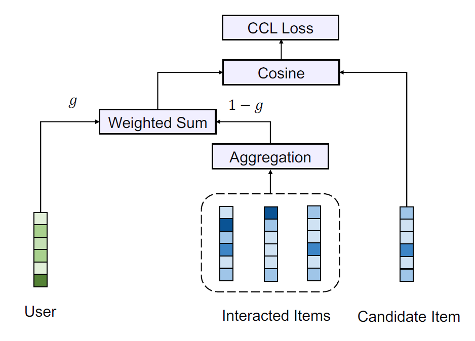

SimpleX
===========

Introduction
---------------------

`[paper] <https://dl.acm.org/doi/10.1145/3459637.3482297>`_

**Title:** SimpleX: A Simple and Strong Baseline for Collaborative Filtering

**Authors:** Kelong Mao, Jieming Zhu, Jinpeng Wang, Quanyu Dai, Zhenhua Dong, Xi Xiao, Xiuqiang He

**Abstract:**  Collaborative filtering (CF) is a widely studied research topic in recommender systems.
The learning of a CF model generally depends on three major components, namely interaction encoder, loss
function, and negative sampling. While many existing studies focus on the design of more powerful
interaction encoders, the impacts of loss functions and negative sampling ratios have not yet been well
explored. In this work, we show that the choice of loss function as well as negative sampling ratio is
equivalently important. More specifically, we propose the cosine contrastive loss (CCL) and further
incorporate it to a simple unified CF model, dubbed SimpleX. Extensive experiments have been conducted
on 11 benchmark datasets and compared with 29 existing CF models in total. Surprisingly, the results show
that, under our CCL loss and a large negative sampling ratio, SimpleX can surpass most sophisticated
state-of-the-art models by a large margin. We believe that SimpleX could not only serve as a simple
strong baseline to foster future research on CF, but also shed light on the potential research direction
towards improving loss function and negative sampling.

Running with RecBole
-------------------------

**Model Hyper-Parameters:**

- ``embedding_size (int)`` : The embedding size of users and items. Defaults to ``64``.
- ``margin (float)`` : The margin to filter negative samples in CCL loss. Range
  in ``[-1, 1]``. Defaults to ``0.9``.
- ``negative_weight (int)`` : Control the relative weights of positive-sample loss and negative-sample 
  loss in CCL loss. Defaults to ``10``.
- ``gamma (float)`` : The weight for fusion of user representations and historically interacted
  items representations. Range in ``[0, 1]``. Defaults to ``0.5``.
- ``aggregator (str)`` : The way to aggregate historically interacted items representations. Range
  in ``['mean', 'user_attention', 'self_attention']``. Defaults to ``'mean'``.
- ``history_len (int)`` : The length of the user's historical interaction items. Defaults to ``50``.
- ``reg_weight (float)`` : The L2 regularization weight. Defaults to ``1e-05``.

**A Running Example:**

Write the following code to a python file, such as `run.py`

.. code:: python

  from recbole.quick_start import run_recbole

  run_recbole(model='SimpleX', dataset='ml-100k')

And then:

.. code:: bash

  python run.py

Tuning Hyper Parameters
-------------------------

If you want to use ``HyperTuning`` to tune hyper parameters of this model, you can copy the following settings and name it as ``hyper.test``.

.. code:: bash

  margin choice [0,0.5,0.9]
  negative_weight choice [0,10,50]
  gamma choice [0.3,0.5,0.7]

Note that we just provide these hyper parameter ranges for reference only, and we can not guarantee that they are the optimal range of this model.

Then, with the source code of RecBole (you can download it from GitHub), you can run the ``run_hyper.py`` to tuning:

.. code:: bash

	python run_hyper.py --model=[model_name] --dataset=[dataset_name] --config_files=[config_files_path] --params_file=hyper.test

For more details about Parameter Tuning, refer to :doc:`../../../user_guide/usage/parameter_tuning`.

If you want to change parameters, dataset or evaluation settings, take a look at

- :doc:`../../../user_guide/config_settings`
- :doc:`../../../user_guide/data_intro`
- :doc:`../../../user_guide/train_eval_intro`
- :doc:`../../../user_guide/usage`