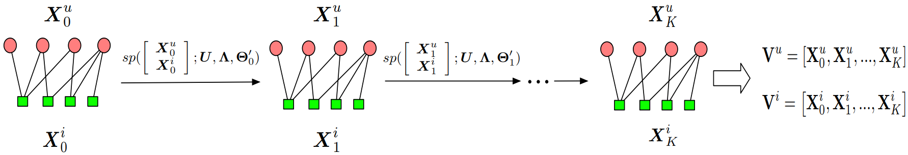

SpectralCF
===========

Introduction
---------------------

`[paper] <https://dl.acm.org/doi/10.1145/3240323.3240343>`_

**Title:** Spectral collaborative filtering

**Authors:** Lei Zheng, Chun-Ta Lu, Fei Jiang, Jiawei Zhang, Philip S. Yu

**Abstract:**  Despite the popularity of Collaborative Filtering (CF), CF-based methods are haunted by the cold-start problem,
which has a significantly negative impact on users' experiences with Recommender Systems (RS). In this paper, to overcome the
aforementioned drawback, we first formulate the relationships between users and items as a bipartite graph. Then, we propose
a new spectral convolution operation directly performing in the spectral domain, where not only the proximity information of
a graph but also the connectivity information hidden in the graph are revealed. With the proposed spectral convolution operation,
we build a deep recommendation model called Spectral Collaborative Filtering (SpectralCF). Benefiting from the rich information
of connectivity existing in the spectral domain, SpectralCF is capable of discovering deep connections between users and items
and therefore, alleviates the cold-start problem for CF. To the best of our knowledge, SpectralCF is the first CF-based method
directly learning from the spectral domains of user-item bipartite graphs. We apply our method on several standard datasets.
It is shown that SpectralCF significantly out-performs state-of-the-art models.

Running with RecBole
-------------------------

**Model Hyper-Parameters:**

- ``embedding_size (int)`` : The embedding size of users and items. Defaults to ``64``.
- ``n_layers (int)`` : The number of layers in SpectralCF. Defaults to ``4``.
- ``reg_weight (float)`` : The L2 regularization weight. Defaults to ``1e-3``.

**A Running Example:**

Write the following code to a python file, such as `run.py`

.. code:: python

   from recbole.quick_start import run_recbole

   run_recbole(model='SpectralCF', dataset='ml-100k')

And then:

.. code:: bash

   python run.py

Tuning Hyper Parameters
-------------------------

If you want to use ``HyperTuning`` to tune hyper parameters of this model, you can copy the following settings and name it as ``hyper.test``.

.. code:: bash

   learning_rate choice [0.01,0.005,0.001,0.0005,0.0001]
   reg_weight choice [0.01,0.002,0.001,0.0005]
   n_layers choice [1,2,3,4]

Note that we just provide these hyper parameter ranges for reference only, and we can not guarantee that they are the optimal range of this model.

Then, with the source code of RecBole (you can download it from GitHub), you can run the ``run_hyper.py`` to tuning:

.. code:: bash

	python run_hyper.py --model=[model_name] --dataset=[dataset_name] --config_files=[config_files_path] --params_file=hyper.test

For more details about Parameter Tuning, refer to :doc:`../../../user_guide/usage/parameter_tuning`.

If you want to change parameters, dataset or evaluation settings, take a look at

- :doc:`../../../user_guide/config_settings`
- :doc:`../../../user_guide/data_intro`
- :doc:`../../../user_guide/train_eval_intro`
- :doc:`../../../user_guide/usage`

