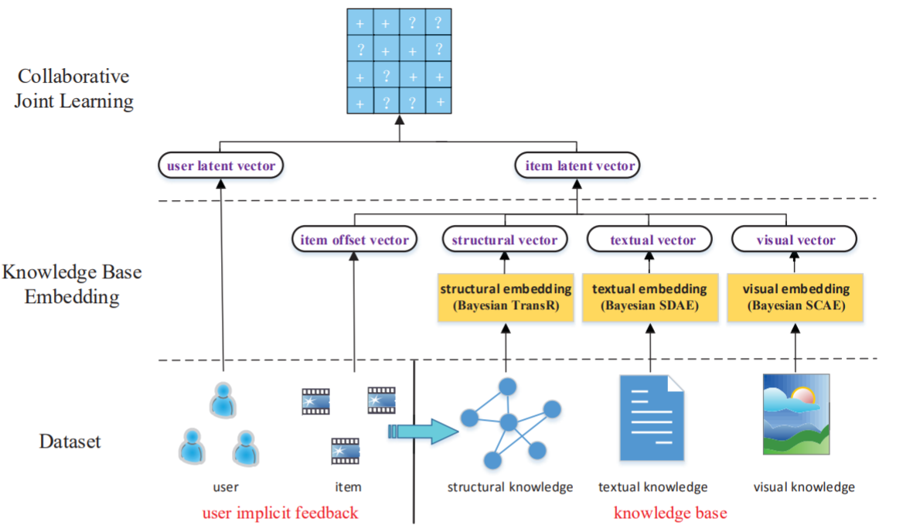

CKE
===========

Introduction
---------------------

`[paper] <https://dl.acm.org/doi/10.1145/2939672.2939673>`_

**Title:** Collaborative Knowledge Base Embedding for Recommender Systems

**Authors:** Fuzheng Zhang, Nicholas Jing Yuan, Defu Lian, Xing Xie, Wei-Ying Ma

**Abstract:**  Among different recommendation techniques, collaborative filtering usually suffer from limited performance due to the sparsity
of user-item interactions. To address the issues, auxiliary information is usually used to boost the performance. Due to the rapid
collection of information on the web, the knowledge base provides
heterogeneous information including both structured and unstructured data with different semantics, which can be consumed by various applications. In this paper, we investigate how to leverage
the heterogeneous information in a knowledge base to improve the
quality of recommender systems. First, by exploiting the knowledge base, we design three components to extract items’ semantic
representations from structural content, textual content and visual content, respectively. To be specific, we adopt a heterogeneous
network embedding method, termed as TransR, to extract items’
structural representations by considering the heterogeneity of both
nodes and relationships. We apply stacked denoising auto-encoders
and stacked convolutional auto-encoders, which are two types of
deep learning based embedding techniques, to extract items’ textual representations and visual representations, respectively. Finally, we propose our final integrated framework, which is termed as
Collaborative Knowledge Base Embedding (CKE), to jointly learn
the latent representations in collaborative filtering as well as items’ semantic representations from the knowledge base. To evaluate the performance of each embedding component as well as the
whole system, we conduct extensive experiments with two realworld datasets from different scenarios. The results reveal that our
approaches outperform several widely adopted state-of-the-art recommendation methods.

Running with RecBole
-------------------------

**Model Hyper-Parameters:**

- ``embedding_size (int)`` : The embedding size of users, items and entities. Defaults to ``64``.
- ``kg_embedding_size (int)`` : The embedding size of relations in knowledge graph. Defaults to ``64``.
- ``reg_weights (list of float)`` : The L2 regularization weights, there are two values,
  the former is for user and item embedding regularization and the latter is for entity and relation embedding regularization. Defaults to ``[1e-02,1e-02]``

**A Running Example:**

Write the following code to a python file, such as `run.py`

.. code:: python

   from recbole.quick_start import run_recbole

   run_recbole(model='CKE', dataset='ml-100k')

And then:

.. code:: bash

   python run.py

Tuning Hyper Parameters
-------------------------

If you want to use ``HyperTuning`` to tune hyper parameters of this model, you can copy the following settings and name it as ``hyper.test``.

.. code:: bash

   learning_rate choice [0.01,0.005,0.001,0.0005,0.0001]
   kg_embedding_size choice [16,32,64,128]
   reg_weights choice ['[0.1,0.1]','[0.01,0.01]','[0.001,0.001]']

Note that we just provide these hyper parameter ranges for reference only, and we can not guarantee that they are the optimal range of this model.

Then, with the source code of RecBole (you can download it from GitHub), you can run the ``run_hyper.py`` to tuning:

.. code:: bash

	python run_hyper.py --model=[model_name] --dataset=[dataset_name] --config_files=[config_files_path] --params_file=hyper.test

For more details about Parameter Tuning, refer to :doc:`../../../user_guide/usage/parameter_tuning`.

If you want to change parameters, dataset or evaluation settings, take a look at

- :doc:`../../../user_guide/config_settings`
- :doc:`../../../user_guide/data_intro`
- :doc:`../../../user_guide/train_eval_intro`
- :doc:`../../../user_guide/usage`