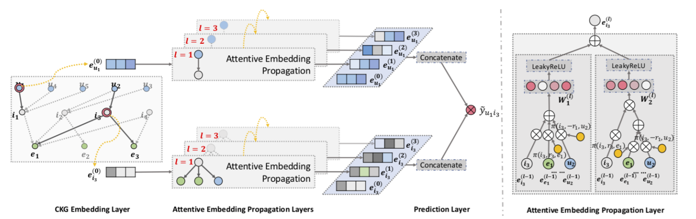

KGAT
===========

Introduction
---------------------

`[paper] <https://dl.acm.org/doi/10.1145/3292500.3330989>`_

**Title:** KGAT: Knowledge Graph Attention Network for Recommendation

**Authors:** Xiang Wang, Xiangnan He, Yixin Cao, Meng Liu, Tat-Seng Chua

**Abstract:** To provide more accurate, diverse, and explainable recommendation,
it is compulsory to go beyond modeling user-item interactions
and take side information into account. Traditional methods like
factorization machine (FM) cast it as a supervised learning problem,
which assumes each interaction as an independent instance with
side information encoded. Due to the overlook of the relations
among instances or items (e.g., the director of a movie is also an
actor of another movie), these methods are insufficient to distill the
collaborative signal from the collective behaviors of users.

In this work, we investigate the utility of knowledge graph
(KG), which breaks down the independent interaction assumption
by linking items with their attributes. We argue that in such a
hybrid structure of KG and user-item graph, high-order relations
— which connect two items with one or multiple linked attributes
— are an essential factor for successful recommendation. We
propose a new method named Knowledge Graph Attention Network
(KGAT) which explicitly models the high-order connectivities
in KG in an end-to-end fashion. It recursively propagates the
embeddings from a node’s neighbors (which can be users, items,
or attributes) to refine the node’s embedding, and employs
an attention mechanism to discriminate the importance of the
neighbors. Our KGAT is conceptually advantageous to existing
KG-based recommendation methods, which either exploit highorder relations by extracting paths or implicitly modeling them
with regularization. Empirical results on three public benchmarks
show that KGAT significantly outperforms state-of-the-art methods
like Neural FM and RippleNet. Further studies verify
the efficacy of embedding propagation for high-order relation
modeling and the interpretability benefits brought by the attention
mechanism.

Running with RecBole
-------------------------

**Model Hyper-Parameters:**

- ``embedding_size (int)`` : The embedding size of users, items and entities. Defaults to ``64``.
- ``kg_embedding_size (int)`` : The embedding size of relations in knowledge graph. Defaults to ``64``.
- ``layers (list of int)`` : The hidden size in GNN layers, the length of this list is equal to the number of layers in GNN structure. Defaults to ``[64]``.
- ``mess_dropout (float)`` : The message dropout rate in GNN layer. Defaults to ``0.1``.
- ``reg_weight (float)`` : The L2 regularization weight. Defaults to ``1e-05``.
- ``aggregator_type (str)`` : The aggregator type used in GNN layer. Defaults to ``'bi'``. Range in ``['gcn', 'graphsage', 'bi']``.

**A Running Example:**

Write the following code to a python file, such as `run.py`

.. code:: python

   from recbole.quick_start import run_recbole

   run_recbole(model='KGAT', dataset='ml-100k')

And then:

.. code:: bash

   python run.py

**Notes:**

- If you want to run KGAT in RecBole, please ensure the torch version is 1.6.0 or later. Because we use torch.sparse.softmax in KGAT, which is only available in torch 1.6.0 or later.

Tuning Hyper Parameters
-------------------------

If you want to use ``HyperTuning`` to tune hyper parameters of this model, you can copy the following settings and name it as ``hyper.test``.

.. code:: bash

   learning_rate choice [0.01,0.005,0.001,0.0005,0.0001]
   layers choice ['[64,32,16]','[64,64,64]','[128,64,32]']
   reg_weight choice [1e-4,5e-5,1e-5,5e-6,1e-6]
   mess_dropout choice [0.1,0.2,0.3,0.4,0.5]

Note that we just provide these hyper parameter ranges for reference only, and we can not guarantee that they are the optimal range of this model.

Then, with the source code of RecBole (you can download it from GitHub), you can run the ``run_hyper.py`` to tuning:

.. code:: bash

	python run_hyper.py --model=[model_name] --dataset=[dataset_name] --config_files=[config_files_path] --params_file=hyper.test

For more details about Parameter Tuning, refer to :doc:`../../../user_guide/usage/parameter_tuning`.

If you want to change parameters, dataset or evaluation settings, take a look at

- :doc:`../../../user_guide/config_settings`
- :doc:`../../../user_guide/data_intro`
- :doc:`../../../user_guide/train_eval_intro`
- :doc:`../../../user_guide/usage`