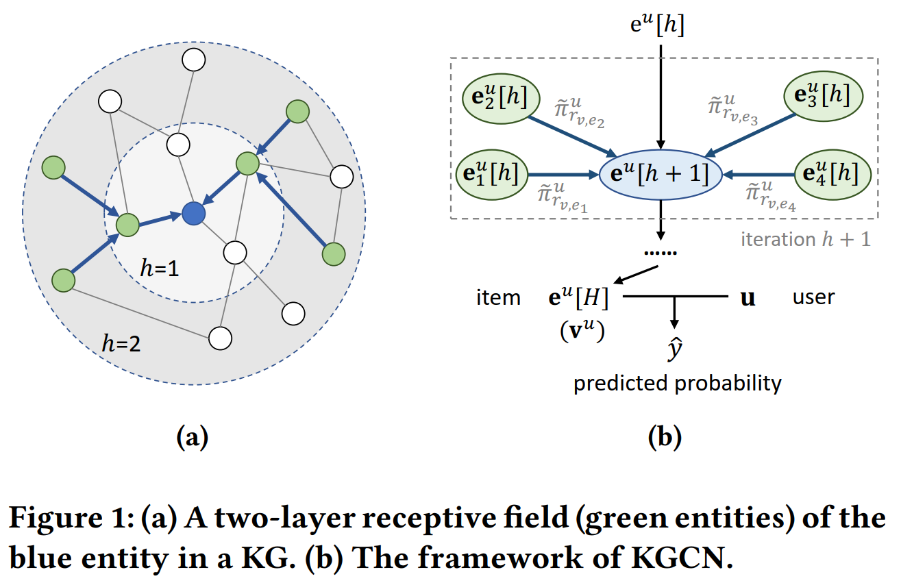

KGCN
===========

Introduction
---------------------

`[paper] <https://dl.acm.org/doi/10.1145/3308558.3313417>`_

**Title:** Knowledge Graph Convolutional Networks for Recommender

**Authors:** Hongwei Wang, Miao Zhao, Xing Xie, Wenjie Li, Minyi Guo

**Abstract:**  To alleviate sparsity and cold start problem of collaborative filtering
based recommender systems, researchers and engineers usually
collect attributes of users and items, and design delicate algorithms
to exploit these additional information. In general, the attributes are
not isolated but connected with each other, which forms a knowledge graph (KG). In this paper, we propose Knowledge Graph
Convolutional Networks (KGCN), an end-to-end framework that
captures inter-item relatedness effectively by mining their associated attributes on the KG. To automatically discover both high-order
structure information and semantic information of the KG, we sample from the neighbors for each entity in the KG as their receptive
field, then combine neighborhood information with bias when calculating the representation of a given entity. The receptive field can
be extended to multiple hops away to model high-order proximity
information and capture users’ potential long-distance interests.
Moreover, we implement the proposed KGCN in a minibatch fashion, which enables our model to operate on large datasets and KGs.
We apply the proposed model to three datasets about movie, book,
and music recommendation, and experiment results demonstrate
that our approach outperforms strong recommender baselines.

Running with RecBole
-------------------------

**Model Hyper-Parameters:**

- ``embedding_size (int)`` : The embedding size of users, relations and entities. Defaults to ``64``.
- ``aggregator (str)`` : The aggregator used in GNN layers. Defaults to ``'sum'``. Range in ``['sum', 'neighbor', 'concat']``.
- ``reg_weight (float)`` : The L2 regularization weight. Defaults to ``1e-7``.
- ``neighbor_sample_size (int)`` : The number of neighbors to be sampled. Defaults to ``4``.
- ``n_iter (int)`` : The number of iterations when computing entity representation. Defaults to ``1``.

**A Running Example:**

Write the following code to a python file, such as `run.py`

.. code:: python

   from recbole.quick_start import run_recbole

   run_recbole(model='KGCN', dataset='ml-100k')

And then:

.. code:: bash

   python run.py

Tuning Hyper Parameters
-------------------------

If you want to use ``HyperTuning`` to tune hyper parameters of this model, you can copy the following settings and name it as ``hyper.test``.

.. code:: bash

   learning_rate choice [0.01,0.005,0.001,0.0005,0.0001]

Note that we just provide these hyper parameter ranges for reference only, and we can not guarantee that they are the optimal range of this model.

Then, with the source code of RecBole (you can download it from GitHub), you can run the ``run_hyper.py`` to tuning:

.. code:: bash

	python run_hyper.py --model=[model_name] --dataset=[dataset_name] --config_files=[config_files_path] --params_file=hyper.test

For more details about Parameter Tuning, refer to :doc:`../../../user_guide/usage/parameter_tuning`.

If you want to change parameters, dataset or evaluation settings, take a look at

- :doc:`../../../user_guide/config_settings`
- :doc:`../../../user_guide/data_intro`
- :doc:`../../../user_guide/train_eval_intro`
- :doc:`../../../user_guide/usage`

