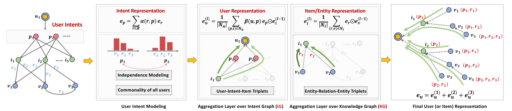

KGIN
===========

Introduction
---------------------

`[paper] <https://dl.acm.org/doi/abs/10.1145/3442381.3450133>`_

**Title:** Learning Intents behind Interactions with Knowledge Graph for Recommendation

**Authors:** Xiang Wang, Tinglin Huang, Dingxian Wang, Yancheng Yuan, Zhenguang Liu, Xiangnan He, Tat-Seng Chua

**Abstract:**  Knowledge graph (KG) plays an increasingly important role in recommender systems. A recent technical trend is to develop end-to-end models founded on graph neural networks (GNNs). However, existing GNN-based models are coarse-grained in relational modeling, failing to (1) identify user-item relation at a fine-grained level of intents, and (2) exploit relation dependencies to preserve the semantics of long-range connectivity.

In this study, we explore intents behind a user-item interaction by using auxiliary item knowledge, and propose a new model, Knowledge Graph-based Intent Network (KGIN). Technically, we model each intent as an attentive combination of KG relations, encouraging the independence of different intents for better model capability and interpretability. Furthermore, we devise a new information aggregation scheme for GNN, which recursively integrates the relation sequences of long-range connectivity (i.e., relational paths). This scheme allows us to distill useful information about user intents and encode them into the representations of users and items. Experimental results on three benchmark datasets show that, KGIN achieves significant improvements over the state-of-the-art methods like KGAT, KGNN-LS, and CKAN. Further analyses show that KGIN offers interpretable explanations for predictions by identifying influential intents and relational paths.

Running with RecBole
-------------------------

**Model Hyper-Parameters:**

- ``embedding_size (int)`` : The embedding size of users, items, entities and relations. Defaults to ``64``.
- ``reg_weight (float)`` : The L2 regularization weight. Defaults to ``1e-5``.
- ``node_dropout_rate (float)`` : The node dropout rate in GCN layer. Defaults to ``0.1``.
- ``mess_dropout_rate (float)`` : The message dropout rate in GCN layer. Defaults to ``0.1``.
- ``sim_regularity (float)`` : The intents independence loss weight. Defaults to ``1e-4``.
- ``context_hops (int)`` : The number of context hops in GCN layer. Defaults to ``3``.
- ``n_factors (int)`` : The number of user intents. Defaults to ``4``.
- ``ind (str)`` : The intents independence loss type. Defaults to ``'cosine'``. Range in ``['mi', 'distance', 'cosine']``.
- ``temperature (float)`` : The temperature parameter used in loss calculation. Defaults to ``0.2``.

**A Running Example:**

Write the following code to a python file, such as `run.py`

.. code:: python

   from recbole.quick_start import run_recbole

   run_recbole(model='KGIN', dataset='ml-100k')

And then:

.. code:: bash

   python run.py

Tuning Hyper Parameters
-------------------------

If you want to use ``HyperTuning`` to tune hyper parameters of this model, you can copy the following settings and name it as ``hyper.test``.

.. code:: bash

    learning_rate choice [1e-4,1e-3,5e-3]
    node_dropout_rate choice [0.1,0.3,0.5]
    mess_dropout_rate choice [0.0,0.1]
    context_hops choice [2,3]
    n_factors choice [4,8]
    ind choice ['cosine','distance']

Note that we just provide these hyper parameter ranges for reference only, and we can not guarantee that they are the optimal range of this model.

Then, with the source code of RecBole (you can download it from GitHub), you can run the ``run_hyper.py`` to tuning:

.. code:: bash

	python run_hyper.py --model=[model_name] --dataset=[dataset_name] --config_files=[config_files_path] --params_file=hyper.test

For more details about Parameter Tuning, refer to :doc:`../../../user_guide/usage/parameter_tuning`.

If you want to change parameters, dataset or evaluation settings, take a look at

- :doc:`../../../user_guide/config_settings`
- :doc:`../../../user_guide/data_intro`
- :doc:`../../../user_guide/train_eval_intro`
- :doc:`../../../user_guide/usage`

