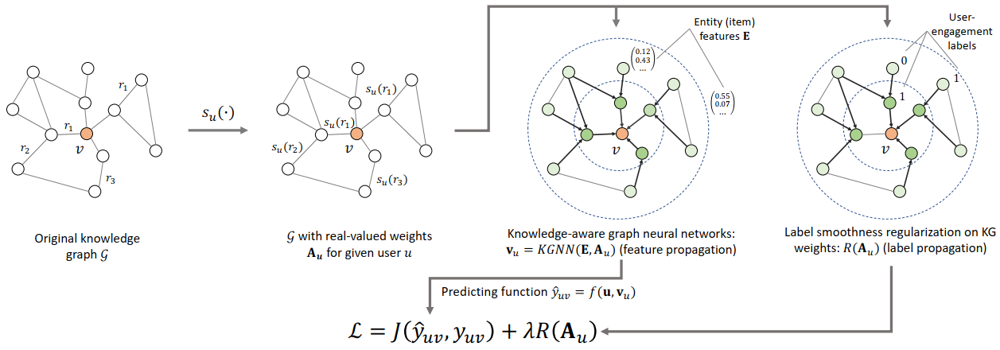

KGNNLS
===========

Introduction
---------------------

`[paper] <https://dl.acm.org/doi/10.1145/3292500.3330836>`_

**Title:** Knowledge-aware Graph Neural Networks with Label Smoothness Regularization for Recommender Systems

**Authors:** Hongwei Wang, Fuzheng Zhang, Mengdi Zhang, Jure Leskovec, Miao Zhao, Wenjie Li, Zhongyuan Wang

**Abstract:**  Knowledge graphs capture structured information and relations between a set of entities or items.
As such knowledge graphs represent an attractive source of information that could help improve recommender systems.
However, existing approaches in this domain rely on manual feature engineering and do not allow for an end-to-end
training. Here we propose Knowledge-aware Graph Neural Networks with Label Smoothness regularization (KGNN-LS) to
provide better recommendations. Conceptually, our approach computes user-specific item embeddings by first applying
a trainable function that identifies important knowledge graph relationships for a given user. This way we transform
the knowledge graph into a user-specific weighted graph and then apply a graph neural network to compute personalized
item embeddings. To provide better inductive bias, we rely on label smoothness assumption, which posits that adjacent
items in the knowledge graph are likely to have similar user relevance labels/scores. Label smoothness provides
regularization over the edge weights and we prove that it is equivalent to a label propagation scheme on a graph.
We also develop an efficient implementation that shows strong scalability with respect to the knowledge graph size.
Experiments on four datasets show that our method outperforms state of the art baselines. KGNN-LS also achieves
strong performance in cold-start scenarios where user-item interactions are sparse.

Running with RecBole
-------------------------

**Model Hyper-Parameters:**

- ``embedding_size (int)`` : The initial embedding size of users, relations and entities. Defaults to ``64``.
- ``aggregator (str)`` : The aggregator used in GNN layers. Defaults to ``'sum'``. Range in ``['sum', 'neighbor', 'concat']``.
- ``reg_weight (float)`` : The L2 regularization weight. Defaults to ``1e-7``.
- ``neighbor_sample_size (int)`` : The number of neighbors to be sampled. Defaults to ``4``.
- ``n_iter (int)`` : The number of iterations when computing entity representation. Defaults to ``1``.
- ``ls_weight (float)`` : The label smoothness regularization weight. Defaults to ``0.5``.

**A Running Example:**

Write the following code to a python file, such as `run.py`

.. code:: python

   from recbole.quick_start import run_recbole

   run_recbole(model='KGNNLS', dataset='ml-100k')

And then:

.. code:: bash

   python run.py

Tuning Hyper Parameters
-------------------------

If you want to use ``HyperTuning`` to tune hyper parameters of this model, you can copy the following settings and name it as ``hyper.test``.

.. code:: bash

   learning_rate choice [0.01,0.005,0.001,0.0005,0.0001]

Note that we just provide these hyper parameter ranges for reference only, and we can not guarantee that they are the optimal range of this model.

Then, with the source code of RecBole (you can download it from GitHub), you can run the ``run_hyper.py`` to tuning:

.. code:: bash

	python run_hyper.py --model=[model_name] --dataset=[dataset_name] --config_files=[config_files_path] --params_file=hyper.test

For more details about Parameter Tuning, refer to :doc:`../../../user_guide/usage/parameter_tuning`.

If you want to change parameters, dataset or evaluation settings, take a look at

- :doc:`../../../user_guide/config_settings`
- :doc:`../../../user_guide/data_intro`
- :doc:`../../../user_guide/train_eval_intro`
- :doc:`../../../user_guide/usage`

