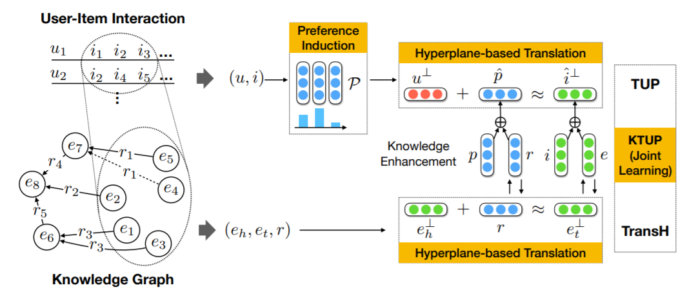

KTUP
===========

Introduction
---------------------

`[paper] <https://dl.acm.org/doi/10.1145/3308558.3313705>`_

**Title:** Unifying Knowledge Graph Learning and Recommendation: Towards a Better Understanding of User Preferences

**Authors:** Yixin Cao, Xiang Wang, Xiangnan He, Zikun hu, Tat-Seng Chua

**Abstract:** Incorporating knowledge graph (KG) into recommender system
is promising in improving the recommendation accuracy and explainability. However, existing methods largely assume that a KG is
complete and simply transfer the "knowledge" in KG at the shallow
level of entity raw data or embeddings. This may lead to suboptimal
performance, since a practical KG can hardly be complete, and it is
common that a KG has missing facts, relations, and entities. Thus,
we argue that it is crucial to consider the incomplete nature of KG
when incorporating it into recommender system.

In this paper, we jointly learn the model of recommendation
and knowledge graph completion. Distinct from previous KG-based
recommendation methods, we transfer the relation information
in KG, so as to understand the reasons that a user likes an item.
As an example, if a user has watched several movies directed by
(relation) the same person (entity), we can infer that the director
relation plays a critical role when the user makes the decision, thus
help to understand the user’s preference at a finer granularity.

Technically, we contribute a new translation-based recommendation model, which specially accounts for various preferences in
translating a user to an item, and then jointly train it with a KG
completion model by combining several transfer schemes. Extensive experiments on two benchmark datasets show that our method
outperforms state-of-the-art KG-based recommendation methods.
Further analysis verifies the positive effect of joint training on both
tasks of recommendation and KG completion, and the advantage
of our model in understanding user preference.

Running with RecBole
-------------------------

**Model Hyper-Parameters:**

- ``train_rec_step (int)`` : The number of steps for continuous training recommendation task. Defaults to ``5``.
- ``train_kg_step (int)`` : The number of steps for continuous training knowledge related task. Defaults to ``5``.
- ``embedding_size (int)`` : The embedding size of users, items, entities, relations and preferences. Defaults to ``64``.
- ``use_st_gumbel (bool)`` : Whether to use gumbel softmax. Defaults to ``True``.
- ``L1_flag (bool)`` : Whether to use L1 distance to calculate dissimilarity, if set to False, use L2 distance. Defaults to ``False``.
- ``margin (float)`` : The margin in margin loss. Defaults to ``1.0``.
- ``kg_weight (float)`` : The weight decay for kg model. Defaults to ``1.0``.
- ``align_weight (float)`` : The align loss weight(make the item embedding in rec and kg more closer). Defaults to ``1.0``.

**A Running Example:**

Write the following code to a python file, such as `run.py`

.. code:: python

   from recbole.quick_start import run_recbole

   run_recbole(model='KTUP', dataset='ml-100k')

And then:

.. code:: bash

   python run.py

Tuning Hyper Parameters
-------------------------

If you want to use ``HyperTuning`` to tune hyper parameters of this model, you can copy the following settings and name it as ``hyper.test``.

.. code:: bash

   learning_rate choice [0.01,0.005,0.001,0.0005,0.0001]
   L1_flag choice [True, False]
   use_st_gumbel choice [True, False]
   train_rec_step choice [8,10]
   train_kg_step choice [0,1,2,3,4,5]

Note that we just provide these hyper parameter ranges for reference only, and we can not guarantee that they are the optimal range of this model.

Then, with the source code of RecBole (you can download it from GitHub), you can run the ``run_hyper.py`` to tuning:

.. code:: bash

	python run_hyper.py --model=[model_name] --dataset=[dataset_name] --config_files=[config_files_path] --params_file=hyper.test

For more details about Parameter Tuning, refer to :doc:`../../../user_guide/usage/parameter_tuning`.

If you want to change parameters, dataset or evaluation settings, take a look at

- :doc:`../../../user_guide/config_settings`
- :doc:`../../../user_guide/data_intro`
- :doc:`../../../user_guide/train_eval_intro`
- :doc:`../../../user_guide/usage`