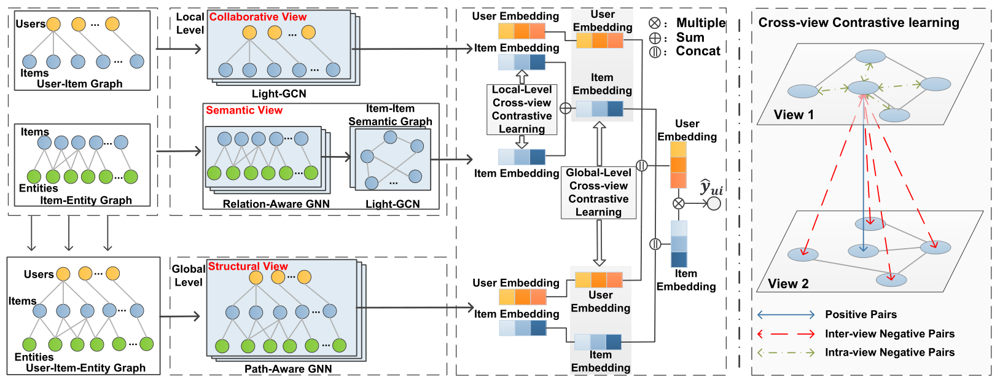

MCCLK
===========

Introduction
---------------------

`[paper] <https://arxiv.org/abs/2204.08807>`_

**Title:** Multi-level Cross-view Contrastive Learning for Knowledge-aware Recommender System

**Authors:** Ding Zou, Wei Wei, Xian-Ling Mao, Ziyang Wang, Minghui Qiu, Feida Zhu, Xin Cao

**Abstract:** Knowledge graph (KG) plays an increasingly important role in recommender systems. Recently, graph neural networks (GNNs) based model has gradually become the theme of knowledge-aware recommendation (KGR). However, there is a natural deficiency for GNN-based KGR models, that is, the sparse supervised signal problem, which may make their actual performance drop to some extent. Inspired by the recent success of contrastive learning in mining supervised signals from data itself, in this paper, we focus on exploring the contrastive learning in KG-aware recommendation and propose a novel multi-level cross-view contrastive learning mechanism, named MCCLK. Different from traditional contrastive learning methods which generate two graph views by uniform data augmentation schemes such as corruption or dropping, we comprehensively consider three different graph views for KG-aware recommendation, including global-level structural view, local-level collaborative and semantic views. Specifically, we consider the user-item graph as a collaborative view, the item-entity graph as a semantic view, and the user-item-entity graph as a structural view. MCCLK hence performs contrastive learning across three views on both local and global levels, mining comprehensive graph feature and structure information in a self-supervised manner. Besides, in semantic view, a k-Nearest-Neighbor (kNN) item-item semantic graph construction module is proposed, to capture the important item-item semantic relation which is usually ignored by previous work. Extensive experiments conducted on three benchmark datasets show the superior performance of our proposed method over the state-of-the-arts.

Running with RecBole
-------------------------

**Model Hyper-Parameters:**

- ``embedding_size (int)`` : The embedding size of users, items, entities and relations. Defaults to ``64``.
- ``reg_weight (float)`` : The L2 regularization weight. Defaults to ``1e-5``.
- ``n_hops (int)`` : The number of context hops in GCN layer. Defaults to ``2``.
- ``node_dropout_rate (float)`` : The node dropout rate in GCN layer. Defaults to ``0.1``.
- ``mess_dropout_rate (float)`` : The message dropout rate in GCN layer. Defaults to ``0.1``.
- ``lightgcn_layer (int)`` : The number of LightGCN layer. Defaults to ``2``.
- ``item_agg_layer (int)`` : The number of item aggregation layer. Defaults to ``1``.
- ``alpha (float)`` : The local-level contrastive loss weight. Defaults to ``0.2``.
- ``beta (float)`` : The contrastive loss weight. Defaults to ``0.1``.
- ``k (int)`` : The topk parameter used in building a k-NN item-item semantic graph. Defaults to ``10``.
- ``lambda_coeff (float)`` : The coefficient when updating k-NN item-item semantic graph. Defaults to ``0.5``.
- ``temperature (float)`` : The temperature parameter used in loss calculation. Defaults to ``0.8``.
- ``build_graph_separately (bool)`` : Whether user a separate GCN to build item-item graph. Defaults to ``True``.
- ``loss_type (str)`` : The loss type used in this model. Defaults to ``'BPR'``. Range in ``['BPR', 'BCE']``.

**A Running Example:**

Write the following code to a python file, such as `run.py`

.. code:: python

   from recbole.quick_start import run_recbole

   run_recbole(model='MCCLK', dataset='ml-100k')

And then:

.. code:: bash

   python run.py

Tuning Hyper Parameters
-------------------------

If you want to use ``HyperTuning`` to tune hyper parameters of this model, you can copy the following settings and name it as ``hyper.test``.

.. code:: bash

    learning_rate choice [1e-4,1e-3,5e-3]
    node_dropout_rate choice [0.1,0.3,0.5]
    mess_dropout_rate choice [0.0,0.1]
    build_graph_separately choice [True, False]

Note that we just provide these hyper parameter ranges for reference only, and we can not guarantee that they are the optimal range of this model.

Then, with the source code of RecBole (you can download it from GitHub), you can run the ``run_hyper.py`` to tuning:

.. code:: bash

	python run_hyper.py --model=[model_name] --dataset=[dataset_name] --config_files=[config_files_path] --params_file=hyper.test

For more details about Parameter Tuning, refer to :doc:`../../../user_guide/usage/parameter_tuning`.

If you want to change parameters, dataset or evaluation settings, take a look at

- :doc:`../../../user_guide/config_settings`
- :doc:`../../../user_guide/data_intro`
- :doc:`../../../user_guide/train_eval_intro`
- :doc:`../../../user_guide/usage`
