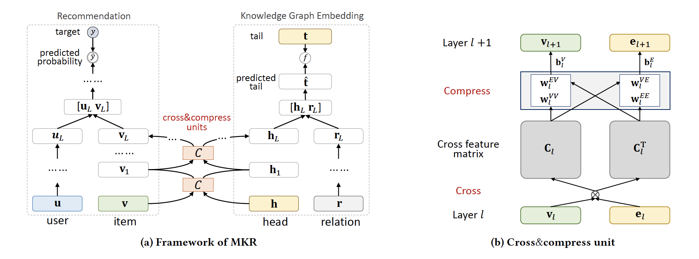

MKR
===========

Introduction
---------------------

`[paper] <https://dl.acm.org/doi/10.1145/3308558.3313411>`_

**Title:** Multi-Task Feature Learning for Knowledge Graph Enhanced Recommendation

**Authors:** Hongwei Wang, Fuzheng Zhang, Miao Zhao, Wenjie Li, Xing Xie, Minyi Guo

**Abstract:** Collaborative filtering often suffers from sparsity and cold start problems in real recommendation scenarios, therefore, researchers and engineers usually use side information to address the issues and improve the performance of recommender systems. In this paper, we consider knowledge graphs as the source of side information. We propose MKR, a Multi-task feature learning approach for Knowledge graph enhanced Recommendation. MKR is a deep end-to-end framework that utilizes knowledge graph embedding task to assist recommendation task. The two tasks are associated by crosscompress units, which automatically share latent features and learn high-order interactions between items in recommender systems and entities in the knowledge graph. We prove that crosscompress units have sufficient capability of polynomial approximation, and show that MKR is a generalized framework over several representative methods of recommender systems and multi-task learning. Through extensive experiments on real-world datasets, we demonstrate that MKR achieves substantial gains in movie, book, music, and news recommendation, over state-of-the-art baselines. MKR is also shown to be able to maintain satisfactory performance even if user-item interactions are sparse.

Running with RecBole
-------------------------

**Model Hyper-Parameters:**

- ``embedding_size (int)`` : The embedding size of users and items. Defaults to ``64``.
- ``kg_embedding_size (int)`` : The embedding size of entities, relations. Defaults to ``64``.
- ``low_layers_num (int)`` : The number of low layers. Defaults to ``1``.
- ``high_layers_num (int)`` : The number of high layers. Defaults to ``1``.
- ``kge_interval (int)`` : The number of steps for continuous training knowledge related task. Defaults to ``3``.
- ``use_inner_product (bool)`` : Whether to use inner product to calculate scores. Defaults to ``True``.
- ``reg_weight (float)`` : The L2 regularization weight. Defaults to ``1e-6``.
- ``dropout_prob (float)`` : The dropout rate. Defaults to ``0.0``.

**A Running Example:**

Write the following code to a python file, such as `run.py`

.. code:: python

   from recbole.quick_start import run_recbole

   run_recbole(model='MKR', dataset='ml-100k')

And then:

.. code:: bash

   python run.py

Tuning Hyper Parameters
-------------------------

If you want to use ``HyperTuning`` to tune hyper parameters of this model, you can copy the following settings and name it as ``hyper.test``.

.. code:: bash

   learning_rate choice [0.01,0.005,0.001,0.0005,0.0001]
   low_layers_num choice [1,2,3]
   high_layers_num choice [1,2]
   l2_weight choice [1e-6,1e-4]
   kg_embedding_size choice [16,32,64]

Note that we just provide these hyper parameter ranges for reference only, and we can not guarantee that they are the optimal range of this model.

Then, with the source code of RecBole (you can download it from GitHub), you can run the ``run_hyper.py`` to tuning:

.. code:: bash

	python run_hyper.py --model=[model_name] --dataset=[dataset_name] --config_files=[config_files_path] --params_file=hyper.test

For more details about Parameter Tuning, refer to :doc:`../../../user_guide/usage/parameter_tuning`.

If you want to change parameters, dataset or evaluation settings, take a look at

- :doc:`../../../user_guide/config_settings`
- :doc:`../../../user_guide/data_intro`
- :doc:`../../../user_guide/train_eval_intro`
- :doc:`../../../user_guide/usage`
